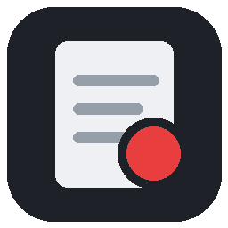
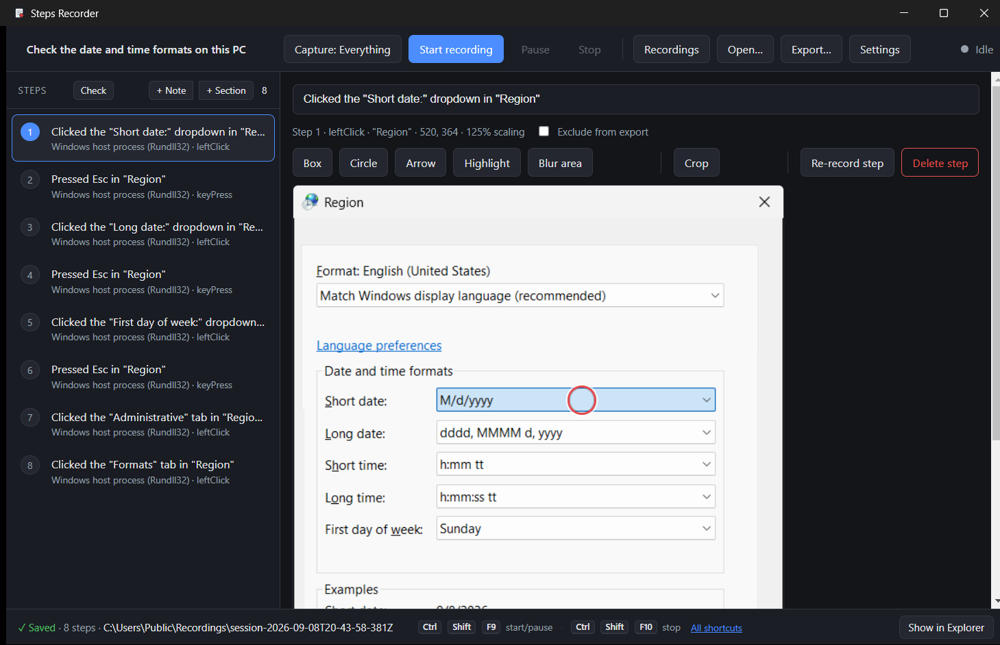
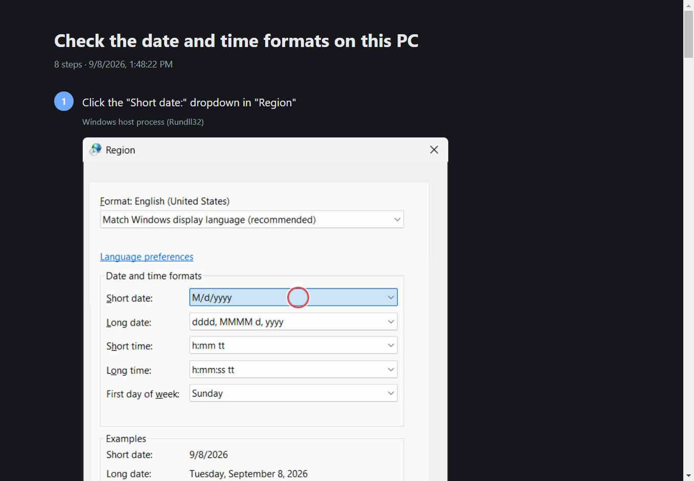

<div align="center">



# Steps Recorder

**Records what you do on screen — every click, drag and keystroke — with a
screenshot of each step, then turns it into a guide you can hand to someone.**

A modern replacement for the deprecated Windows `PSR.exe`.

[](https://github.com/Bunbob41/BetterStepsRecorder/releases/latest)
[](#install)
[](LICENSE)

### **[⬇ Download the installer](https://github.com/Bunbob41/BetterStepsRecorder/releases/latest)**

Per-user install · no administrator prompt · no .NET or Node needed ·
nothing leaves your machine

</div>



---

## In one paragraph

You press record and use your computer normally. Every click, drag and typed
value becomes a numbered step with a screenshot of the window it happened in,
described in words rather than coordinates. You then tidy the wording, group
the steps into phases, blur anything private, and export the result as a web
page, a PDF, a Word document or your own organisation's SOP template.

Nothing leaves the machine at any point. There is no account, no telemetry and
no network use of any kind.

### And this is what comes out



One portable HTML file with the images embedded — or PDF, Markdown, Word, or
your organisation's own SOP template. The wording is rewritten as instructions:
the recording says *Clicked*, the guide says **Click**.

## What it does

- **Captures accurately.** Correct on mixed-DPI multi-monitor setups, and works
  with GPU-composited applications (Chrome, Electron, VS Code) that defeat the
  usual screenshot approach.
- **Names what you clicked.** Uses UI Automation, so a step reads
  *Clicked the "Save" button in "Billing"* rather than *Clicked at 412,308*.
- **Records typing, not keystrokes.** Text is grouped per field. Password fields
  record only that a password was entered; card and SSN shapes are masked even
  in ordinary fields.
- **Starts without going back to the window.** One shortcut works everywhere:
  it starts a recording when none is running, pauses when one is, and resumes
  when it is paused. A recording started that way captures only the application
  that was in front when you pressed it — the point of a global shortcut is
  that you are already inside the thing you want to document.
- **Scopes to one application.** Documenting one system does not capture your
  mail and chat alongside it — out-of-scope events are never captured at all.
- **Frames each shot as you choose** — the window that was clicked, the whole
  monitor, or every display.
- **Blurs regions destructively.** The pixels in the file are replaced, so a
  redacted guide's source images do not still contain the data.
- **Marks up a screenshot.** Box, circle, arrow and highlighter, for the things
  a recorder cannot know: *this* is the field that matters, look here first.
  Right-click the highlighter for a different colour, and a guide that uses
  several can print a key explaining what each one means.
- **Groups a long procedure into phases.** Headings break forty clicks into the
  three or four pieces of work they actually are, and the app offers one
  wherever the recording moved to a different application.
- **Crops a screenshot** to the part that matters. Each step remembers the
  region of screen it came from and stores the click as a position within it,
  so cutting the picture cuts that region by the same proportion and the marker
  goes on pointing at the same thing.
- **Lets you move the click marker.** A typed step is marked at the centre of
  the field you typed into, because that is all the recorder can know; on a wide
  search box that is not where the words went, so drag it where it belongs.
- **Finds and replaces across a whole recording**, and searches *every*
  recording you have — a system gets renamed, and the alternative is retyping
  forty steps or letting the guide go stale.
- **Undo and redo everything**, from the keyboard or the right-click menu. An
  edit that touches many steps is one undo, not twenty.
- **Saves as you go**, with no Save button, and says what the recordings folder
  is costing you — SOP screenshots stack up faster than anyone expects.
- **Re-records a single step.** Guides rot when an application changes; refresh
  step 17 without touching the other forty.
- **Tells you which steps have rotted.** Press **Check** and it asks the running
  application whether the controls each step refers to still exist, and marks
  the ones that do not - so maintaining a guide is a few minutes rather than a
  re-recording.
- **Exports** to HTML (one portable file), PDF, Markdown or Word, rewritten as
  instructions: *Click Save* rather than *Clicked the Save button*.
- **Renders into your own SOP format.** Point it at your organisation's template
  and the output is their document - their headings, numbering, revision table
  and approval block - with the recording injected into the marked slots. The
  template file is only ever read. Markdown, HTML or **Word**: point it at a
  .docx and the recording is injected into that document, screenshots embedded.
  See `templates/corporate-sop.md` and `templates/corporate-sop.docx`.

## Install

1. Download **`StepsRecorder-Setup-<version>.exe`** from
   [the latest release](https://github.com/Bunbob41/BetterStepsRecorder/releases/latest).
2. Run it. It installs per-user, so there is no administrator prompt, and
   nothing else is required — no .NET, no Node.
3. Windows 10 (1607 or later) or Windows 11, x64.

Every release lists the installer's SHA-256 and the commit it was built from,
so you can check you have what was published:

```powershell
Get-FileHash StepsRecorder-Setup-0.1.0.exe -Algorithm SHA256
```

> **Windows will warn you the first time.** The binary is not code-signed yet,
> so SmartScreen shows "Windows protected your PC" — choose **More info** then
> **Run anyway**. Some endpoint protection may also object: a tool that hooks
> input, takes screenshots and writes them to disk looks, structurally, like a
> keylogger. That is a fair thing for antivirus to be suspicious of, which is
> why the source is here to audit.

Recordings go to `Documents\StepRecordings` by default, and nothing leaves the
machine — there is no account, no telemetry and no network use of any kind.

## Using it

1. **Set out** — press **Start recording** and say what you are making: a
   procedure (rendered into an SOP template), a training guide, or an evidence
   record (kept in the past tense, because it describes what was done). Name it,
   pick a template, and scope it to one application if you want everything else
   kept off the record.
2. Do the thing you are documenting. The window shrinks to a small floating
   strip so it is not in your way. `Ctrl+Shift+F9` pauses, `Ctrl+Shift+F10`
   stops, from wherever you are.
3. **Edit** — reword steps, drag to reorder them, add written steps for the
   instructions that are not clicks, add headings to group them into phases,
   mark up a screenshot, exclude steps you want kept but not published, blur
   anything sensitive, re-record a step that came out wrong. Arrow keys move
   between steps, Ctrl+click and Shift+click select several, Delete removes
   them and Ctrl+Z puts them back.
4. **Export** — HTML, PDF, Markdown, Word, or your own template.

Recordings save continuously to `Documents\StepRecordings` (configurable). There
is no Save button because there is nothing to save: every step is on disk as it
is captured. Name a recording in the field at the top left; the app opens onto
your recent recordings so you can pick one up again.

Exports can carry your organisation's name, logo and a footer — set them in
Settings.

## Building from source

Requires the [.NET 10 SDK](https://dotnet.microsoft.com/download) and Node 20+.

Every command below is run from `ui/`, and works the same in PowerShell,
`cmd` and a POSIX shell.

```
cd ui
npm install
npm run build:capture     # publishes the C# capture engine
npm start                 # run in development
npm run dist              # build the installer into ../dist
```

## How it is put together

Two processes:

- **`capture/`** — a C# console application owning the Win32 hooks, screenshots
  and UI Automation. It speaks newline-delimited JSON over stdio.
- **`ui/`** — an Electron app that spawns it, renders steps as they arrive, and
  handles editing and export.

They are separate processes rather than a native addon: a low-level hook needs
its own message pump, and this avoids node-gyp and Electron ABI coupling
entirely. The protocol is documented in [docs/ipc-contract.md](docs/ipc-contract.md).

## What changed, and when

[CHANGELOG.md](CHANGELOG.md) — what each release added, and what it still does
not do.

## Documentation

- **[docs/FIELD-GUIDE.md](docs/FIELD-GUIDE.md)** — how the whole system works,
  in plain language and diagrams. Start here.
- **[docs/ENGINEERING.md](docs/ENGINEERING.md)** — the technical master record:
  invariants, the changelog of design decisions and their reasons, known debt.
- **[docs/ipc-contract.md](docs/ipc-contract.md)** — the message protocol.

## Tests

Every test here runs without touching the mouse or keyboard, so they can be run
on a machine you are using.

From `ui/`:

```
npm test                # 23 suites, 766 checks, a few seconds
npm run test:window     # the real page in a real Electron window
npm run test:composite  # the click marker drawn into real pixels
```

`npm test` is a runner rather than a shell loop on purpose: the loop this
replaced was bash, and this is a Windows project. It covers export rendering,
templates, .docx, sessions, section headings, annotations, shortcut
conversion, window fitting, screenshot sizing, the library, build identity,
click markers, renderer wiring, find and replace, cropping, the undo history,
recording format versions, path confinement, archive search, application
naming and size formatting.

`npm run test:window` loads the real `index.html`, `renderer.js` and stylesheet
in an Electron window with the IPC bridge stubbed, and dispatches mouse events
into the page — nothing is synthesized at the operating system. It exists
because the drag preview shipped broken twice while every other test passed:
it was present in the DOM, correct, and invisible. Set `BSR_SHOTS=<dir>` and it
also writes what the window is actually showing, because a measurement cannot
tell you a thing is drawn where nobody can see it.

The rest drive the real capture engine, so build it first — a fresh clone has
not. From the repository root:

```
dotnet build capture -c Debug          # the engine these tests drive
dotnet build tests/KbdTarget -c Debug  # something for them to point at

python tests/smoke.py                  # engine protocol
python tests/scope_test.py             # window enumeration and scoping
python tests/verify_test.py            # rot detection against a real app
cd tests/LogicTests
dotnet run                             # redaction, wording, naming, scope
                                       # rules, capture framing
```

Beyond that the interface is checked by hand. There used to be a set of suites
that drove it by synthesizing clicks at fixed pixel coordinates; they were
retired because every layout change silently broke them, they could only be run
on an idle machine and so were run rarely enough to rot unnoticed, and they
exited successfully while reporting failures. `git log -- tests/ui_drive.py`
has them if they are ever wanted back.

## Licence

MIT — see [LICENSE](LICENSE). Use it, change it, ship it; keep the copyright
notice, and it comes with no warranty.
