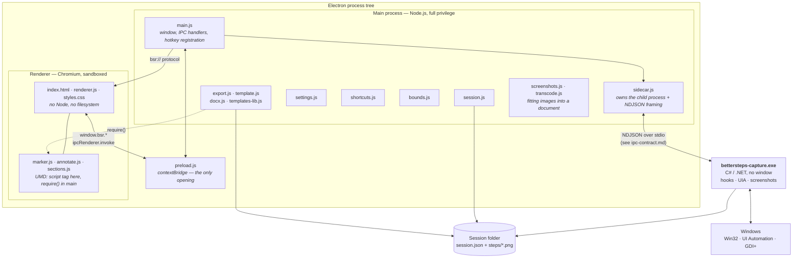

# Engineering Record

The master technical document for Steps Recorder. It sits above the detailed
specifications and links to them rather than repeating them.

- [ipc-contract.md](ipc-contract.md) — the exact message protocol between the
  Electron app and the C# capture engine. Normative.
- [FIELD-GUIDE.md](FIELD-GUIDE.md) — the same system explained for a
  non-programmer. Keep both true.

**Maintenance rule.** Any meaningful change — a design decision, a new module or
dependency, a swap, a rationale that would otherwise survive only in a commit
message — updates this document and the field guide as part of the same work,
before the change is considered done.

---

## 1. What this is

A Windows screen-capture tool that turns a task performed on screen into a
document somebody else can follow. A replacement for the deprecated
`PSR.exe`.

Current state: **v0.1.2** released and in daily use by colleagues, with builds
since then carrying the marker, LaTeX and photograph work. Packaged as an
unsigned per-user NSIS installer, in a PUBLIC repository - which is a fact
about what may safely appear in a screenshot, a commit or an issue.

---

## 2. System

### Process boundaries and why they are where they are

| Boundary | Reason |
|---|---|
| Electron ↔ C# engine | Chromium cannot install global input hooks, call UI Automation, or capture other applications' windows. The engine exists solely to do what a browser is designed to prevent. |
| Main ↔ renderer | `contextIsolation: true`, `nodeIntegration: false`. The renderer gets a fixed, enumerated API surface via `contextBridge` and nothing else. |
| `bsr://` custom protocol | Screenshots are served to the renderer through a scheme that refuses any path outside the open session directory, rather than exposing `file://`. |

Renderer CSP: `default-src 'none'; img-src bsr: data:; style-src 'self'; script-src 'self'`.

### Transport

One JSON object per line (NDJSON), UTF-8, over the child process's stdio.
`stdout` is protocol; `stderr` is logs and is never parsed. Every message
carries `v`, `type` and `id`; `id` echoes on the response so requests correlate.

Chosen over shared memory or a socket because it is trivially loggable, survives
being read by a human during a failure, and has no partial-state failure mode.

---

## 3. Invariants

These are load-bearing. Breaking one is a defect even if tests pass.

1. **Exclusion beats inclusion.** `ignorePids` is evaluated before `allowPids`,
   so no scope choice can drag the recorder's own windows into a recording.
   Implemented as a pure function (`Scope.cs`) with its own tests rather than a
   condition inside the worker.
2. **Out-of-scope events are discarded before capture**, not captured and
   filtered. A screenshot that we delete afterwards still existed, and so did a
   password held in a buffer until the next flush. Scope is decided when focus
   moves, on the field, before a character is kept or a UIA call is made.
3. **A template is read, never written.** Unrecognised markers are left exactly
   as found and reported.
4. **Naming never blocks capture.** UIA runs off-thread behind a 400 ms
   deadline; a lookup that fails yields an unnamed step, never a lost one.
5. **Password secrecy is a property of the field, not of the buffer**, and
   survives a flush.
6. **Claimed hotkeys are suppressed in the engine**, or the last step of every
   recording is the user pressing stop. Suppression is by *label*, and the two
   sides name keys for different readers - so every key a shortcut can end in
   must translate to the string the engine actually builds. Checked in
   `shortcuts_test.js` against the engine's own map, read from its source.
7. **Blur is destructive**, and pre-blur originals are purged when the session
   closes or the undo entry expires.
8. **Excluded steps' screenshots are never copied alongside an export.**
9. **Step metadata is flushed on every mutation.** PSR serialised only at export
   and lost everything on a crash.
10. **The engine's hooks are installed on the thread that pumps messages.** See
    D-9; this is not optional, it is how Windows dispatches hook callbacks.
11. **A capture never fails.** If a window cannot draw itself, the screen is
    copied instead; a step is never lost for want of a screenshot.
12. **A recording whose metadata cannot be parsed is never written to**, and is
    listed rather than hidden. Refused at load, flagged, and refused again in
    `flush()` - the operation that would otherwise replace it with the empty
    thing the parse failure produced.
13. **A recording from a newer version is never written to.** Refused at load
    and never adopted as the session: flushing it would rewrite the whole file
    in this version's shape and discard what it does not understand.
14. **Nothing in a `session.json` may name a file outside its own folder.** A
    recording is something people send each other, so its paths are claims.
    Rejected at load and re-checked at every read, write and delete.
15. **A screenshot captured from the screen is exactly the size of the `frame`
    recorded with its step, AND is entirely that window's rendering.** The
    second half was learned the hard way (D-67): the sizes agreed while the
    window had drawn itself into three quarters of the bitmap, so the marker was
    a correct percentage of a picture that was mostly blank. The click marker is a percentage of that
    rectangle, so any mismatch misplaces the marker on every step of the guide.
    A photograph has no frame, no window and no click; every marker decision
    already answers "there is none" for a step shaped that way, which is why
    photographs needed nothing taught to them.
16. **Step numbers run through the whole guide, never restarting at a heading.**
    A reader who says "step 9" must mean the ninth step of the procedure. Every
    format counts rows that are neither notes nor headings, via
    `sections.countSteps`.
17. **A heading that has no name, or nothing under it, never reaches the
    reader.** Applied after exclusion, so holding back a phase's last step
    takes the phase too.
18. **Every edit that can touch more than one step is one undo entry.** Bulk
    delete and replace-all both; twenty presses of Ctrl+Z is not undo.
19. **`textEdited` means a person wrote those words.** Only an explicit claim
    sets it. Inferring it from a mechanical substitution freezes that step's
    tense at export.
20. **Applying an undo entry returns the entry that puts it back.** Redo is not
    a second implementation; it is the same traversal run the other way. An
    entry type whose branch returns no inverse is a dead end - undo would work
    once and redo would silently do nothing - and `invariants_test.js` fails on
    one.

---

## 4. Decision changelog

Newest first. Each entry records what was decided, why, and what it replaced.

### D-59 - Marks are data, and the reason they were not has expired
`(this change)` - [ui/src/renderer/annotate.js](../ui/src/renderer/annotate.js)

Reported in one sentence: "there's no way to delete it." There was not. A box,
ring, arrow or highlight was painted into the screenshot's pixels the instant it
was drawn, so there was no arrow to delete - only an image that had one in it.
The only way back was undo, in order, taking every later mark with it.

**The original decision was right and had gone stale.** Marks were burned in
because Word embeds a picture and cannot lay anything over it, so a mark held as
data would have been missing from the format most likely to reach a company.
Then D-31 built `composite.js` to burn the CLICK marker into the pixels for
Word - machinery that draws anything an SVG can express into an image on the way
out. From that moment the constraint was gone, and nobody noticed for months.
Worth remembering as a class of bug: a decision that documents its own reason
can still be wrong later, and the thing that invalidates it is usually a
capability built for something else.

So a mark is now `{ id, tool, colour, geometry }` on the step, in percentages of
the picture - the same units as the click marker, for the same two reasons: a
step can be cropped, and its screenshot can be re-encoded at a different size on
the way into a document. Pixels survive neither.

**One piece of code draws them.** `annotate.svgAll` produces the overlay; the
window lays it over the picture, the HTML and PDF exports lay the same thing
over the same picture, and `composite` draws it into the pixels for Word and
LaTeX - under the click marker, exactly as on screen. Drawing them once in the
window and again in each export is how a preview starts lying.

Consequences that had to be handled rather than discovered later:

- **A crop moves them**, and drops only a mark that has left the picture
  entirely. Half a box around a field that is still visible is worth keeping;
  deciding for the author that their mark is now worthless is not the crop's
  business.
- **A step with marks and no placeable click now reaches the compositor.** The
  old filter was "has a click marker", so a photograph somebody drew on would
  have arrived in Word with nothing on it.
- **`annotated` follows the list** rather than being set once. Left true over an
  empty list it would tell the compliance summary about marks that are not
  there.
- **The overlay takes no pointer events at all.** Which mark was right-clicked
  is worked out from where the marks are, not by hit-testing the SVG, so a drag
  that starts over a mark still draws and the picture underneath is still there
  to be dragged. The hit box is generous around an arrow, because a line is
  nearly impossible to hit with a mouse and "click on the arrow" does not mean
  "click on the two pixels of its shaft".

**Blur is not one of these and never will be.** It destroys pixels on purpose,
because a redacted guide whose screenshot still holds the data is a lie (D-2).
It keeps the pre-edit stash and the `pixels` undo entry; everything else moved.

Marks already burned into existing recordings stay burned. They are pixels;
there is nothing to convert them from.

Proven in pixels rather than in structure: a blue box burned into a real image,
its edge drawn, its middle untouched, the rest of the picture untouched, and the
click marker still over it.

### D-79 - The steps column is dragged, not decreed
`(this change)` - [ui/src/renderer/renderer.js](../ui/src/renderer/renderer.js),
[ui/src/main/settings.js](../ui/src/main/settings.js),
[ui/src/renderer/styles.css](../ui/src/renderer/styles.css)

320px was a compromise that suited a laptop and a wide monitor equally badly,
and folding the column away was the only answer to it: all or nothing. The seam
between the column and the screenshot is now draggable and the width is
remembered beside `stepsCollapsed`.

Ported from a fork of this tree (`workspace1`, commit 983ac64, co-authored by
Cursor) which built it on a renderer split this tree does not have. The logic
moved into `renderer.js` beside `collapseSteps`; there is no `host` indirection
and no separate home-collapsed state here.

- **Clamped in two places, 200-480.** The window clamps what a drag can reach;
  `Settings` clamps what the file can contain. Neither trusts the other: a
  hand-edited `settings.json` must not be able to leave the screenshot no room,
  and the window must not depend on the file having been written by this
  version.
- **Zero means "as narrow as allowed", not "unset".** The original used
  `Number(v.stepsWidth) || 320`, which reads a stored 0 as missing and returns
  320 where 200 was meant. `Number.isFinite` separates "not a number" from "a
  number I do not like".
- **Written once, at the end of a drag.** The column follows the pointer every
  frame with `persist: false`; a settings write per `pointermove` would be a few
  hundred writes to save one integer.
- **`pointermove` is bound to the window, not the seam.** The pointer routinely
  outruns a 6px target mid-drag, and losing the moves strands the column
  half-resized.
- **`min-width: 0` on `.steps`.** Without it the widest step title sets a floor
  under the grid track and the column refuses to be dragged narrower than its
  longest row.

Two notes from building it, both about tests rather than the feature:

`Settings` had no test suite at all - the one module that trusts a value from
outside the program enough to paint it straight into the window. It has one now
([tests/settings_test.js](../tests/settings_test.js)), covering the clamp, the
merge over defaults, and an unreadable file.

The window test's settings stub answered from a fresh literal on every call, so
nothing the page saved could ever be read back and any "it is remembered" check
was unfalsifiable. It holds state now. The first version of the persistence
check still passed with persistence removed, because it asserted 320 - which is
both the default and what the double-click writes; it reads the width back while
it is still 380, before anything else can produce that number by accident.

### D-78 - The two steps before the upload
`(this change)` - [ui/src/renderer/appname.js](../ui/src/renderer/appname.js),
[ui/src/main/main.js](../ui/src/main/main.js),
[ui/src/main/transcode.js](../ui/src/main/transcode.js)

With the zip (D-77) the upload itself is one file and one action. What was left
was everything before it, and there were exactly two things.

**A recording nobody named was called the time it started.** That name is the
heading of the exported guide and the caption under every figure in it, so a
thirty-seven step procedure carried "9/11/2026, 3:42:26 PM" thirty-seven times.
The application and the size are what a person recognises a recording by - the
same two things the library card already shows - so `appName.label` builds that
name and a recording takes it when it stops.

- **At the stop, not at the start.** At the start there are no steps to be named
  after; the dominant application is a fact about what was recorded.
- **Only when nobody chose a name.** The name this application picked at the
  start is remembered in memory for exactly this comparison. Deliberately NOT
  stored in `session.json`: a name in the file is a name somebody may have
  typed, and adding a field to say otherwise would be a format change (D-69)
  for a fact that only matters while the application is running. An app
  restarted mid-recording simply keeps the timestamp.
- **Nothing to say means say nothing.** A recording with no window in it has no
  application to be named after, and "0 steps" is not a name; it keeps what it
  had.

**Screenshots went into LaTeX at the size they came off the screen.** Measured:
37 full-size PNGs, 14MB, a free Overleaf project at the edge of its compile
timeout. The copies inside a document do not need to be bigger than the page can
print - 1600px is wider than 0.85 of a text line at any sensible resolution - so
they are sized on the way out. The recording keeps its originals; this is the
copy going into the document.

The sizing happens AFTER the marker is drawn into the pixels (D-31), so the
marker shrinks with the picture it is on. `transcode.toJpegFrom` exists because
of that order: by then a marked screenshot is a buffer that never had a file.

### D-77 - One file to upload
`(this change)` - [ui/src/main/texzip.js](../ui/src/main/texzip.js),
[ui/src/main/main.js](../ui/src/main/main.js)

Asked after rating the Overleaf import at eight out of ten and saying what the
missing two were. Both were the same thing: a LaTeX export is a document PLUS a
folder, so it is two drags and one rule nobody is told - keep the folder's name,
because the paths inside the document go through it. Get it wrong and there is
no error, only empty boxes where the screenshots were.

A zip removes the rule. Overleaf takes one as a whole project and unpacks one
dropped into an existing project, so the import becomes: export, upload, compile.

Decisions worth keeping:

- **What goes in it is the complete document** (D-76), never the fragment.
  A zip is for uploading and compiling; there is nothing inside a zip to paste
  a fragment into.
- **JSZip, which is already here** for reading .docx templates - zips of XML.
  No new dependency. Deliberately NOT `Compress-Archive` through a shell: this
  application records the screen and hooks input on machines whose security
  software watches for exactly that shape, and a recorder that spawns
  powershell.exe is a conversation nobody needs.
- **The pictures are gathered once and then either written or zipped.** The
  folder-and-file export and the zip must not diverge into two ways of naming a
  screenshot - the naming IS the join between the document's paths and the files
  (D-44), and two of them would drift.
- **Every path the document asks for is checked against what is being handed
  over**, and a mismatch is logged and told to the person. In LaTeX that failure
  is silent: a path naming nothing sets an empty box, and the guide has holes in
  it that no error mentions. `missingFrom` is the one thing in this arc that
  could not be checked by compiling, because a missing figure compiles fine.

Checked by building a zip and reading it back: the entries are the document and
every picture and nothing else, the document inside is the standalone one, its
paths point into the folder that is in the zip, a picture comes back byte for
byte, a screenshot two steps share is one file rather than two, and a folder
renamed underneath the paths is reported rather than shipped.

### D-76 - A LaTeX export that stands on its own, beside the one that does not
`(this change)` - [ui/src/main/latex.js](../ui/src/main/latex.js)

Asked for after watching a fragment go into Overleaf: "can we make our recording
export as its own latex file? start to finish?"

The fragment is right for a procedure joining an existing manual (D-44) and
wrong for a procedure being handed to somebody on its own, which needs a class,
a preamble and a title before it is anything at all. Both are real; this is a
second format in the export list rather than a change to the first, because
nothing about the fragment was wrong.

What the complete document does differently, and why:

- **Its headings sit one level up.** The procedure IS the document, so a
  recording's own section headings become `\section`, not `\subsubsection`
  hanging under a `\subsection` that is now the title block.
- **The title becomes a title block** (`\title` + `\maketitle`), not a heading.
  The `\label{sec:...}` goes with it: a label with no sectioning command to
  attach to is a dangling reference, so the fragment keeps it and the document
  does not.
- **Figures are pinned, `[H]`, not floated.** In a procedure the picture belongs
  beside the step it is about; a figure that drifts to the next page is worse
  than one that leaves white space. A fragment cannot do this - `float` has to be
  loaded in a preamble it does not own - which is exactly why its header explains
  how to turn it on.
- **It loads what it needs and no more**: `fontenc`, `geometry`, `graphicx`,
  `float`. A bare TeX install compiles it.

Proved by compiling it: `latex_compile_test.js` already built the fragment
inside the smallest wrapper that could receive it; the document is handed to
pdfTeX with no wrapper at all, which is the whole claim being made about it.

### D-75 - The fragment says the line that includes it
`(this change)` - [ui/src/main/latex.js](../ui/src/main/latex.js),
[ui/src/main/main.js](../ui/src/main/main.js)

The LaTeX export shipped in 0.2.0 with one part never verified: whether what it
writes actually compiles **in Overleaf**. A local TeX install proved the file is
well-formed, which is not the same claim. This is that part, done: a real
recording of thirty-seven steps exported, uploaded, compiled, and the figures
inspected in the PDF - screenshots with the click marker burned in, captioned
*procedure name, step N*, in a project that went from three pages to twenty-three.

What it found was not a bug in the output. Both files uploaded correctly, the
folder name matched the paths inside the `.tex`, and the template's preamble
already had `graphicx` - and nothing appeared, because **nothing in the document
included the fragment**. A fragment cannot include itself. It could say how, and
did not.

So the header gained one line - `% To include it without pasting: \input{name}` -
with the name the file was actually saved as, quoted when that name has a space
in it, because `\input{my guide}` is an error. The message the app shows after
exporting says the same thing: upload both, then add this line.

Also measured, and worth knowing before somebody's first attempt: thirty-seven
full-size PNG screenshots come to 14MB, and that project reported itself near
the free plan's compile timeout. JPEG at 85% is about a quarter of that. The
field guide says so in the recipe.

### D-74 - A program the recorder cannot see is said out loud
`(this change)` - [capture/Privilege.cs](../capture/Privilege.cs),
[capture/Recorder.cs](../capture/Recorder.cs),
[ui/src/renderer/renderer.js](../ui/src/renderer/renderer.js)

HYPACK started with *Run as administrator* produced two recordings with no
HYPACK steps in them. No error, no warning, nothing in the log - the recording
strip showed a healthy recording the whole time. Windows withholds a
higher-privilege program's input from a lower-privilege program's hooks (User
Interface Privilege Isolation), so the clicks never reached the engine. There
was nothing to fail.

That cannot be fixed from inside an ordinary process, and it is not a bug to
work around: it is Windows keeping one program from watching another. What can
be fixed is the silence, which made the recorder look broken rather than
blocked.

**What is still visible from this side of the wall is which window is in
front.** So the engine watches that:

- **On the idle tick.** Shut out of the program in front, no events arrive and
  the worker is idle - so the tick runs exactly when the check is needed.
- **Asked about a program only when the program in front changes.** The
  question is two handle opens and a token read; asking it four times a second
  about the same program would be waste.
- **By integrity level**, which is what the isolation is decided by
  ([Privilege](../capture/Privilege.cs)). A process whose token this one may not
  even open is higher by definition. A process that could not be opened for any
  other reason - most often one that has already exited - is not reported as a
  wall.
- **Not about programs out of the recording's scope**, whose clicks would not be
  recorded anyway.
- **Sent on the change** as a `blocked` message, true on the way in and false on
  the way out, never repeated between.

**The window says it where it will be read.** On the recording strip, in place of
the elapsed time - *Can't see Hypack64: running as administrator* - because the
strip is the only thing on screen during a recording. It takes the elapsed
line's place rather than adding a row: the strip is 132 pixels tall, and a
warning that wrapped would push Pause and Stop out of it, which are the two
buttons somebody who has just read "not recording" most wants. It stays on one
line and shortens with an ellipsis; the full sentence is its tooltip. And a
notice is left in the notice bar, hidden while the strip is up, for when the
recording is opened afterwards and the steps are not there.

The name is the filename, tidied - *Hypack64*, not *HYPACK Shell*: the friendly
name lives in the executable's own version resource, which a program running as
administrator will not let a lesser one read.

Proved: `Privilege.CannotSee` against real processes in LogicTests - this one,
File Explorer, `services.exe` (SYSTEM on every machine, so always above the
test), and a process that has already exited; a window test that raises the
message on a 360-pixel strip and checks the strip is no taller, Stop is still
inside it, and the warning clears; invariants for the rest. The window test
uses a long program name on purpose: *Hypack64* happens to fit on the strip's
one line, and with it a warning allowed to wrap passed every check. With a
long name the same change grew the strip from 113 to 131 pixels and failed. Not proved against
HYPACK itself, which needs the user to start it elevated again.

### D-73 - A control is asked about in its own window's DPI terms
`(this change)` - [capture/UiaResolver.cs](../capture/UiaResolver.cs),
[tests/DpiTabTarget](../tests/DpiTabTarget/Program.cs)

Found while checking whether pictures ran before or after their clicks, in a
HYPACK recording on a display at 125%. Step 9 read *"Clicked the Charts tab"*;
its arrow was on Tracklines, and the next picture showed the Tracklines page.
The picture was right and the WORDS were wrong. Step 17 the same: Planned Lines
recorded as "3D Options and Levels".

Every tab step fitted one rule. Multiply the click's distance along the dialog
by 1.25 and the tab there is the name that was recorded:

    step  arrow is on       tab at x * 1.25          recorded as
       6  Soundings         Soundings                Soundings
       7  Seabed ID         Seabed ID                Seabed ID
       9  Tracklines        Charts                   Charts
      17  Planned Lines     3D Options and Levels    3D Options and Levels

Radio buttons and checkboxes in the same dialog were named correctly.

**The cause is where UI Automation builds its description.** A button, a
checkbox, a radio button is a window of its own, and Windows scales a question
about it. The tabs of a plain Windows tab control are drawn inside one window
and have no description of their own, so UI Automation builds one with a
stand-in that runs in the ASKING process and measures the tabs with messages -
in the application's own coordinates. HYPACK never declared itself DPI aware,
so those are unscaled, and this process is per-monitor aware, so its point is in
real pixels. A real-pixel point against a layout four fifths the size lands a
quarter further along. Near the start of the strip a quarter is less than a
tab, which is why General through Seabed ID were right.

**The first attempt to reproduce it found nothing.** A DPI-unaware WinForms test
window, asked the old way, named all eight tabs correctly - because a WinForms
TabControl describes its own tabs from inside its own process, at the scale it
knows, and never touches the stand-in. Only a plain `SysTabControl32`, which is
what an MFC dialog has, reproduced it, and then exactly:

    plain tabs    asked the old way: 2/8   (Seabed ID as "Tracklines", Tracklines as "Charts" ...)
                  asked this way:    8/8
    WinForms tabs 8/8 both ways
    checkbox      1/1 both ways

That is the reason `tests/DpiTabTarget` has both rows. A target with only the
WinForms row passes against the bug.

**The fix asks in the window's own terms.** Before UI Automation is asked what
is at a point, the asking thread takes the DPI mode of the window under that
point (`GetWindowDpiAwarenessContext`), and the point is converted into that
window's coordinates (`PhysicalToLogicalPointForPerMonitorDPI`). The stand-in's
measurements and the point then agree. For a per-monitor-aware window it is no
change at all: its mode is this process's, and its logical point is its
physical one.

Details worth keeping:

- **The window under the pointer, not the frame.** For a dropdown the frame is
  the dialog it belongs to (D-71); the question is about the list.
- **The thread's mode is always put back.** The lookup runs on a pool thread, and
  a mode left behind would change the answer to the next question anything else
  in the engine asks on it.
- **Every call says which window it is asking about.** The two-argument form is
  gone, so a new caller cannot forget; an invariant also checks it.
- **Verified against a real window, not arithmetic.** LogicTests launches the
  target, converts each tab's centre to real pixels, and asks the resolver.
  It skips on a display at 100%, where there is nothing to get wrong.

A correction to how this entry was first written. It said HYPACK "runs as
Administrator", read off a title bar that says `(Administrator) HYPACK`. That
is HYPACK's own user mode, not Windows elevation: every HYPACK recording in
this file was made by a recorder running normally. Taking the note literally,
the user started HYPACK with *Run as administrator* - and the recorder recorded
nothing at all from it. See the known gap on elevated programs.

A system-aware application on a monitor that differs from the system DPI goes
wrong by the same mechanism and is covered by the same fix, but cannot be
reproduced on a machine whose monitors all match its system DPI, as this one's
do.

### D-72 - A problem a recording survives does not end it
`(this change)` - [ui/src/main/sidecar.js](../ui/src/main/sidecar.js),
[ui/src/main/main.js](../ui/src/main/main.js),
[capture/PressShot.cs](../capture/PressShot.cs),
[capture/Protocol.cs](../capture/Protocol.cs)

Reported as "the app really did not like me trying to record multiple games of
Rocket League", and then, asked what that looked like: it stopped or closed.

Nothing crashed. Windows recorded no crash or hang for either process, both
recordings' details files were intact and saved within a second of their last
click, and the engine never fell behind - every picture was written within a
fraction of a second of its click, from the first step to the 657th. What the
evidence did show took reading three layers of code together:

- **D-71's slow-copy guard reported itself as an error.** `Protocol.Error`
  sends a message of type `error`.
- **Every engine error ended the recording in the window.**
  `sidecar.on('error')` called `leaveCompact()` - the full editor came back
  over the game and stopped being on top - and the renderer then raised a
  blocking `alert()` and set the state to idle. The engine went on recording
  underneath. From inside a full-screen game that is indistinguishable from the
  app giving up.
- **None of it was logged.** The only line in `main.log` was the harmless one
  below, so the recording that ended mid-game left no trace of why.

And one fact in the recording points at a worse failure D-71 made possible:
mouse steps stop at 05:59:19 while keyboard steps carry on until 05:59:37.
Windows removes a low-level hook that runs too long, silently, and D-71's guard
switches copies off only AFTER the slow one has happened. A full-screen
DirectX game is exactly where a screen copy is slow - it is read back from the
graphics card - so the eviction is consistent with the evidence. It is not
proved: eighteen seconds without a click is at the edge of ordinary play.

Four changes:

- **A slow copy is a `warning`**, a new message type. Logged, shown to nobody,
  stops nothing. An interface older than the type ignores it by contract
  instead of mistaking it for an error.
- **Only a fatal error ends a recording in the window** - `HOOK_FAILED` and the
  interface's own `SPAWN_FAILED`. Every other code is one thing that failed, and
  the engine is still recording. Those are now logged, and told to the person
  in the notice bar, which is hidden while the strip is up and so appears
  afterwards instead of over the application. `STEP_FAILED` had been ending
  recordings in the window this way since long before D-71; nothing had hit it
  often enough to notice.
- **A full-screen window is not copied inside the hook.** A window covering its
  monitor to every edge with no title bar is a game, a video or a slideshow:
  the case where a copy is slow, and where a picture from before the click
  matters least, with no tab to switch or menu to open. Such a click is captured
  just after the press, as before D-71. The title bar is the test rather than
  the size, because a maximised window covers its monitor too when the taskbar
  hides itself, and maximised HYPACK is the window the copy exists for. Both
  calls it needs read what Windows already knows about the window and cannot
  wait on the game.
- **Stopping the engine is safe to call twice.** Quitting runs both
  `window-all-closed` and `before-quit`, each of which stopped the engine; the
  second wrote to a stdin the first had ended. That produced the one line in the
  log - `write after end` - which read like a crash and was not one.

Proved by a stand-in engine in `sidecar_test.js` that is stopped twice and must
raise nothing a tick later; the fatal classification there; `FillsMonitor` in
LogicTests, including the maximised window with a hidden taskbar; and
invariants for the error handler's order and for the full-screen test coming
before any pixels are borrowed.

### D-71 - The picture is copied inside the hook, before the click is delivered
`(this change)` - [capture/PressShot.cs](../capture/PressShot.cs),
[capture/MouseHook.cs](../capture/MouseHook.cs),
[capture/Recorder.cs](../capture/Recorder.cs),
[capture/WindowResolver.cs](../capture/WindowResolver.cs)

D-70 was tested against the application it was written for and the verdict was
"not any better - somehow might be worse". Both halves were true.

**Not better: tabs and menus still came out one step behind.** A step labelled
*"Clicked the Seabed ID tab"* showed Seabed ID already selected. D-70 moved the
work to the press, but did it on the worker thread - and a tab switches, and a
menu opens, when the button goes DOWN. Windows delivers the press to the
application the instant the hook returns; by the time any other thread has woken
up, resolved a window and asked for a picture, the application has handled it.
D-70's own text predicted a race here "which they will lose far more often than
they win". They lost every time.

**Worse: popups became the frame.** At the press, a menu or a dropdown list that
the click is about to dismiss is still on screen, and it is a top-level window
of its own - so the window under the pointer was the popup, and the frame was
the popup. One step came out 224x51: the dropdown's own rectangle, recorded two
steps earlier when it opened, with a click on the tab strip beside it. A menu
came out as the menu with no application around it. At the release the popup
had always already closed, which is why this never happened before D-70.

**The fix for the first is to copy the screen inside the hook.** Windows does
not deliver a click until every low-level hook has returned, so pixels copied
there cannot show anything the click did. This is the one moment that is
guaranteed to come first, and D-70's claim that a real fix "does not have to be
inside the hook" was wrong.

What made it acceptable was measuring it rather than assuming a hook has no time:

    BitBlt, whole 1920x1080 monitor, reused bitmap   median 20.0ms  p90 23.0ms  max 33.2ms
    BitBlt, 800x700 region                            median  7.3ms  p90  8.6ms  max  8.9ms

- **Only the pixels.** The hook copies the monitor under the pointer into a
  reused buffer and hands it to the worker. No window lookup - `WindowFromPoint`
  can wait on a hung application - no UI Automation, no encoding, no file, and
  nothing written to the protocol. An invariant pins that list.
- **Nothing at all unless a recording wants it.** The hook asks `WantsPress`
  before spending twenty milliseconds on a click nobody is recording.
- **Two reused buffers.** A monitor's worth of pixels allocated on every click
  would hand the garbage collector a pause to take in the one place it must
  not. Warmed when recording starts, so the first click does not pay for
  compiling the code and starting GDI+.
- **A slow copy switches itself off.** Windows evicts a hook that is too slow,
  silently, and a recording then captures nothing while looking healthy. Any
  copy over 150ms - several times the worst measured - stops press copies for
  the rest of the recording; the worker reports it and falls back to capturing
  just after the press.
- **Used only when the window was the active one.** A click that activates a
  window behind another would otherwise be pictured with the other window
  across it; there, asking the window to draw itself is still the better
  picture.
- **Trimmed, not refused, at a monitor's edge.** A maximised window's frame
  overhangs its monitor by its invisible border - HYPACK reported 9,0 1922x1031
  on a 1920-wide display - so a frame is supplied if nine tenths of it is on
  the copied monitor, and captured the old way if not.

**The fix for the second is to frame a popup as the window it belongs to.**
`WindowResolver.FrameWindowFor` follows OWNERS, one popup at a time: a dropdown
list in a dialog is framed as the dialog, not as the application that owns the
dialog. A popup is recognised by class where Windows gives it one (`#32768` for
a menu, `ComboLBox` for a dropdown) and otherwise by shape - owned, popup, no
title bar. A dialog is also an owned popup, and it is the step rather than a
decoration on it; the title bar is what tells them apart. An unowned popup menu
is framed as the window that was active at the press. The frame is widened to
take the popup in, because a menu hangs off the bottom of a small window.

And because the picture now comes from the screen rather than from the window
drawing itself, the open menu or dropdown is in it, in place.

**That reverses a decision, so the reason it was made has to be answered.**
Window framing asked the window to draw itself precisely because a screen copy
took whatever sat on top - and this application's recording strip is always on
top, so it landed in the middle of the pictures. The strip is now marked with
`setContentProtection(true)` while it floats, which on Windows 10 2004 and later
is `WDA_EXCLUDEFROMCAPTURE`. Measured on this machine rather than taken from the
documentation, because this file once recorded it as a black rectangle:

    ordinary window      : magenta 100%  black 0%
    excluded from capture: magenta   0%  black 6%    => left out, what is behind it copied

It is switched off again when the strip returns to the editor, or the editor
would vanish from somebody's screen share. A screen copy does still include
OTHER applications' windows on top - a notification toast arriving at the moment
of a click - which asking the window to draw itself excluded. That is accepted:
a toast is rare and visible, and a picture a step behind its words was neither.

**The dev build also lied about which build it was.** `npm start` from a tree
three commits past 0.2.1 reported "Build 117 - 0.2.1 - c1c588c", because
packaging 0.2.1 had left its stamp in `ui/`, and the recording made with D-70's
engine was reported as having been made with the release. A stamp found in a
source tree is now believed only while the tree is still at the commit it
describes.

Verified: `PressCrop` and `SaveCrop` in LogicTests, including the second
monitor's offset; popup framing against real, never-shown windows (an owned
captionless popup framed as its dialog, not its application); and invariants
for everything above that is a property of the code rather than of arithmetic.
The rest is the user's to confirm in the application it was reported from.

### D-70 - A step is made at the press, not at the release
`(this change)` - [capture/MouseHook.cs](../capture/MouseHook.cs),
[capture/Recorder.cs](../capture/Recorder.cs),
[capture/PressPairing.cs](../capture/PressPairing.cs)

Reported as an off-by-one: "when it says I clicked Options, it's a picture of
HYPACK; when it says I clicked Settings, that picture is when I clicked
Options." The pictures read as one step behind the words.

**Everything about a step was resolved after the click had already been
delivered.** The hook did nothing at all on button-down except remember the
point; the event was offered on button-UP, queued, and a worker thread then
hit-tested the window, asked UI Automation, and took the screenshot. Measured
from a real recording, click timestamp against the moment the PNG hit disk:

    step  7   click 15:39:31.868   picture 15:39:32.126   +258 ms
    step 13   click 15:40:10.573   picture 15:40:10.763   +190 ms
    step  1   click 15:39:10.564   picture 15:39:10.687   +123 ms

A Win32 menu opens on button-DOWN and paints in about twenty milliseconds. So
the menu the click opened was on screen before the recorder looked, and went
into the picture of the step that opened it.

The same clock produced two faults nobody had connected to it:

- **D-4's open question** - "a click that changes the interface is named after
  what replaced it" - is this bug. UI Automation hit-tests when it is called,
  and it was called after the dialog had drawn.
- **Steps with no name at all.** In the recording above, steps 14 and 15 have
  an empty title, an empty process and no target: `"text": "Clicked"`. Both
  were clicks on **Open** and **OK**. Pressing them closed the dialog, so by
  the time the worker described the window, *the window did not exist*. The two
  steps that commit the action were the two the recorder failed hardest on.

**The fix is to do the work at the press.** Almost every control acts when the
button comes UP, so button-down is a genuine "before" that costs nothing: the
hook still only enqueues, and the worker takes the picture, the window and the
UIA target while the button is still held. The release then decides only what
kind of event it was - click, double-click or drag - and adopts what the press
took.

The previous note in this file said a real fix "has to resolve inside the hook,
before the click is delivered - which a low-level hook has no time for". That
was true and it was the wrong conclusion: it does not have to be inside the
hook, it has to be before the RELEASE.

Details worth keeping:

- **The hook still does nothing that can wait.** `WindowFromPoint` sends
  `WM_NCHITTEST`, which can block on a hung application, and a low-level hook
  that blocks is evicted from the chain for the whole desktop. So the window
  lookup happens on the worker. *Superseded in part by D-71: the hook now copies
  the screen, which cannot wait on anybody, because the worker was too late for
  tabs and menus.*
- **A press is matched to its release** by point and by clock
  ([PressPairing](../capture/PressPairing.cs)), and matching can fail: a
  recording paused between the two, a press whose release never came. An
  unmatched press is discarded and the release captures where it always did,
  which is the old behaviour rather than a lost step. Its own file because it
  is arithmetic on a point and a clock, so LogicTests can check it without
  hooks or COM.
- **The picture goes to a temporary name** (`steps/.press-<ticks>.png`), because
  at press time nobody knows whether this will become a step or which number it
  is. It is renamed at the release, or deleted - on the next press, on the idle
  tick after thirty seconds, when the release lands out of scope, and on the way
  out.
- **Both capture routes end at `Settle`**, which owns the byte comparison that
  lets two steps share one file (D-47). A second capture site that skipped it
  would write duplicates again, silently, so an invariant pins it.
- **Typing flushes at the press too.** What ends a typed step is usually the
  click that follows it, so its screenshot is now taken before that click as
  well.
- **A press does not consume a single-shot re-record.** Pressing is not
  clicking; only the release may spend the arm.
- **A double-click keeps the second press's picture**, which is the screen after
  the first click. Left alone: the two are usually identical and the dedupe
  makes them one file.

Menus still race, because they act on the way down - but the gap is a few
milliseconds instead of a hundred and fifty, which they will lose far more often
than they win. *They did not. Tested in HYPACK, tabs and menus came out a step
behind exactly as before, and pressing while a popup was open framed the popup;
both are D-71.*

Verified where it can be: the pairing rule in LogicTests, and invariants that
pin the hook offering a press, the release preferring what the press took, and
every unused press being discarded. The rest is the user's to confirm against
the application it was reported from.

### D-69 - What this version does not understand, it writes back
`(this change)` - [ui/src/main/format.js](../ui/src/main/format.js),
[ui/src/main/session.js](../ui/src/main/session.js)

D-38 gave the format a version number, a refusal for a recording from the
future, and a message saying which of the two reasons a recording would not
open. What it did not give it was an answer for the case the refusal cannot
detect - and that case turned out to be the normal one.

**`CURRENT` has been 1 since the beginning.** In that time a step gained marks,
a moved marker, an angle, a hidden flag, a recorded size, photographs and an
exclusion. The number was never raised, so the refusal has never once fired
between two released versions. The mechanism was correct and had never been
armed, because nothing made anybody decide.

Being lucky is why that has cost nothing so far: `flush` writes `this.steps`,
and steps are held whole, so a field on a step this version never heard of is
carried through a save untouched. The TOP level was not - it was an object
literal listing six keys, and everything else in the file was dropped on the
next write. A recording made by a later version, opened here and renamed, came
out of that rename with the later version's fields gone and nothing anywhere
saying so.

Three changes, none of them large:

- **`format.OWNED`** names the six top-level keys this version owns, next to
  the version number rather than in the writer, because it is part of the
  format. **`format.foreign(data)`** is everything else in a loaded file;
  `Session` keeps it and `flush` spreads it back FIRST, so a carried key can
  never displace one this version owns. Foreign fields are preserved, not
  obeyed.
- **`format.migrate(data)`** is the seam, and deliberately not an empty one: it
  normalises a file with no `v` to `v: 1`, so what is read is never less
  definite than what is written. The rule it establishes matters more than what
  it does today - a migration runs ONCE, at load, after `canRead` and before
  anything reads the data. Migrating at the point of use would mean migrating
  at every point of use, and the one that gets forgotten is a silent
  corruption; migrating a file from the future would mean guessing at it.
- **A test that pins the written shape.** Adding a top-level field now fails
  `format_test.js`, and the failure prints what was written, what is owned, and
  the question to answer: does this need `CURRENT` raised, and a migration to
  go with it? That is the migration story - a forcing function rather than an
  abstraction waiting for a day that never comes.

Proved by mutation: dropping the spread loses the field, and adding a stray key
to the payload fails the shape check with the message a future author needs.

### D-68 - A mark is held by its ends, and a menu holds groups
`(this change)` - [ui/src/renderer/annotate.js](../ui/src/renderer/annotate.js),
[ui/src/renderer/renderer.js](../ui/src/renderer/renderer.js)

Reported together, from the menu itself: "we can probably file the colour
options under one *change colour*", and "there is no simple rotation of the
drawn arrows".

**The menu could not group anything.** `showContext` walked a flat list of
items, so every choice cost a line. Right-clicking an arrow produced eleven:
undo, redo, hide the marker, delete this arrow, four colours, move the marker
here, point the arrow the way it chooses, and put the marker back. Two of those
eleven contain the word "arrow" and they mean DIFFERENT arrows - the one the
author drew and the one the recorder puts on every click - five lines apart.

So `fillMenu` builds either menu from the same items, and an item may carry
`items` of its own, which open beside it on hover in a second element. A second
element rather than a nested one: the menu is emptied and refilled on every
open, and a child would go with it mid-hover. Two groups came out of it -
**Change colour** (with a swatch each and a tick on the current one) and **The
click marker** (the three things done once per recording, if ever) - and the
menu went from eleven lines to six, with the drawn mark's own actions at the
top where the right-click happened.

A group whose every child is unavailable is itself disabled, so a menu never
offers a way in to three greyed-out choices.

The colour group also settled an inconsistency: the strip had always offered a
highlight its five highlighter colours while the menu refused to recolour a
highlight at all, for want of room. It offers them now, from the highlighter's
palette rather than the shape one, because those colours mean something in the
key at the front of the guide (D-33).

**Nothing could change a mark's shape after it was drawn.** A mark could be
moved, recoloured and deleted; its geometry was whatever the original drag
happened to be. `handlesOf` and `withHandle` in `annotate.js` fix that, and the
choice worth recording is that **there is no rotate control**. An arrow is two
points: dragging either end while the other stays put IS a rotation, and it
sets the length in the same gesture. A rotate handle would have been a second
idea that could only do half as much - and the same two functions give a box, a
circle and a highlight four corners to resize by, which was the identical
complaint waiting to be made.

- **The tail turns it, and the point does not move.** The tip is on the thing
  being pointed at; a rotation that took it off that would be the wrong end.
- **Shift snaps to fifteen degrees**, and the snap needs the picture's aspect
  ratio. Marks are percentages of each axis independently, so an angle worked
  out in those units is not the angle anybody sees: on a 2:1 screenshot, 45
  degrees in mark coordinates is 27 on screen. `withHandle` takes `aspect` and
  the renderer passes the displayed shape of the picture.
- **The handles are divs on their own layer, not shapes in the SVG.** The marks
  layer takes no pointer events at all - that is what lets a drag beginning
  over a mark still draw a new one (D-61) - and an exception for handles would
  mean unpicking it. Positioned in percentages, like the marks and like the
  click indicator.
- **They disappear while a tool is armed**, so one drag cannot mean two things.
- **The drag previews and commits once**, like every other mark change: one
  entry to undo, not sixty.
- **A selected arrow is no longer boxed.** The dashed outline (D-61) was the
  only cue that a mark was in hand; around an arrow it encloses a large area
  that is not part of the mark and says nothing about which way it points.
  With a dot on each end it does no work - "is the blue border necessary? it
  doesn't do anything." The shapes keep theirs, because an outline traces
  roughly what they are, and a label keeps its because it has no handles.
- **The strip drops to the foot of the picture when it would sit on the mark.**
  It floats over the top-left (D-64), which is where a mark near the top of a
  screenshot keeps its handles - and the top of a screenshot, where the title
  bar and the menus are, is the most marked-up part of any picture. Found by
  looking at a window screenshot, not at a number: every measurement passed
  while two handles were underneath the strip. Measured rather than guessed at
  a percentage, because the strip's width depends on what is in it.

**Right-clicking a mark now selects it**, the way right-clicking a row in any
list on this operating system does. Without it the menu talked about one mark
while the strip and the handles showed another, or showed nothing - which is
how somebody came to right-click an arrow, read "delete this arrow", and see no
way to turn it.

Proved in a real window: the group opens on hover and closes when the pointer
moves to another item, the tail is dragged with a real mouse and the point is
still where it was, Shift makes a nearly-level arrow level, and the line
redrawn on the picture comes from the committed mark rather than from the
handle that was dragged.

### D-67 - A window draws itself at its own dpi, not at the monitor's
`(this change)` - [capture/ScreenCapture.cs](../capture/ScreenCapture.cs)

Reported as three separate faults from one recording made with 0.2.0: the
window title landing on the wrong steps, the in-window capture "not always"
working, and clicks that were sometimes exact and sometimes wildly out. Two of
the three were the same bug, and it had been there from the beginning.

Measured from the exported guide, by finding where the drawn content ends
inside each screenshot:

    bitmap 800x560    content 645x455    ratio 1.240
    bitmap 1900x1009  content 1525x814   ratio 1.246
    bitmap 801x692    content 646x561    ratio 1.240
    bitmap 121x35     content 97x28      ratio 1.247

The same number every time: **1.25, a display at 125%.**

This process is per-monitor DPI aware, deliberately, so that the coordinates it
reports are real screen pixels (see `Program.Main`). A window's rectangle is
therefore physical, and the bitmap is allocated at that size. But an application
that never declared itself DPI aware does not draw in physical pixels: Windows
renders it at 96 dpi and the desktop scales the result on the way to the screen.
`PrintWindow` returns what the application drew - so the picture arrived three
quarters the size of the bitmap it was asked for, in the top-left corner, with
the rest untouched.

Every symptom follows from that one fact:

- **A quarter of every screenshot was blank**, right and bottom. That is the
  "in-window capture does not always work".
- **The click marker was displaced by a quarter of its distance from the corner**
  - a few pixels near the top-left, over a hundred at the bottom right, and
  nothing at all on a display at 100%. That is "sometimes dead accurate,
  sometimes dead wrong", and it is why it looked random.
- **Invariant 15 held the whole time.** The picture really was the size of the
  frame. The invariant was not wrong, it was incomplete: it says nothing about
  the picture being entirely the window's rendering, which is the property the
  marker actually depends on.

The fix asks Windows what each side believes: `GetDpiForWindow(hwnd)` for the
window, `GetDpiForMonitor` for the display. Where they disagree, the drawn part
is stretched to fill the frame. Scaled up rather than cropped down on purpose -
the frame must stay the size of the picture, because the marker and every mark
are percentages of it, and because a scaled-up render is what the person
actually saw.

**A second, older bug surfaced in the same screenshot.** One capture came back
with its title bar drawn and a black hole where the content should be, which is
what a window drawing through the graphics card does to `PrintWindow`. The
fallback to copying the screen exists for exactly this, but the test asked
whether the *whole* bitmap was black. A window that drew its frame and nothing
else passed, and went into the guide as a black rectangle. It now asks whether
nearly all of it is black. A genuinely near-black window would fall back to a
screen copy, which is a correct picture by another route - a cheap way to be
wrong.

**And one that was not the engine at all.** The caption under a step names the
application, but it was printed whenever the window TITLE changed - so opening
a dialog and closing it again re-announced the program the reader had never
left. Seven times in twenty-six steps, in a recording that never left HYPACK.
That is the "title applies to the wrong steps".

None of this is a 0.2.0 regression. It needed a scaled display and an
application old enough not to declare itself DPI aware, which is most
engineering software.

### D-66 - Whatever a change touches, its undo entry has to carry
`(this change)` - [ui/src/main/history.js](../ui/src/main/history.js)

Found by reading the seams this session created, with 0.2.0 drafted and not yet
published - which is the cheapest moment there is to look.

**Undoing a crop left the marker and the marks where the crop had put them.**
A crop rewrites the hand-placed marker and every mark into the new picture's
percentages, because that is what a percentage means once the picture is cut.
Undo restored the pixels and the frame and nothing else, so a marker and a set
of boxes that were right before the crop came back pointing at the wrong things,
on a picture that had been restored around them. From the outside it looks as
though the marks moved by themselves.

The rule the `pixels` entry already stated for the frame - "one without the
other is what a crop must never leave behind" - was right and was applied to one
field. It now carries `markerAt`, `marks` and `size`, and the inverse carries
them back, so redo stays the same traversal in the other direction. An entry
written before this change has none of those keys, and the restore leaves those
fields alone rather than wiping them.

Three smaller ones, all on paths that had no second pair of eyes:

- **Opening a recording from a folder was not the same act as opening one from
  the library.** `session:open` adopted a recording this version must not write
  to - the guard from D-49 was on the other route only - and never took in
  photographs dropped in its folder. That is the route for a recording somebody
  sent you, so the photo feature simply did not work there, which looks exactly
  like the feature being broken rather than one route missing.
- **A cropped photograph kept its old size.** A photo has no frame, so `size` is
  the only record of how big it is, and marks are measured against it outside
  the window. Cropping made it a lie.
- **A failed check left "Checking..." in the status line** for the rest of the
  session. It came from converting a button whose label was restored in a
  `finally`; the status line had no such restore.

The first of those is worth the most as a lesson: two routes to one act, one of
them getting every improvement and the other quietly staying behind. The photo
scan and the damaged-recording refusal were both added to the route that was in
front of me at the time.

### D-65 - The steps column folds, and start moves to Ctrl+Shift+S
`(this change)` - [ui/src/renderer/styles.css](../ui/src/renderer/styles.css)

Two asks from the same session of real use.

**The column folds away.** The picture is what somebody marking up a screenshot
is looking at, and on a laptop the list spends a third of the window showing
rows nobody is reading at that moment. Ctrl+B, the button in its header, or the
rail.

It folds to a **rail, not to nothing**: a column that vanishes entirely has no
obvious way back, and the step count is worth keeping in view. Arrow Up and
Down still move between rows while it is folded, which is what makes this a view
rather than a mode somebody can get stuck in - and there is a check for exactly
that.

**Start, pause and resume were moved to Ctrl+Shift+S and moved straight back.**
Asked for because it is the key pressed over and over, mid-task, with your hands
on the thing being recorded, where F9 is a stretch and a glance. Taken back out
the same day, on the cost: **a global hotkey is taken from every other
application while this one holds it**, and Ctrl+Shift+S is Save As in a good
deal of software - so the application being recorded would not see it, in a tool
whose entire job is recording applications.

Worth keeping as an entry rather than deleting, because the reasoning is the
useful part and the next person to find F9 awkward will have the same idea. The
defaults are function keys for a reason; both remain rebindable in Settings for
anyone who wants that trade knowingly.

**A fault found by a person, the day after:** the fold hid a LIST of the things
in the column - the head, the list, the find bar, the footer - and "No steps
yet." was not on it. On an empty recording it stayed behind and wrapped itself
down the thirty-pixel rail, one letter per line. It hides the column now, not an
inventory of its parts: anything added to that column from here is folded away
by default, which is the right way round, because a new control appearing in a
folded column is a bug and remembering to add it to a list is how that bug
happens.

The check that missed it is worth more than the fix. It asked whether the step
LIST was hidden, in a fixture that has steps in it - and with steps present the
empty message is hidden anyway, so a folded column looked perfect while the bug
sat waiting for the first person to open the app before recording anything. It
now asks whether ANYTHING in the column is still showing, with the empty message
in the state it appears in.

A note on how the checks for this went, because it is the second time in a day:
a blanket `s.replace()` with no count edited the FIRST match in the file rather
than the intended one, and left two probes referring to names they had not
declared. The suite said `pane is not defined`, which was true and was nothing
to do with the feature. Targeted replacements, or a count, from here.

### D-64 - Controls that float over the picture are not part of it
`(this change)` - [ui/src/renderer/renderer.js](../ui/src/renderer/renderer.js)

Reported the same day the strip shipped: "I cannot interact with its options,
cannot make font bigger or change color."

The strip floats INSIDE `#shot-wrap` - D-62 put it there so that selecting a
mark would not push the picture down under the pointer. But the picture's own
mousedown handler is on that wrapper, so every press on the strip was also a
press on the picture. It looked for a mark beneath the strip, usually found
none, and deselected - which took the button being pressed out of the document
before the click could land on it. Where it DID find something, it selected that
instead, and the strip stayed open describing a different mark.

The select was worse: `preventDefault` on a mousedown is exactly what stops a
native dropdown opening, so it could never be opened at all.

One guard, `onTheControls`, on the three handlers that treat the wrapper as the
picture. The fix is small; the lesson is that **an element positioned over
something is still inside it as far as events are concerned**, and floating a
control into a surface that has its own pointer behaviour means telling that
surface what is not its own.

**Why the suite said this was fine.** The check called `.click()` on the button.
That fires the handler and skips the mousedown - and the mousedown WAS the bug.
Worse, dispatching a click at a saved node fires it even after the strip has
left the screen, so the colour still changed and the check still passed. A real
mouse sends its click to whatever is under the pointer when the button comes up;
if the strip has gone, that is the picture.

The press is now a real one - mousedown, read, mouseup, click - and what it
asks is not "is a strip on screen" but **"is it still about the same mark"**.
The first version asked the weaker question and passed under mutation, because
falling through to a leftover arrow leaves a strip open about the arrow, which
from the DOM is indistinguishable. Under mutation it now fails with `the strip
was about a Arrow afterwards`, which is the bug in one line.

That makes three in a row - D-52, D-62 and this - where a control was present,
correct, styled, and did not behave the way the object model said. Every one was
found by a person using it, and every one was invisible to a check that spoke to
the element instead of to the page.

### D-63 - One button for recordings, and Check stops being furniture
`(this change)` - [ui/src/renderer/index.html](../ui/src/renderer/index.html)

Three buttons for one subject became one. **Recordings**, **Open...** and
**Check** are all things you do to a recording, and they sat in two different
rows of the window competing with the picture.

**Check earned its keep as a feature and not as a button.** It asks the running
applications whether the controls a recording names are still there, marks the
steps that are not, and points at Re-record - which is the answer to guides
rotting, and worth having. But it is used once in a blue moon, and it needs the
application it describes to be running at that moment, so most of the time its
button was present in order to be useless. It is the first item you find when
you go looking under Recordings, which is where somebody wondering whether an
old recording is still true would look.

Nothing was deleted. The engine, the tally, the stale-row marking and the
status line are all as they were; what went is a permanent fixture.

`showPane` now records which half of the right-hand pane is showing, in a
variable, instead of writing it into two elements and reading it back from
neither. The menu needs to know whether "your recordings" would do anything,
and asking an element whether it is hidden to find out is how the `hidden`
confusion in D-62 started.

The tests followed the interface: three probes clicked `#btn-library` directly,
and now open the menu and click the item, which is both the only route left and
the one a person takes.

### D-62 - The window loses eleven buttons and gains nothing
`(this change)` - [ui/src/renderer/index.html](../ui/src/renderer/index.html)

"The UI might be getting crowded", with a screenshot showing why: two rows of
text buttons above a picture that is the thing anybody is actually looking at.

Seven drawing tools became icons. They were the widest run of chrome in the
window and the least in need of words - a box icon is a box - and the label
survives as the tooltip and as the accessible name, so nothing is lost to a
screen reader or to a person hovering.

Five buttons left entirely, and the argument for each is that it was already
somewhere else:

- **Delete step** and **Re-record step** were permanent, prime-position buttons
  for rare actions, one of them destructive. Delete was already on a step's
  right-click menu and already bound to Del; Re-record joins it there.
- **+ Note**, **+ Section** and **+ Photo** became one **+ Add**. Two of the
  three were already on the step menu, so the toolbar was paying rent twice.

`+ Add` and the step menu are built from `addMenuItems()`, one list used twice,
because a menu item that works by clicking an invisible button breaks the day
somebody deletes the button - which is exactly what this change did.

Three faults came out of it, and none was found by a test:

- **`el.text` was two elements.** The Label tool was captured as `text`, and so
  was the step's description box. A JavaScript object literal keeps the LAST
  key, so `el.text` silently stopped being the textarea: the description
  stopped rendering and typing into it did nothing. It shipped in build 99 and
  was visible in the screenshot that came with the report - an empty box above
  the picture - which is where it was eventually noticed.
- **`hidden` did not hide.** `.mark-bar { display: flex }` beats the browser's
  own `[hidden] { display: none }`, so the strip of mark controls sat on screen
  permanently while `el.markBar.hidden` read true. Anything asking the DOM was
  told it was hidden. Found by looking at a screenshot of the toolbar, and now
  checked for every hidden element in the markup at once, by computed style.
- **Selecting a mark moved the picture.** The strip appeared in the layout above
  the screenshot, so clicking a mark pushed the picture down and out from under
  the pointer, and a drag begun straight after landed somewhere else. It floats
  over the picture now. This one DID show up in the suite, as three unrelated
  failures with stale coordinates - the test was feeling the same thing a hand
  would.

The last two share a shape with D-52 and with this file's oldest lesson about
`.hidden` on an `<svg>`: a control can be present, correct, styled, and still
not behave the way the DOM says it does. The answer each time has been to ask
the rendered page rather than the object model.

`TOOL_BUTTONS()` also gained Label and Crop, which had never been in it: both
armed correctly and looked exactly as though they had not. As words that was a
missing highlight; as icons it would have been the only feedback there is.

### D-61 - A mark can be taken hold of, and its controls arrive with it
`(this change)` - [ui/src/renderer/renderer.js](../ui/src/renderer/renderer.js)

Two things asked for at once: a way to adjust a label after placing it, and
something done about a crowded window. They have the same answer.

Clicking a mark selects it. A strip appears above the picture carrying only what
applies to THAT mark - its colour, a size if it is a label, and delete - and it
goes away when nothing is selected. Dragging moves it. So the window gains no
permanent chrome, and the controls that exist are about something on screen
rather than describing a thing that may not be there.

The alternative - a size dropdown and a colour picker sitting in the toolbar all
day - would have made the crowding worse in order to fix the label, which is the
trade this avoids.

Details worth keeping:

- **Which mark is under the pointer is worked out from where the marks are**,
  not by hit-testing the SVG. The overlay takes no pointer events at all, so a
  drag that starts over a mark still draws when a tool is armed, and the picture
  underneath is still draggable for the click marker. The click marker and its
  rotate handle sit on a layer above and are checked for first.
- **A drag is one change.** The preview is drawn from the step as it would be;
  nothing is written down until the mouse is let go, or a single move across the
  picture would be sixty undo entries.
- **Delete removes the selected mark rather than the step** while one is
  selected. Without that the key would delete a step while the window is showing
  a bar about one arrow on it.
- **Selection is a fact about the window, not the recording.** `svgAll` takes it
  as an option, so an export cannot print somebody's selection into a document.
- **Changing step lets the mark go**, or the strip would describe something that
  is no longer on screen.

Three sizes for a label, not a number to type: a caption is a note, a label or a
heading, and choosing between those is a decision, while choosing between 17 and
19 points is fiddling.

**Two faults in the test suite came out of writing the check for this**, and
both had been silently costing information for a long time:

- `check()` in `window_test.js` accepted a third argument, the diagnostic, and
  threw it away. Every failure in that file printed only its name, and every
  hint anybody had passed went nowhere. A failing check that has been told what
  went wrong and does not say is worse than one that was never told.
- The probe pressed Escape at `window`, where nothing listens: the keyboard
  handler is on `document`, and an event dispatched AT window has a propagation
  path of window alone. It looked exactly like a broken Escape key. Worth
  knowing generally - dispatching to the wrong node is indistinguishable from
  the feature not working.

Also: probes in that file draw marks that outlive them, so a later one that
assumed it had the picture to itself measured somebody else's leftovers. The
count is relative now.

### D-60 - A label is typed where it will appear
`(this change)` - [ui/src/renderer/renderer.js](../ui/src/renderer/renderer.js)

Asked for alongside the colours: a text box on a screenshot. It is a mark like
any other - the same store, the same undo, the same delete - so what was left to
decide was where the words get typed.

On the picture, at the point that was clicked. A caption is a claim about a
particular spot, and typing it in a dialog three inches away is how a guide ends
up with labels pointing at nothing. The input is placed at the click, sized to
roughly what the lettering will be, and coloured the colour it will be, so what
is being typed looks like what will appear.

Enter writes it, Escape abandons it, and **emptying an existing label deletes
it** - which is what a person means by selecting the words and pressing Delete.
Keystrokes are stopped from reaching the window, or a space bar in a caption
would also be a shortcut.

The lettering is painted stroke-then-fill, the same pale outline the shapes get,
because a label has to be readable on a white dialog and on a dark terminal and
that is the one thing that works on both. Its size scales with the picture like
every other mark: fixed points are illegible on a 4K capture and enormous on a
small dialog.

Escaping matters more here than anywhere else in the window: the words are typed
by a person, but they end up inside an SVG that is parsed in three places and
drawn into a canvas in a fourth. `svgFor` escapes them, and a check feeds it a
closing tag and a script element to prove it.

### D-58 - Photographs are steps with no click
`(this change)` - [ui/src/main/photos.js](../ui/src/main/photos.js)

Asked for months ago and built now: half the work this tool is used for is
physical - a cable in a socket, a switch in a position, a serial number on the
underside of a unit - and a recording could only ever show what a mouse did.
The step that says "connect the battery" had no picture and could not have one.

**A photo step is a step with a screenshot and nothing else**: no `point`, no
`window`, no `frame`. That shape is the whole design. Every marker decision
already answers "there is none" for a step like that, `windowTracker` already
says nothing for a step with no window, and every export already keys off
`screenshot` - so photographs travel through HTML, PDF, Markdown, Word and
LaTeX without any of them being taught what a photograph is. Invariant 15 was
reworded to admit them rather than any code being changed to accommodate them.

**Two ways in, one implementation.** Chosen or dragged onto the window while
the recording is open; or dropped into the recording's folder and taken in when
it is next opened. The second is the one that matters after a job - thirty
pictures come off a camera in a lump and nobody will add them one at a time
through a dialog - and both go through `importInto`, because two answers to
"what does a photo become" would drift and the drift would only ever show up in
somebody's finished manual.

**2000 pixels on the long edge**, by the long edge specifically: a photo held
upright is as common as one held sideways, and resizing by width shrinks a
landscape photo correctly while leaving a portrait one enormous. Both cases are
measured in `photos_image_test.js`, because that is the sort of thing that
looks right in the code and is wrong on the page.

**The original is moved, never deleted.** What the recording keeps is smaller
than what arrived, so deleting the source would make this the reason somebody's
full-sized photograph no longer exists. It goes to `originals/` inside the
recording - which is also what stops the folder route importing the same photo
on every opening, the one failure here that would be invisible until the same
picture appeared in a guide four times. The scan looks at the top level of the
folder only, and never at `steps/` or `originals/`.

**HEIC is refused by name and told what to do about it.** It is what an iPhone
writes by default and Windows cannot decode it here. Reporting it is the whole
point: dropping twenty photos in a folder and getting nineteen, silently, is
the failure worth designing against.

Placing a marker by hand came with this, from the screenshot's right-click
menu. Without it the arrow could point at things this tool watched happen and
at nothing a person photographed - and a marker placed on a step whose marker
is hidden now unhides it, because putting one somewhere and showing nothing
reads as the menu item being broken.

What is NOT covered by a test is the two ways in that live in the window: the
button and the drop. The route they both end at is checked end to end - folder
to step to a compiled document - but the drag itself is a real mouse on a real
window, and that has to be tried by hand.

### D-57 - The LaTeX output is compiled, by a compiler
`(this change)` - [tests/latex_compile_test.js](../tests/latex_compile_test.js)

D-56 shipped with an admission: nothing had compiled the fragment, the checks
were lexical, and lexical is not a compiler. That is the same gap D-48 found
with Mermaid, where two versions of the real parser accepted a diagram GitHub
refused. An admission is better than a false claim, but it is not evidence.

So there is now a TeX engine here (TinyTeX, about 100MB, unpacked into one
folder) and a suite that hands it a recording containing every character TeX
reserves - as a Windows path, a percentage, a price, a formula, a control name
in quotes - wraps it in the smallest document that could receive it, and
compiles. It checks for `! ` lines, for a PDF, for **"Missing character"**,
which is how a character escaped into a glyph the font lacks prints nothing at
all and says nothing about it, and it compiles twice so the `\label`s this
export writes are seen to resolve.

Mutation: removing the backslash from the escape table produces
`! Undefined control sequence` and no PDF - which is exactly what the person
this was built for would have seen in Overleaf, and exactly what no lexical
check can promise.

**It skips loudly when there is no engine**, printing that the fragment was NOT
compiled rather than passing quietly. A skipped check reported as a pass is
worse than no check, because it is believed.

Two things learned by doing it, both of which cost time:

- **pdfTeX meets a malformed PNG by crashing.** No error, no message, a log
  truncated mid-line and an exit code Windows uses for an invalid handle. The
  first fixture here was a hand-typed 2x2 PNG that was subtly wrong, and the
  crash read for a while as a fault in the fragment. It bisects to
  `\includegraphics` and nothing else. Worth knowing beyond the test: a
  corrupted screenshot would fail somebody's build this way, and the export
  cannot tell them why.
- **Looking for `/Page` in the PDF bytes proves nothing.** pdfTeX writes page
  objects into a compressed object stream, so the string is absent from a file
  that has pages. The check asks the engine's own "Output written on ...
  (N pages, M bytes)" line instead. A check that reads the wrong artefact can
  fail while everything is fine, which is how this one was caught, and could as
  easily have passed while everything was broken.

What is still not established is how it looks **in their manual**, with their
preamble and their house style. A compiler answers whether it builds. Only the
person with the document can answer whether it belongs.

### D-56 - LaTeX export is a fragment, and everything follows from that
`(this change)` - [ui/src/main/latex.js](../ui/src/main/latex.js)

Asked for by a colleague and then by a manager: the team writes its manuals in
Overleaf and wanted recordings to land in them without being retyped.

**A fragment, not a document**, and that one decision settles nearly all of the
design. Their manual is a book-sized `article` with its own preamble, packages
and house style. A complete document would have to be taken apart before any of
it could be used, and the parts thrown away are exactly the parts they already
have. So: no `\documentclass`, no `\begin{document}`, no `\usepackage`, no
styling of any kind. It starts at `\subsection` and ends at the last figure.

The consequence worth stating plainly is that **a fragment cannot add
packages** - it is read long after the preamble. `graphicx` is assumed, and the
generated file says so in a comment header, which is the only place a fragment
has to say anything at all. That header also says where the screenshots are, and
how to pin the figures with `float` if the team prefers `[H]`.

**Escaping is the risk this format has and the others do not.** Every other
exporter writes into a container that treats unknown text as text; a wrong HTML
entity is a display bug. TeX has no such container: a backslash in a window
title is a command. So all ten reserved characters are escaped, plus `< > |` -
legal, but printed as inverted punctuation and a dash in the OT1 encoding a
Computer Modern manual still uses, which is a silent typo in somebody's document
and therefore worse than a build error. Escaping is ONE pass: the replacement
for a backslash contains braces, and a second pass would escape those and print
the replacement instead of performing it.

Straight quotes are opened and closed. TeX prints `"` as a closing quote
wherever it appears, and nearly every step the engine writes quotes a control
name, so without this most of the document would read as a mistake.

Two structural details that are not obvious:

- **The list is opened and closed repeatedly.** A heading or a note between two
  steps cannot sit inside an `enumerate` without becoming an item of it. So the
  list closes, the heading or note is written, and a new list opens with
  `\setcounter{enumi}{n}` - the step numbers are the ones the app shows and the
  HTML export prints, and a procedure that restarts at 1 halfway down is a
  different document.
- **The caption is `<title>, step N`, not the instruction.** Repeating the
  item's own sentence directly under it was tried first, on real output, and
  reads as a fault in the document. The title and the number are what a List of
  Figures entry and a "see Figure 12" need in order to be worth anything.

The marker is burned into the pixels via the same composite path Word uses
(D-31): `\includegraphics` embeds a picture and LaTeX cannot lay anything over
it. The naming of those files lives in `writeImages`, shared between the
exporter and its test, because a screenshot re-encoded on the way out is a
`.jpg` carrying a `.png` name - a fragment referring to the original extension
would compile with **every figure missing** and no error anywhere. The check
writes the images, reads the `.tex` back, and asserts that every file it names
exists on disk.

**It compiles.** That sentence was not true when this was written - the entry
said so, and said the checks were lexical and that lexical is not a compiler.
It is true now: see D-57.

### D-55 - Moving an arrow settles its direction, rather than re-deriving it
`(this change)` - [ui/src/renderer/renderer.js](../ui/src/renderer/renderer.js)

The other half of the same report, one day later: "if I grab the triangle it
does your old 45 ... but if I use the white grab point on the tail end then
your 45 never comes back."

Both halves were true, and the second one was D-54 working. What was left is
that `markerAngle` absent means *automatic*, and automatic is
`direction(pos)` - a step function on the position, flipping 28% in from the
top and 28% in from the left. Every redraw asks it again. So dragging an arrow
nobody had turned re-aimed it partway across the picture, at an invisible line,
while the author was holding it. Nothing had changed about the arrow; the
question was simply being asked again from a new place.

Two rules now, and the split is the point:

- An arrow **nobody has touched** works out its own direction, exactly as
  before. Every existing recording and every export is unchanged, and a click
  near a corner still gets a tail that fits without anyone intervening.
- **Touching it settles it.** Turning by the handle already did. Now moving
  does too: the angle the arrow is showing when it is picked up is held for the
  whole drag and written down with the new position.

Written down in the *same* change as the position - `moveMarker(id, at, angle)`
onto the one `step:marker` handler - so one Ctrl+Z takes back one drag. Two
calls would have been two undo entries and a window where a step had its new
position and its old direction.

The 28% threshold is left alone despite being far more room than the tail
needs: the arrow is 76px long, so on a 1500px-wide screenshot it wants about
5%. Tightening it would change where the automatic direction flips on
recordings people already have, for no gain now that a drag no longer trips
over it.

**One trap worth naming.** The first version passed `{ id, at, angle }` with
`angle` undefined for an ordinary move. The handler distinguishes "not
mentioned" from "put it back to automatic" by `angle !== undefined`, so an
undefined that arrived over IPC as null would have **cleared the angle of every
arrow anybody dragged** - the reported bug again, one layer down and this time
written to disk. The preload omits the key instead of relying on what structured
clone does with undefined. Not a thing to be clever about at a process boundary.

The check measures which side of the tip the tail is on, not the bounding box:
45 and 135 degrees have the *same* box, so a swing is invisible to anything
looking at the shape. It drags across the line and asserts the side is
unchanged before, during and after, and that the commit carried an angle.
Mutated by not holding the angle: three of the four fail.

### D-54 - The marker is drawn from one place, or it drifts
`(this change)` - [ui/src/renderer/renderer.js](../ui/src/renderer/renderer.js)

Reported the day after D-53 shipped: "when I drag it by the triangle it still
does your old 45 rotation." Turning an arrow worked, and moving one worked, but
moving a turned one snapped it back to the automatic diagonal for the whole
drag and only put it right on release.

`placeIndicator` is the one function that knows how to draw the marker for a
step - it reads `markerAngle`, falls back to the automatic direction, and adds
the handle. The drag's `mousemove` did not use it. It called `BsrMarker.render`
directly with the shared options, which carry no angle, so the live drawing
came out of a second, simpler path that had never heard of turning.

The fix is to have no second path: the drag redraws through `placeIndicator`
with the step and the position it would have, `{ ...step, markerAt: at }`. The
same shape as the rotate drag beside it, which had been written that way from
the start and never had this bug.

Worth naming as a rule, because this is the third time a preview and a final
render have disagreed in this file: **anything that draws the marker goes
through `placeIndicator`.** A grep for `BsrMarker.render` outside it should
return the one call inside it. That grep is what found this.

The check drags a turned arrow and asserts the marker box stays tall - wide
would mean it had swung back to a diagonal - before, during, and after, with
the handle still present mid-drag. Mutated by restoring the direct `render`
call: four of them fail.

**A note on the check itself, which cost more than the fix.** It borrows a step,
turns it, drags it, and has to hand it back for the checks that follow. Putting
it back by calling the bridge directly left the marker where the drag had
dropped it: the bridge updates the main process, and the window keeps its own
copy of the steps. The restore now drags it back and uses the menu, the way a
person would - which is the same lesson as D-52 wearing different clothes. If a
probe reaches past the interface to set things up, it is no longer testing the
thing anybody uses.

### D-53 · The arrow marker turns, which meant making it polar
`(this change)` · [ui/src/renderer/marker.js](../ui/src/renderer/marker.js)

The arrow could point along four diagonals and nothing else, because its tip sat
at one corner of a square box and its tail at the opposite one. `direction()`
chose the corner, flipping near an edge so the tail stayed on the picture. An
author who wanted the arrow to come from directly below could not have it.

The geometry is polar now: an angle, a drawn length, and a bounding box the
shape of the arrow rather than a square. The four automatic directions are 45,
135, 225 and 315 degrees, so **every existing recording is unchanged** - 45
reproduces the old corner case exactly, which was checked before anything else.
`markerAngle` on the step overrides it, absent means automatic, and null puts it
back to automatic - which is not the same as zero, one being "work it out" and
the other "point right".

Turned by dragging a handle at the **tail**, because the tip has to stay on the
thing being pointed at: what moves is the other end. Only arrows get one; a ring
has no direction to change.

Three things this turned up that arithmetic alone would not have:

- `svg()`, the path that burns the marker into Word, still rebuilt the tip from
  `dx > 0 ? size : 0` - the old corner model - while spreading an unscaled plan
  around it. Shaft, head and box came from three different coordinate systems
  the moment the geometry stopped being a square.
- The tests asserted the old *representation* (`dx === 1`) rather than the
  behaviour. They now say where the tail is relative to the tip, which is the
  thing that was ever meant.
- A per-item options object referenced a name the loop never bound, so
  `markAll` threw on every item and **every marker vanished from Word** with
  `marked === 0`. The composite suite caught it immediately.

Checked in pixels at four angles: a short way back along the shaft is marker
red, the same distance past the tip is untouched picture. That pair is what
"points the right way" means, and it is not something to eyeball - a render of
twelve angles looked a few pixels out to me and was exactly right.

### D-52 · The marker could never actually be grabbed
`(this change)` · [ui/src/renderer/marker.js](../ui/src/renderer/marker.js)

Reported plainly: "no matter how much I click on it I always drag the photo,
not the marker." Dragging the marker has never worked for anybody using a
mouse, since the day it was added.

`declarations()` includes `pointer-events: none`, and `render()` applied every
declaration as an **inline style**, which beats any stylesheet rule. The
`.indicator.movable .bsr-marker { pointer-events: auto }` written to make it
grabbable never had a chance. The browser found the `` at that pixel every
time.

The declaration is correct for its original purpose. `html()` uses the same
object for the exported guide, which has no stylesheet of its own and must not
let the marker swallow a click or block selecting the text under it. So
`render()` - the window's version - now omits that one declaration and lets the
window's stylesheet decide, while the export keeps it inline.

**Why every test passed.** They dispatched `mousedown` directly onto the marker
element, which bypasses hit-testing entirely: it proves the handler works and
says nothing about whether a mouse can reach it. The check now asks
`document.elementFromPoint` what is actually at the marker's centre, and reads
back the computed `pointer-events` rather than trusting the rule to have won.
Before the fix it answered `IMG`; after, `SPAN.bsr-marker`.

The other half of the report was the browser's own image drag, which starts on
any mousedown over an `` and competed with both marking and moving. Turned
off on the screenshot.

This is the same lesson as the collapsed arrowhead and the invisible drag
preview, in its most literal form yet: a control can be present, correct,
styled, and unreachable.

### D-51 · One answer to "is there a marker, and where"
`(this change)` · [ui/src/renderer/marker.js](../ui/src/renderer/marker.js)

Asked for as "either move the click, or turn it off and I will draw my own
pointer". The moving half existed (D-40); turning it off did not, and building
it exposed that the question was being answered in five places.

Two of them computed the position - once in the window, once in the exporter,
the same arithmetic written twice. The other three asked **"does this step have
a click point?"** as a stand-in, including the one that burns the marker into
the pixels for Word. That stand-in is wrong in both directions: a step can have
a click and show no marker, and show a marker and have no click - a photograph,
or a click that was cropped away.

`marker.positionFor(step, opts)` is now the only answer, in the module both
sides already share. It returns null for hidden, for turned-off, and for a
picture with nothing placed on it, so every output agrees by construction
rather than by being kept in step.

Off in two independent ways, because they mean different things. **A setting**
turns markers off everywhere, for somebody whose habit is to draw their own.
**`markerHidden` on a step** turns off that one, for the screenshot where an
arrow says it better. Neither can un-hide the other; a step that is off stays
off. Both travel to every export, or the guide disagrees with the preview it
was checked in.

Undo carries both halves of what a marker is - where it sits and whether it
shows - because restoring one and not the other puts the step into a state it
was never in.

The window test caught the interesting one. `placeIndicator` returned early
when there was no position, which was harmless while selecting a step cleared
the overlay first, and became "hiding the marker does nothing" the moment
something could take one away in place. Emptied now, not skipped.

### D-50 · A marker the author dragged is cut with the picture
`(this change)` · [ui/src/renderer/crop.js](../ui/src/renderer/crop.js)

Found while working out what a photograph needs, and live in 0.1.2.

A recorded marker survives a crop because it is *derived*: click point inside a
frame, and D-32 cuts the frame by the same proportion as the picture, so the
arithmetic lands in the same place. A marker the author **dragged** (D-40) has
no such derivation - it is a percentage of the picture itself. Cropping moved
the content out from under it and left it pointing at whatever slid into that
percentage. Measured: a marker at 25%,25% of a 1000x800 picture, cropped to the
middle, should read 0%,0%; it still read 25%,25%.

`markerAtAfter` does for a dragged marker what `frameAfter` does for a recorded
one, and returns null when the crop cuts the marked spot away entirely - in
which case the field is removed rather than left pointing at nothing.

The warning before cropping now asks about **the marker the step actually
shows** rather than the recorded click. Those differ exactly when it matters:
a click still inside the region while the dragged marker is not, and - once
photographs exist - a picture with a marker and no click at all.

The unit tests for crop.js passed throughout, because they exercise the module
and the handler never called it. The invariant test now reads the handler.

### D-49 · A recording that cannot be read is damaged, not empty
`(this change)` · [ui/src/main/session.js](../ui/src/main/session.js)

The worst defect found in this project, and it had been there from the start.

`Session.load` ended in `catch { s.steps = []; }`. A `session.json` that would
not parse therefore opened as a recording with no name and no steps, with
nothing said - and because everything saves as you go, the next edit flushed
that emptiness over the real file. Measured before fixing: two steps and a
name on disk, one `rename`, and the steps were gone with their screenshots
orphaned beside them. A byte order mark is enough to trigger it, which is what
`Set-Content -Encoding utf8` writes, and what put it in front of us.

The listing had the matching half: `catch { }` around the parse meant a damaged
recording **disappeared from the library entirely**, which is exactly the
failure D-24 exists to prevent - one that has vanished from the screen looks
like one that has been lost, while its folder sits there with every screenshot
in it.

Both now use the machinery D-38 already built for a recording from a newer
version: `unreadable` is set, the library lists it dimmed with the reason, and
`recording:open` refuses to adopt it. The wording is separate from the version
refusal because the situations differ - one is "your app is too old", the other
is "this file is damaged, and your screenshots are still there".

**And `flush()` now refuses outright while `unreadable` is set.** Every caller
is supposed to check first and the IPC handler does, but this is the single
operation that can destroy somebody's work, and a guard at the point of writing
does not depend on every future caller remembering. Removing it turns three
checks red, and the recording is destroyed again.

Found by chasing a loose end rather than by a test, in a build already in daily
use by other people.

### D-48 · The documentation's diagrams are checked, by two different means
`(this change)` · [tests/diagrams_test.js](../tests/diagrams_test.js)

A diagram in the field guide had been rendering on GitHub as a red "Unable to
render rich display" box with a parser trace in it, in the middle of the section
explaining how naming works. Reported by a reader, which is the wrong way to
find out: the field guide is a deliverable, and nothing here had ever read it.

The cause was `&quot;` inside a node label - decoded to a real quote before the
label is parsed, closing it early. Replaced with curly quotes, which are
ordinary characters no renderer has to interpret.

The interesting part is what it takes to catch. **The broken diagram parses
cleanly under Mermaid 11, and under Mermaid 10** - both were tried. Whatever
GitHub renders with refuses something neither of those does, so a parse test
would have passed the exact diagram that was failing in public, with full
confidence.

So there are two checks and they are different in kind. `test:diagrams` parses
every diagram in the README and both documents with the real Mermaid, which
catches ordinary syntax errors. Alongside it sits a flat rule - no quote entity
inside a node label - which is not derived from any grammar but from the
observed failure, and is the only one of the two that catches this bug. It was
mutated against the original text and seen to fail.

The general lesson is the session's recurring one in another costume: the
authoritative renderer is the one the reader uses, and a local check that
disagrees with it is not evidence.

### D-47 · A screenshot is referred to by steps, not owned by one
`(this change)` · [capture/Recorder.cs](../capture/Recorder.cs)

Found by hand-testing the start hotkey and reading what came out. A typed
step's screenshot is captured when the text **flushes**, and what flushes it is
usually the click that follows - so the two steps are captured at the same
instant and their PNGs were byte-identical. In a guide that is the same picture
printed twice in a row; on disk it is double the space for every "type
something, then click" pair, which is most of what a procedure is made of.

The engine now compares each capture with the one before it and, when nothing
has changed, deletes the new file and points the step at the old one. Bytes
rather than a hash: the answer is nearly always "different", and a length check
settles that in one comparison.

Capturing at flush time is **not** the bug and was left alone. It is what shows
the field *with* the text in it; capturing at the first keystroke would show an
empty box, which is a worse picture of "typed this here".

The consequence is that a screenshot is now referred to by steps rather than
owned by one, and three paths had to learn that:

- **Editing** copies first. `rewriteScreenshot` is the single choke point for
  every destructive pixel write - blur, crop, every mark - so `forkScreenshot`
  goes there and nowhere else.
- **Re-recording** must not delete a file another step still uses. `removeStep`
  had always checked; this path had never needed to.
- **Deleting** already checked, which is why nothing broke there.

`forkScreenshot` is deliberately not clever about blur. Blurring one of two
identical steps leaves the other unredacted - exactly as it did when the engine
wrote two files. Sharing is a storage decision and must not quietly become a
redaction policy; that question is worth answering, but on its own terms.
See the open question below.

The invariant test now checks that the engine has exactly one call to
`CaptureTo` and that it is inside the helper, because a new capture site added
later would start writing duplicates again with nothing to notice.

### D-46 · The pause hotkey starts a recording, scoped to what is in front
`(this change)` · [ui/src/main/main.js](../ui/src/main/main.js)

Reported as "the hotkeys will not change". Nothing was broken: both hotkeys
returned silently when no recording was running, so a key pressed in the
expectation that it would *start* one did nothing, and a silent hotkey is
indistinguishable from a broken one.

The expectation was the better design. The moment a global hotkey is worth
having is the moment you are already inside the application you want to
document - which is exactly the moment the window is elsewhere and a setup
dialog would drag you out of it.

**One key, three states**: starts when nothing is running, pauses when
recording, resumes when paused. A third global chord was the alternative and it
is worse - one more system-wide combination to claim, one more that another
application may already own - and this is the key somebody reaches for anyway.
Renamed in the dialog and in the footer strip, because "Pause" that also starts
is a label that lies.

**Scope comes from the foreground window, not from the dialog's default.**
Nothing can be asked, so something has to be assumed, and "the application I am
looking at" is both the likeliest answer and a *narrower* one than "everything
on screen": pressing the key by accident cannot quietly begin recording your
mail. It is announced in the strip - a decision made on the user's behalf has
to be visible - and the scope button shows it.

That needed the engine's help. `WindowLister` sorts by name for a menu, so
z-order is gone by the time the window sees the list, and Electron cannot see
other applications' windows at all. Each entry now carries `foreground`, set
from `GetForegroundWindow()`. Checked against a real desktop in
`scope_test.py`: every entry carries the flag, and at most one is true.

**Stop, pressed with nothing to stop, now says so** rather than returning in
silence - the specific behaviour that made a working hotkey look broken.

Both start paths go through one `beginRecording(intent)` in the main process
and one `recordingBegan(r)` in the window. The second matters more than it
looks: a window that does not keep up with a recording it did not start sits
there claiming to be idle while the engine records.

### D-45 · Those four groups became four tabs
`(this change)` · [ui/src/renderer/index.html](../ui/src/renderer/index.html)

Labelling the groups (D-44) made the page legible without making it shorter:
somebody who only wanted Exports still scrolled past three groups to reach it.
So the groups are tabs, and the tab's label does the job the subhead was doing.

**It reopens on the tab you used last**, held for the session rather than
written to the settings file. Somebody in Exports is usually in Exports several
times running, and reopening on Recording each time is the same scrolling one
dialog later. Not persisted because it is a position, not a preference - after
a restart, starting at the beginning is the honest default.

**The one exception is the notice about screenshot size**, whose *Open Settings*
link now opens on Screenshots. A link that offers to fix something should land
where the fix is.

Both entry points go through one `openSettings(tab)`; the comment on the old
duplicate already said the two must not drift, which is a comment asking to be
made unnecessary.

A fixed `min-height` on the panels stops the dialog resizing as you move
between tabs of different lengths, which reads as the window being unstable.

### D-44 · Settings is four groups, and its sentences wrap
`(this change)` · [ui/src/renderer/index.html](../ui/src/renderer/index.html)

Three of the descriptions in Settings were clipped mid-word, and the dialog had
a horizontal scrollbar.

`.hint` began as the footer's keycap strip - one line, never wrapping, nudged
right - and Settings later reused the class for prose. A paragraph carrying
`white-space: nowrap` cannot wrap, so it ran out of the 520px dialog and took
the sentence with it. The footer's rules are now scoped to `footer .hint`, and
`.hint` is what it says it is: small muted text that wraps.

`.check` was worse: the class was in the markup and **nowhere in the
stylesheet**. Two checkboxes and their explanations were loose inline elements
that happened to look acceptable.

The ordering was the other half. Thirteen controls in one column, with image
settings interleaved with annotation settings - format, then the click
indicator, then highlighting, then JPEG quality. They are four groups
(Recording, Screenshots, Marking up, Exports) and are now labelled as such,
extending the one subhead the dialog already had rather than inventing a
pattern.

None of this was visible in any assertion. It was found by opening the dialog
in the window test under `BSR_SHOTS` and looking at the picture - the same way
the collapsed arrowhead and the invisible drag preview were found, and the
reason that switch exists.

The fixture is part of the fix: `getSettings` was answering with a third of the
keys the page reads, so the capture showed "undefined" as the save path and
"NaN%" as the scale. A stub that lies makes a screenshot useless for exactly
the thing it is for.

### D-43 · The hotkeys are released while a new one is being chosen
`(this change)` · [ui/src/main/main.js](../ui/src/main/main.js)

Rebinding a global hotkey did nothing, and said nothing about why.

A registered global shortcut is taken **at the operating system, ahead of every
window - including ours**. So while the application held `Ctrl+Shift+F9`, a user
pressing `Ctrl+Shift+F9` in the dialog that replaces it had the key press
swallowed by the very hotkey they were replacing: it never reached the page, the
row sat there saying "Press keys…", and nothing changed. Giving pause the chord
that stop had was worse than nothing - it stopped the recording.

`shortcuts:capture` releases them for as long as the dialog is listening and
puts them back on **every** exit: chosen, refused, cancelled with Escape, or the
dialog simply closed. The dialog's own `close` event is the backstop, because
listening is the only state in this application that is unsafe to leave behind.
Both refusal paths in `shortcuts:set` now re-register too; without that, being
told "that needs a modifier" left the application with no global hotkeys at all.

Second half of the same bug: **a key that cannot be used was answered exactly
like a key that had not arrived yet.** `acceleratorFrom` returned `null` for
both a bare modifier (keep waiting) and an unusable key (never going to work),
so pressing something like ScrollLock left the row waiting in silence. It now
returns `null` only for a modifier, and `{ error }` otherwise - shown, with the
row still listening so the next attempt does not need another click.

Arrow keys are accepted now as well. They are legitimate global hotkeys and were
rejected for no reason beyond not being on the list.

### D-42 · The right-hand pane has a way out, and the search survives it
`(this change)` · [ui/src/renderer/renderer.js](../ui/src/renderer/renderer.js)

The pane has always shown one of two things - your recordings, or the step you
selected - and there was no way from the second back to the first. You noticed
it after searching, which is where it hurts most: the query is the work, and
opening a result threw the results away.

**One button, in the toolbar's Document group**, beside `Open…` - global
navigation next to the other global navigation, in the place people look when
they want out of something. Greyed when the library is already showing, so it
never appears to do nothing.

**It shows; it does not close.** The recording stays open and the selected step
stays selected. That makes the step list the way back *in* - the row you were on
is still highlighted, and clicking it returns you - so one button covers both
directions and there is no second "resume" control to add.

**The query is left in the box and re-run.** Landing on "Recent recordings"
after searching is the same dead end from the other direction.

**The open recording is marked in the list.** Coming back to twelve similar
cards and having to work out which one you were just in is only half a way
back.

`showPane` is the single owner of both `hidden` flags and the button's state,
because three places were setting the pair by hand and a fourth - starting a
recording while a step was open - was not setting it at all, which left the
previous recording's screenshot in the pane under a step list that had just
been emptied.

A leftover multiple selection is also cleared on open. Ids are GUIDs so it
could never match a step in the new recording, but it was still counted: the
button offered to delete three steps that were not there, and then deleted
nothing.

### D-41 · Right-clicking offers the same things everywhere
`(this change)` · [ui/src/renderer/renderer.js](../ui/src/renderer/renderer.js)

Undo and redo existed only as keystrokes, which meant they existed only for
people who knew they were there. A menu on the thing you are looking at is
where somebody reaches for "put that back".

**One menu element, filled differently**, rather than one per surface. Two menu
elements is two sets of styling, two placement bugs and two things to keep in
step; the highlighter's colour menu had already shown the shape, so the new one
reuses its appearance deliberately.

**Built as elements, never as markup.** The labels carry step wording, which
came off somebody's screen and may have come out of a `session.json` somebody
else wrote. Through `innerHTML` a window title could write elements into the
menu. `textContent` on a `` cannot.

**Right-clicking a row selects it first**, unless it is already part of the
selection - the Windows convention. Without that, "Delete step" on the menu and
"Delete step" on the toolbar would act on different steps, which is the worst
possible way for a delete to behave.

Undo and redo are greyed by the real depth, which arrives on the `undo:depth`
event that already existed for the Delete button's tooltip; that event now
carries both halves rather than one number.

### D-40 · The click marker can be moved
`(this change)` · [ui/src/main/main.js](../ui/src/main/main.js)

A typed step is anchored at the **centre of the focused control**, because the
engine has no way to know where the caret is. On a wide search box or a text
area that puts the marker in the middle of the box rather than where the words
went. Reaching into UIA for a caret rectangle is unreliable, slow and wrong as
often as it is right, and the tool already has a person looking at the
screenshot - so this is a limitation to be corrected by hand, not a defect to be
chased in the engine.

`markerAt` is **one optional field on the step**, a percentage of the frame,
exactly like the computed position. The exporter prefers it and otherwise
computes as before, so every format, and the crop arithmetic that cuts the
frame with the picture (D-32), follow without knowing this exists.

Reset writes `undefined` rather than `null`, so the field leaves the file
entirely and the step reads as one that was never moved.

Dragged on the picture, not typed as numbers: the question is "not there,
*there*", and the answer is a place on a screenshot. Two guards make one drag
mean one thing - the marker takes the pointer only when no drawing tool is
armed, and a drag under three pixels is a click, not a move. Without the second
every click on the marker would write a step and fill the history with edits
nobody made.

The overlay the marker sits in covers the whole screenshot and stays
`pointer-events: none`; only the marker itself accepts the pointer. A full-size
overlay that takes clicks is what once made the window look frozen.

### D-39 · Undo and redo are one traversal, not two
`(this change)` · [ui/src/main/history.js](../ui/src/main/history.js)

Undo was a stack in `main.js` and a `switch` over entry types inside the IPC
handler. Adding redo to that shape means writing every branch a second time,
backwards, and the two drift the first time a third branch is added.

So the entry types were made **symmetric**: applying one returns the entry that
puts it back. `restoreSteps` yields `removeSteps` and the reverse; `retext`,
`pixels` and `marker` each yield themselves with the other state in them. Redo
is then `undo` run against the other list, and there is one `#move` used both
ways.

Getting there meant collapsing `crop` and `redact` into a single `pixels` entry.
They differed only in which flags came back, and a crop's entry also had to
carry the frame - the one thing that must never be left behind, since a picture
whose frame does not match it misplaces the marker on every export.

`session.swap()` exists for the same reason: undoing a pixel edit has to stash
what is on disk *now* before restoring what was there before, or the redo has
nothing to put back. It stashes, restores, and discards the stash if the restore
fails, so a failed undo leaves the recording exactly as it was.

The future is cleared on a new edit, and the screenshots it was holding are
discarded with it - otherwise pre-blur originals would accumulate for a redo
that can never happen, which is the leak D-7 was written to prevent.

`invariants_test.js` now reads both files: every type `main.js` pushes must have
a branch in `history.js`, and every branch must return an inverse.

### D-38 · A recording from a newer version is refused, not rewritten
`8bed349` · [ui/src/main/format.js](../ui/src/main/format.js)

`session.json` has carried `v: 1` since the beginning and nothing ever read it,
which is a version number that means nothing. That was fine while every
recording belonged to the person who made it. It stops being fine the moment
this is published: the shape of that file becomes a promise to somebody else.

Three cases, and only one is interesting.

**Older** is migrated forward silently. Nothing has ever been *removed* from a
step, only added, so a recording made before headings existed is simply a
recording with no headings in it.

**Newer is refused.** Not because its steps cannot be shown - because opening
it, editing one step and flushing would write the whole file back in *this*
version's shape and silently discard everything this version has never heard
of. A recording that cannot be written to safely is one that must not be held
open at all, so it is never adopted as the current session.

The refusal names both versions and says the recording was left alone. "Cannot
open this recording", with no reason, is the kind of message that makes people
delete things.

**A version that is not a number counts as newer.** It means "something I do
not understand wrote this", which is precisely when not to write over it.

The listing still shows such a recording, dimmed and flagged. One that vanished
from the list would look exactly like one that had been lost - the same
reasoning as D-24, where a renamed folder disappeared from the application while
sitting untouched on disk.

Verified by removing the guard: three checks in `format_test.js` go red, and the
one that matters is that none of the newer recording is taken in.

### D-37 · Autosaving and disk use are shown, not merely true
`833c3e8` · [ui/src/renderer/bytes.js](../ui/src/renderer/bytes.js)

Two properties of this application were true and invisible, and a true thing
nobody can see is not a promise - it is a thing they find out later.

**There is no Save button.** Every mutation flushes to disk (invariant 9), and
a `✓ Saved` tick said so - but only while recording. Open an existing
recording and edit it and the bar read "12 steps · C:\...", which is the
moment somebody is most likely to go looking for a Save button and worry when
there isn't one. It now says the same thing in both places, and the screen the
application opens on says it outright.

**Screenshots stack up faster than anybody expects.** Nine real recordings came
to 479 MB, and one of them - a game - was 403 MB of that: 84% of the archive in
a single entry, findable only through Explorer. The landing screen now carries
the folder, the count and the total; every card and every search result carries
its own size. That is what makes the 403 MB one findable.

**Measured, not remembered.** The screenshots are written by the capture engine,
so a stored total would be wrong the moment anything touched them. Walking every
folder took 12ms for nine recordings and 289 files, which is a price worth
paying to never be wrong.

Amber past a gigabyte. Not a warning - the application has no business telling
somebody their own disk is too full - just the point at which they would want
to know without having gone looking.

Two things found while building it:

- `folderBytes` built a path *before* its guard, so a directory entry it could
  not make sense of threw past the caller and dropped that recording from the
  listing entirely. The same class of fault as the folder-name bug in D-24: a
  measurement problem costing somebody a recording.
- And the reason it took two attempts to see any of it on screen: a patch
  script threw on its last edit and, because it writes the file at the end,
  silently discarded the four edits before it. Everything reported as applied
  had been applied to a string that was never saved.

### D-36 · An application is called what Windows calls it
`e15ff4d` · [ui/src/renderer/appname.js](../ui/src/renderer/appname.js)

A recording of Gemini in Chrome listed as **explorer.exe**. Two faults at once.

**It was the first step's application, not the recording's.** A recording almost
always begins by clicking something on the taskbar, so "the first step that
names a process" named the way IN rather than the thing being documented. It is
a tally now, which is what `template.js` had been doing all along - the listing
was simply the one place that never got it.

**And it was a filename.** Windows already knows the good name: every executable
carries a FileDescription, which is where "Google Chrome" and "Windows Explorer"
come from. The engine now reads it per window - cached by process id, because
this runs once per captured step and reading version information means opening
the file on disk - and records it as `window.product`.

Recordings made before that only have the filename, so there is a fallback: a
short list of Windows' own executables whose names are genuinely opaque
(`explorer.exe`, `taskmgr.exe`, `rundll32.exe`), and otherwise the filename
tidied - `chrome.exe` becomes `Chrome`. Deliberately short: a list of every
application anybody might record is a thing to maintain forever and would still
be missing whatever the next person uses. The FileDescription is the general
answer; the list only covers the past.

Applied everywhere a person reads it - the library, search results, the step
list, the per-step line in HTML and Markdown, and `INJECT_TARGET_APP`. Templates
keep `{{process}}` as the filename for anyone who wants it, and gain
`{{application}}` for the readable one.

Found by writing the test for it: `ProductNameOf` read `p.Id` for its cache key
*outside* its own guard, and a `Process` object with nothing behind it throws on
that. It would have been caught by `Describe`'s own catch and cost the process
name as well as the product name.

### D-35 · The archive is searched, not just the open recording
`a2463b9` · [ui/src/main/archive.js](../ui/src/main/archive.js)

A recording is written once and read months later. After forty of them the
question stops being "what does this guide say" and becomes "which of these is
the one where I set up the VPN" - and without an answer to that, an archive is
a pile rather than a record. This is the feature that decides which of the two
the application is.

**The same matcher as the find bar**, unchanged. A search across the archive and
a search inside one recording must never disagree about what matches, so the
literal-not-a-pattern rule and the whole-word behaviour come from `find.js`
rather than being written twice.

**Read on every search rather than indexed.** An index would be faster and would
be wrong the moment a recording is edited outside the application; a few hundred
small JSON files is milliseconds, and being right without having to be
invalidated is worth more than being fast. Revisit only when somebody has enough
recordings for it to be slow.

**A result opens the recording at the matched step.** That is what separates a
search from a filter: finding the recording is half the job, and the other half
is not then scrolling forty steps looking for the line you searched for.

**Ranked by how much a recording matches, then by recency.** Someone searching
an archive wants the recording that is most *about* the thing, and falls back to
the most recent when several are equally about it. Only a few lines come back
per recording, with a true total, because a result is a way in and the recording
itself is one click away.

Two things found by looking at it rather than asserting: a match in a
recording's *name* fell through to the browser's own `<mark>` - a solid yellow
block with black text in the middle of a dark interface, because the highlight
rule was scoped to the snippets. And the heading still read "Recent recordings"
over a list of search results, which is a small lie the eye catches before the
mind does.

Found while building it: `library.js` counted a card's steps with
`action !== 'note'`, so every heading counted as a step and a card promised more
work than the recording held. The invariants suite was supposed to catch exactly
that and named three files by hand, missing this one - it now finds every module
in `ui/src` rather than being told where to look. A check that has to be
remembered is a check that will be forgotten.

Also here: `window_test.js` wrote its preload straight into the system temp
folder. Node resolves a module by walking UP looking for a `package.json`, so an
unrelated program that had dropped a malformed one in there made Electron refuse
to load the preload at all and the page came up with no bridge. The test now
writes into its own directory with its own `package.json` beside it, which stops
the walk at the first step.

### D-34 · Scope is a property of the focused field, decided before anything is kept
`a1f249b` · [capture/TypingState.cs](../capture/TypingState.cs)

Invariant 2 says out-of-scope events are discarded *before* capture, not
captured and filtered. That held for the mouse - `InScope` is checked before any
screenshot or UIA work. It did not hold for the keyboard.

Scope was applied in `EmitKeyStep`, at flush time. Every character typed into
every other application on the desktop was accumulated in `TypingState._buffer`
first and thrown away afterwards. Nothing reached disk, and no step was ever
emitted - but "documenting one system does not capture your mail and chat" is
the promise this feature exists to keep, and holding somebody's password in a
buffer for the length of a flush is not keeping it.

Worse in its own way: `IsPasswordField` and `FocusAcceptsText` were called on
every focus change *anywhere*, so the recorder reached across into applications
the user had explicitly scoped out to ask what kind of field they had focused.

Scope is now decided once when focus moves, alongside secrecy and for the same
reason, and stored on the field. Out of scope: no UIA call, no characters, no
key counts, nothing pending, and not even the fact that a password field was
typed into. `ProcessKey` returns before the switch, so a named key or a chord is
never taken either - the difference between discarding an event and never
taking it.

Proved against the old behaviour: with the guard removed, four of the new
checks in `LogicTests` go red.

Also here, while reading the engine: `ReadCommands` caught only `JsonException`,
so a command that failed for any other reason - a session directory that could
not be created, a disk that filled - killed the process mid-recording, taking
the hooks and any unflushed typing with it. Any failure is now reported as
`COMMAND_FAILED` and the loop keeps listening.

Read and found sound, for the record: the dead-key handling (`ToUnicodeEx` with
the do-not-disturb flag, which is what stops a recording corrupting accented
input in the app being documented), GDI handle discipline in `ScreenCapture`,
double-click folding (three rapid clicks correctly become a pair and a single,
not one endlessly-superseding double), hook callbacks that only enqueue, and the
command parser's per-field `TryGet` discipline.

### D-33 · A recording's own paths are treated as claims, not facts
`bb6dfb4` · [ui/src/main/paths.js](../ui/src/main/paths.js)

A recording is a folder, and the entire point of it is that it can be handed to
somebody else - the README says so. Which means `session.json` is not this
application's data. It is a file that arrived from outside, and every path in
it is an assertion by whoever wrote it.

`Session.load` took `data.steps` verbatim, and `step.screenshot` was joined to
the session directory in seven places. `path.join` resolves `..` cheerfully, so
a recording containing `"screenshot": "../../../secrets.txt"` would have the
application:

- read that file and hand its bytes to the window (`shot:data`),
- serve it over the `bsr:` protocol,
- **replace it** with a blurred or cropped screenshot (`rewriteScreenshot`),
- **copy it** into the recording's trash on the way (`stash`),
- and **delete it** when the step was removed or re-recorded.

Opening a recording somebody sent you and blurring one step is an ordinary
thing to do. Demonstrated rather than argued: with the check reverted, the
hostile-recording test in `session_test.js` deletes the file it planted outside
the recording, and fails by not being able to read it back.

**Rejected at load, and guarded at every file operation.** The reference is
dropped and the step kept - losing a picture is better than refusing to open
the recording, and the step's wording is still worth reading. `screenshotRejected`
marks it rather than blanking it silently.

**`startsWith` is not the check.** The `bsr:` handler already tried to confine
itself and got this wrong: `C:\Recordings\session-10` starts with
`C:\Recordings\session-1`, so every sibling recording passed. `path.relative`
is the check - it answers "how would I get from here to there", and any answer
that begins by climbing is outside.

This is defence in depth for the renderer, which runs only our code under
`script-src 'self'`. It is not defence in depth for a shared recording, which
is a real input from a real stranger.

### D-32 · A crop cuts the frame as well as the picture
`aa181e2` · [ui/src/renderer/crop.js](../ui/src/renderer/crop.js)

A screenshot framed by the monitor, or of a maximised window, is mostly not the
thing being pointed at. Cropping is the difference between a guide whose
pictures a reader can follow and one where every step is a full desktop with a
small ring somewhere in it.

The pixels were never the hard part. **The click marker is stored as a
percentage of the step's `frame`** (invariant 15), so cutting the image without
cutting the frame by the same proportion moves the marker off what it points
at - on every export, silently, with nothing on screen to show it happened.
`frameAfter()` scales the frame by the crop, in the frame's own coordinates
rather than the image's, so a 4K capture of a window measured in logical pixels
scales instead of shifting. The percentage then resolves to the same place in
the world, and the screenshot is still exactly the size of its frame.

**A crop that cuts the click out is legitimate** - trimming to a panel the
click was not in - but it must never be a surprise, so it is asked about before
it happens rather than discovered in a finished document. `markerPosition`
already returns null for a click outside the frame, so nothing further is
needed to make the marker disappear correctly.

**Undo restores both.** A `crop` entry carries the stashed image and the
previous frame; putting one back without the other is the one thing this must
never leave behind. Writing the pixels is now `rewriteScreenshot()`, shared
with redaction, which had the only copy of the write-beside-and-rename dance.

**The compliance summary says so.** A cropped picture is not the frame that was
captured, and a reader comparing the document to the live system should be told.
That is the same honesty as not overclaiming a redaction (`79f85b5`), pointing
the other way.

Verified by cropping a real screenshot and marking it: 27.4%, 60.2% became
17.8%, 64.6% after trimming 15% off each edge, which is what the arithmetic
predicts - and the ring landed on the same element in both pictures.

### D-31 · Word gets the marker drawn into the pixels
`88c5f6e` · [ui/src/main/composite.js](../ui/src/main/composite.js)

HTML and PDF lay the click marker over the picture in CSS, which is why it is
free and restyleable. Word cannot: it embeds a picture and has no way to put
anything on top of it. So in the format most likely to reach a company, the
single most important thing on a screenshot - where to click - was absent.

The only way in is to burn it into the pixels, which needs something that can
draw. There is no image library here and a native one would cost the "no build
tools, one file" install, so the drawing is done by the renderer already
present: a hidden window with a canvas.

**The geometry is the same geometry.** `marker.svg()` is derived from the same
`plan()` the window and the HTML export use, scaled against the image's own
width. A second implementation of "a 34px ring" is precisely how the Word export
would start quietly disagreeing with the guide beside it - which is the reason
[marker.js](../ui/src/renderer/marker.js) exists at all (D-21).

**It arrives by the route the re-encoder already uses.** The composited buffers
go into the same `images` map `screenshots.prepare` fills, so from `docx.js`'s
side a marked screenshot and a shrunk one are indistinguishable. Marking happens
*after* shrinking, so the marker is drawn at the size the reader will see rather
than being resampled away.

**It can never cost somebody their export.** A screenshot that cannot be drawn
keeps whatever it had; if the window itself cannot be opened, every screenshot
goes in unmarked and the document is still produced. A missing marker is a worse
document. A thrown error is no document.

Two things found by running it rather than reasoning about it:

- **The second export failed.** Creating a window, destroying it and creating
  another leaves the second `loadURL` returning ERR_FAILED forever, so a person
  who exported to Word twice in one sitting got a marked document and then a
  failure. One window is now kept for the life of the application.
- **Which then would have stopped the application quitting.** Electron counts
  that hidden window, so `window-all-closed` would never fire and closing the
  app would leave an invisible process running. It is disposed with the main
  window.

Verified at the pixel: the ring is the marker's red where the ring belongs, the
middle of it is still the screenshot, and both hold after the bytes have been
through `docx.render` into `word/media/`. Then looked at, on two real
screenshots, because a ring in the wrong place passes every colour test.

### D-30 · A replacement is not authorship, and it is one undo
`69fb39c` · [ui/src/renderer/find.js](../ui/src/renderer/find.js)

A guide is written once and read for years. The system it documents gets
renamed, a team changes, a button's label changes - and without find-and-replace
the choice is retyping forty steps or letting the guide go stale, which in
practice means stale.

Two things had to be true before it was safe to add, and neither was.

**Nothing in the undo history covered text.** The stack held `delete`,
`deleteMany` and `redact` only, so every text edit in the application was
already irreversible - unnoticed while edits were one step at a time, fatal the
moment one action could rewrite forty. There is now a `retext` entry holding
the previous wording of every row it touched, pushed as **one** entry: replacing
a term across forty steps and pressing Ctrl+Z forty times is not undo, the same
bargain `deleteMany` makes.

**`updateStep` claimed authorship of any text it was given.** Setting
`textEdited` is right when a person rewrites a step - export must then leave
their words alone. It is wrong for a mechanical substitution inside a sentence
the engine wrote: it would stop the export rewriting "Clicked" into "Click", so
renaming a button would silently put those steps, and only those steps, into
the past tense. The flag is now only inferred when the caller does not say, and
replace passes the row's existing value through.

**The query is a literal string, not a pattern.** Everything a person searches
for in a procedure - `(draft)`, `step 1.`, `C:\Users`, `a+b` - is made of regex
syntax. Unescaped, `(` throws and `.` matches every character in the recording.
Whole-word uses lookarounds rather than `\b`, which anchors to a word character
and so matches nothing at all for a query starting with punctuation.

**Notes and headings are searched too.** A reader sees them; a rename that
skipped them would leave the guide contradicting itself.

The count shown is occurrences *and* rows, because "Replace all" against a
number that only counts rows is a guess. A replacement that changes nothing is
refused rather than filling the undo history with a no-op - though a case-only
change does count as a change.

Three things the window test caught that no unit test could:

- The stub returned `null` for `shotData`, so every completed drag hit
  `alert('Could not read the screenshot.')` - a modal that never resolves in a
  hidden window. The test had never reached the marking path at all, and now
  serves a real PNG at a real size ([tests/png-fixture.js](../tests/png-fixture.js)),
  because every ratio in that code is degenerate against a 1x1 placeholder.
  `window.alert` is now recorded rather than raised, and "nothing gave up and
  raised a dialog" is an assertion.
- The test window was sandboxed where the application's is not, so its preload
  could not `require` anything. Matching the app made it more faithful, not
  less.
- In a sidebar this narrow the find bar's two text fields came out about two
  characters wide. It is two rows now. Only the screenshot showed it.

### D-29 · The window is driven in a test, not only reasoned about
`ca9e946` · [tests/window_test.js](../tests/window_test.js)

The drag preview shipped broken twice and nothing caught it. `previewDrag` was
called as `previewDrag(dragStart, { x, y })` from a scope where `x` and `y` do
not exist - a ReferenceError on every mousedown, which killed the rest of the
handler, so **no tool previewed anything**: not the circle the user reported,
not the arrow, not even the rubber band a box and a blur have always had. Every
unit test passed, because none of them runs a handler. `renderer_wiring_test`
passed, because every element and channel it checks does exist.

Under it sat a second one that only a rendered page could show. The overlay is
an `<svg>`, and `.hidden` belongs to `HTMLElement` - so
`el.dragPreview.hidden = false` defined a plain JavaScript property, left the
`hidden` attribute the stylesheet matches on exactly where it was, and read
back as `false` as though it had worked. A DOM assertion written against
`.hidden` was fooled the same way the code was; only the screenshot showed it.
Visibility is now toggled with `toggleAttribute`, and the overlay carries an
explicit size, because an `<svg>` with `width: auto` takes its intrinsic size
rather than filling its box.

So there is now a tier between the pure units and the hand check: the real
`index.html`, `renderer.js` and stylesheet in a real Electron window, with the
bridge stubbed by a preload built from the **real preload's own method names**,
so the stub cannot drift from the surface the page has. Mouse events are
dispatched into the page; nothing is synthesized at the operating system, which
is what made the retired `ui_drive.py` tier unrunnable on a machine in use.

The test was checked against the broken code before being kept: 13 of its 19
checks fail there, and it names the ReferenceError. A test that cannot fail is
not evidence.

Two smaller things it forced, both worth keeping:

- **It must not be able to hang.** Electron shows a modal dialog for an
  uncaught main-process error, and on a hidden window that dialog is invisible
  and waits forever - which it did, four times, until the processes were killed
  by hand. There is a watchdog.
- **The page's own CSP applies.** Sizing the placeholder screenshot with an
  injected `<style>` is refused by `style-src 'self'`; it goes through the
  CSSOM instead. A test that worked around the policy would not be testing this
  page.

### D-28 · A heading is a row, not a property of the step below it
`b720b0d` · [ui/src/renderer/sections.js](../ui/src/renderer/sections.js)

Every SOP format we support has section headings, and nothing in a recording
could produce one. The ISO template ships with "5.1 Phase One" in it and the
engine had no way to fill that shape: a forty-click procedure came out as forty
flat steps, and the reader had to infer where one phase of work ended.

**A heading is a note with a rank.** `action: 'section'`, authored text, no
screenshot, no number - the same shape `addNote` already produced. As a row it
inherits insert-after-selection, drag to reorder, delete, exclude, rename and
"authored text is never rewritten by export" from machinery that already
existed and is already tested.

The alternative was `step.heading = 'Preparation'` on the first step of a
phase. Rejected: the heading would die with the step that carried it, and a
step is deleted or re-recorded precisely when its screenshot was wrong - which
is not a reason to lose the phase it began. It would also need new controls on
every step row instead of one new kind of row.

**Numbering runs through the phases, not restarting in each.** A guide with
four sections numbered 1-3 apiece has four step 3s, and "I am stuck on step 3"
stops meaning anything. `countSteps` counts rows that are neither notes nor
headings, in every format.

**One level.** The number of sections is whatever a procedure needs, but they
do not nest: an ISO template gets its 5.1/5.2 hierarchy from its own structure,
and a second hierarchy from us would fight it. `level: 1` is written to disk so
nesting can arrive later without a migration, and is not surfaced.

**A heading that would say nothing is dropped at export.** `withoutEmpty()`
runs after the exclusion filter, so a phase whose every step was held back goes
with them - a heading over nothing is a promise the document does not keep, and
the reader hunts for the part that was cut. An unnamed one goes the same way: a
heading *is* its text, and one with none renders as a rule with a gap, which
reads as a defect rather than a section. It stays in the step list saying it
will not appear, because that is an unfinished edit and not ours to tidy away.

**Boundaries are suggested, never applied.** `suggestions()` marks the points
where the recording changed application - usually, not always, where the work
changed phase - and offers a heading there. Accepting or dismissing one
silences it; a dismissal is `noSection` on the step, so it survives a reload.
Sectioning is an authoring judgement and the tool only knows which program
changed.

Accepting inserts an **unnamed** heading. The first cut named it after the
application and selected the text for overtyping; that is a name for a program,
not for a piece of work, and offering it as a default invites it to survive
into a guide. The empty row asks the question instead of answering it wrongly.

**Markdown demotes its steps when a guide has headings**, so a wiki's contents
list shows phases with steps beneath rather than forty flat entries. A guide
with no headings is byte-identical to before.

**`{{text_block}}` for the template engine**, in the same spirit as
`image_block` (D-7): a loop body is one string for every row and the engine has
no conditionals, so without it a heading rendered as another bold line of body
text - the one thing a heading must not be. `{{checkbox}}` is the same idea for
checklist templates, empty on a written row so nobody is asked to tick off a
phase name. The Word template branches on `isSection` with `{{IF}}`, which
docx-templates does support, and takes a Heading3 style added for it.

Two things worth recording about the work rather than the design:

- The step description is now computed once per row. `describe` is a window
  tracker that advances on every call, so `text_block` asking it a second time
  would have given two different strings for one step - D-26's condensation
  silently applied twice.
- Notes deliberately keep the emphasis they have always had in templates. The
  first cut of `text_block` restyled them in passing; a test asserting the old
  output caught it. Changing how notes look was not what anybody asked for.

### D-27 · Marks are burned into the image, and are not redactions
`f02cba4` · [ui/src/renderer/annotate.js](../ui/src/renderer/annotate.js)

A recorder can say where the click landed. It cannot say "this is the field
that matters" - that is the author's knowledge, and without a way to add it
every screenshot is a flat picture of a screen. Box, arrow and highlight now
share the machinery blur already had: arming, drag selection, the mapping from
displayed pixels to image pixels, the write-back, and the undo stash.

**Burned in, not stored beside.** Annotations held as data would stay editable,
but Word embeds the picture and cannot layer anything over it - the click marker
is already missing there for exactly this reason (D-23's debt). A mark held as
data would be absent from the format most likely to reach a company. Burning it
in costs the ability to restyle, which is why the original is stashed for undo.

**An annotation is not a redaction.** `redacted` feeds the compliance summary -
"N screenshot(s) had regions blurred by the author" - so an arrow filed as one
would claim a privacy act that never happened, the overclaiming `79f85b5`
exists to prevent. Annotations set `annotated` instead, and undo restores both.

Two things the geometry tests could not have caught, both found by looking at
the rendered picture:

- **The highlight was invisible.** `multiply` is how a highlighter behaves on
  paper - it darkens - so yellow over a dark interface came out as nothing at
  all, on exactly the screenshots this tool is most often pointed at. It is now
  a translucent wash with an outline, which reads on either ground.
- Stroke width scales with the image diagonal. A fixed width vanishes on a 4K
  screenshot and swamps a small dialog.

### D-26 · The window is named once, at render time
`(this change)` · `windowTracker()` in [ui/src/main/export.js](../ui/src/main/export.js)

92% of steps ended `in "<window title>"`, and in one recording that clause was
**69% of all the description text** - the same 60 characters, 103 times.

**Not fixed in the engine.** Every recorded step has to be true on its own:
steps can be reordered, excluded and re-recorded individually, so a step meaning
"the window mentioned two steps ago" would break silently the moment anything
moved. The record keeps the full title; the *document* drops it.

So the condensing happens at render, where the final order and the final set of
included steps are both known. The title is written when it changes and omitted
when it has not. A note carries no window and neither states nor clears one, so
it does not make the following step repeat itself; a title quoted mid-sentence
is part of what was clicked and is left alone.

Found while measuring it: HTML and Markdown also printed the window title as a
caption under **every** step, so condensing the description alone took one
recording from 104 mentions to 2, not to 1. The caption now carries the process
name only - the description names the window at exactly the points the caption
appears, so the two had been saying the same thing on the same line.

Measured on real recordings: description text down 79% and 45%.

### D-25 · Keys are transcribed only where text is entered
`(this change)` · [capture/UiaResolver.cs](../capture/UiaResolver.cs),
[capture/TypingState.cs](../capture/TypingState.cs)

In a 106 step recording of Rocket League, **42 steps read `Typed "wddad"`**. The
only characters across all of them were `a d e q s w` - W A S D driving a car,
transcribed as prose. Two fifths of the document was noise.

The discriminator is **where the keys are going**, not which application is
running. A game is a legitimate thing to document, and a CAD tool's navigation
keys are indistinguishable from a game's; filtering by process would break the
Minecraft-tutorial and point-cloud cases while fixing nothing in principle.

So the focused control is asked whether it accepts text - `ControlType.Edit`,
`Document`, `ComboBox`, `Spinner`, or a writable `ValuePattern`/`TextPattern`.
Where it does, typing is transcribed as before. Where it does not, the keys are
counted and named instead: `Pressed A, D, W (6 times)`. Which keys and how many
is the useful part; the order is not.

**Fails open**, like the password check and for the same reason: when UI
Automation cannot answer, transcribing is the existing behaviour, whereas
summarising would silently discard someone's typing. It costs one extra UIA
call, made at the moment focus changes, where the password check already runs.

Merging consecutive key steps was considered and rejected on the evidence: in
that recording the pattern is `CKCKCKCK` with a longest run of one. Every burst
sits between two clicks, so there is nothing to merge.

### D-24 · A folder is a recording because of what is in it
`(this change)` · [ui/src/main/library.js](../ui/src/main/library.js)

Recordings are created in folders named `session-<timestamp>`, so that two can
never collide and renaming one inside the app never moves files underneath an
open session (`9a0120d`). The library listing then also *required* that prefix.

So renaming a folder - the obvious thing to do with a folder called
`session-2026-09-05T20-19-13-795Z` - removed the recording from the application
entirely, while 404MB of it sat untouched on disk. It was reported as "the
Rocket League demo was renamed RL", and the folder was found only by listing the
directory without the prefix filter.

The prefix was never the test. A readable `session.json` is what makes a folder
a recording; the folder's own name belongs to the person whose disk it is. The
listing now says so, and falls back to the folder name when a recording has no
label of its own, so nothing ever lists as blank.

### D-23 · The stock Word template declares the namespaces a picture needs
`(this change)` · [scripts/make-docx-template.js](../scripts/make-docx-template.js)

Every Word export containing a screenshot was invalid and could not be opened.
Word reported only "Word experienced an error trying to open the file", naming
nothing.

A `.docx` is XML. The stock template declared `w:` and `r:` and no more, which
is correct for what the template contains - paragraphs. But an inserted picture
arrives as drawing XML using `a:`, `pic:`, `wp:` and `a14:`, and a prefix that
is used without being declared makes the whole document malformed. The template
was valid; every export made from it was not.

Only our own generated template was affected. A `.docx` authored in Word
declares the full set already, so a user's own template never hit this.

**The verification was the real failure.** Two separate checks had passed this
file: one confirmed a valid zip containing 104 images, the other that the
document contained no leftover placeholders. A broken export satisfies both. The
suite now parses the document and asserts that every prefix used is declared -
and it was confirmed to fail against the previous template, naming all four
missing prefixes, rather than merely passing against the new one.

### D-22 · Every export honours what the recording was for
`(this change)`

`62cd413` decided that a procedure is written as instructions and an evidence
record stays in the past tense, and made the app ask before recording starts.
Three export formats honoured that. The fourth - templates, including Word -
did not, so the format most likely to reach a company read as a report of what
one person once did.

`template.js` accepted a `voice`, threaded it down to the function building each
step, and that function never read it. `main.js` passed none anyway, and
`docx.js` had no notion of voice at all.

The reason it survived is worth more than the fix: **the test fixtures were
worded imperatively already** - "Click the New User button" - while the engine
records "Clicked the New User button". The transform was a no-op on the test
data in either direction, so the suites watched a template export ignore the
voice entirely and reported nothing wrong. Fixtures now use the engine's own
wording, and the evidence-record direction is asserted as well as the procedure
one, since only checking the default would have passed throughout.

### D-21 · The click indicator is configurable, and defined in one place
`(this change)` · [ui/src/renderer/marker.js](../ui/src/renderer/marker.js)

Feedback was that the red ring confuses readers. It reads either as an error, or
as part of the application being documented rather than an annotation on it. An
arrow does not: it comes from outside the interface and points inward, which is
unambiguously a note about the picture.

Settings now offers **circle or arrow**, each optionally **bolder**. Circle stays
the default; nothing changes for existing guides unless it is asked for.

**One definition, used by both.** The preview in the window and the exported
document had separate copies of the same 34px circle, in `styles.css` and in the
exporter's inline CSS. That is how a preview starts quietly disagreeing with
what it is previewing. The shape, its geometry and its stylesheet now live in one
module, loaded as a plain script by the renderer and required by the exporter.

**The arrow flips to stay inside the picture.** Its tip is the click point and
its tail runs up-left by default, which is the natural reading direction; within
28% of the top or left edge there is no room for the tail, so that axis flips.
Markers are also clipped to the image, because a small screenshot is shorter
than an arrow is long and a marker hanging outside the picture reads as a fault.

Two defects found while building it, both invisible to the tests that existed:

- **The arrowhead was a straight line.** Both barbs were offset along the
  shaft's own diagonal rather than perpendicular to it, so all three points were
  collinear and the head enclosed no area. Every string-matching assertion
  passed. There is now a test that computes the triangle's area.
- Markers escaped the image on short screenshots, which is what prompted the
  clipping above.

### D-20 · A build is identified by version, commit and build time
`(this change)` · [ui/src/main/build-info.js](../ui/src/main/build-info.js),
[scripts/stamp-build.js](../scripts/stamp-build.js)

The application could not say which build it was. Two installers that behaved
quite differently - one of which put the recording strip into every screenshot -
were distinguishable only by comparing file timestamps on disk by hand.

**The version number does not answer it.** It sat at `0.1.0` across every commit
in a day, so an About box reading "0.1.0" would have been no help at all. The
identity is the three together, and the commit carries a trailing `+` when the
tree was dirty, because the commit alone does not then describe what was built.

**The engine is reported separately** because the two halves compile
independently and drift. A rebuilt interface talking to a stale engine looks
exactly like a fix that did not work.

Staleness compares the engine to **its own source**, not to the app. The obvious
check - is the engine older than the app? - is wrong twice over: in a package
the two ship together inside one installer, and `dotnet publish` rightly skips a
rebuild when nothing changed, so a perfectly current engine keeps an older
timestamp than the packaging run around it. Written the obvious way, the freshly
built installer accused itself of shipping a stale engine, in red, on first
open. The case actually worth catching only exists in a source tree: the C# was
edited and not rebuilt.

Settings shows the label, the version and the commit, and nothing else. The
build time and the engine's were shown at first and were noise beside a hash
that already identifies the build uniquely; the engine is now mentioned only
when it has something wrong to report, so silence there means agreement. The
full line including timestamps goes to the log at startup - in plain ASCII,
since a log is opened with whatever tool is to hand and a middot written as
UTF-8 returns as mojibake in anything assuming the system codepage.

The red warning says "capture engine needs rebuilding" rather than naming what
was compared: since the check became the engine against its own source, the app
being newer is no longer the point.

The stamp is generated at build time and gitignored: it describes a build, not a
source tree. Without one the app asks git directly and reports `development`
rather than claiming to be a release.

### D-19 · A framed window is asked to draw itself, not copied off the screen
`(this change)` · [capture/ScreenCapture.cs](../capture/ScreenCapture.cs)

The recording strip was appearing inside the screenshots. `CopyFromScreen` takes
whatever is physically in the rectangle, and the strip is always-on-top, so it
sat in the corner of the screenshots of the very procedure being documented — a
reader sees Pause and Stop buttons that are not part of the software the guide
is about. `ignorePids` does not help: it filters *events*, so a click on the
recorder is not recorded as a step, but it has nothing to say about pixels.

`PrintWindow` with **`PW_RENDERFULLCONTENT`** renders only that window's own
content, so everything overlapping it is excluded by construction — our strip,
notification toasts, another application's tooltips alike. The flag matters: the
previous comment in this file recorded that PrintWindow returns black for
GPU-composited applications, and it does, *without* it. Measured on Chrome:
flag 0 gives 0% non-black, flag 2 gives a complete render.

Two alternatives were measured and rejected:

- **`setContentProtection(true)`** — Windows applies `WDA_MONITOR`, which draws
  the window as a **solid black rectangle** in captures rather than omitting it.
  A black box over the documented application is barely an improvement.
- **`SetWindowDisplayAffinity(WDA_EXCLUDEFROMCAPTURE)` from the engine** — fails
  with `ERROR_ACCESS_DENIED` (5). The call must come from the process owning the
  window, and Electron does not expose that flag.

**Best-effort, with the screen copy as the floor.** Some windows report success
and draw nothing, so the result is sampled and the screen copy used when it
comes back blank. A read-only sweep of every visible window on the development
machine: Settings/UWP 92%, Explorer 100%, Notepad 100%, Chrome, Electron and
Spotify all rendering; NVIDIA's overlay and the Windows Input Experience blank
and falling back. Those two are overlays nobody documents a procedure against,
and they degrade rather than producing a black screenshot.

**Monitor and full-screen framing are unchanged and still show the strip**,
because there is no single window to ask. Documented under debt below.

Image dimensions are unchanged: `PrintWindow` draws the whole window rect,
including the invisible resize border, and the result is cropped back to the DWM
frame so it matches what copying the screen produced. Verified — the click
marker is positioned as a percentage of the recorded frame, so a size mismatch
would silently misplace it on every step.

### D-18 · The capture format is advised on, never changed automatically
`(this change)` · `advise()` in [ui/src/main/screenshots.js](../ui/src/main/screenshots.js)

D-17 copes with an oversized recording at export time. This is the same problem
addressed one step earlier: a recording of photographic content pays about 85MB
per minute for PNG, and the Settings toggle that would fix it is one nobody
would think to look for.

**The format is not switched automatically.** Changing it part way through
alters the record without asking, which for an evidence recording is exactly
the wrong thing to do; and the moment it would have to happen — mid-recording —
is the moment the user is inside the application they are documenting, with this
window shrunk to a strip. So the app says something once, after the recording
has stopped, in a dismissible strip rather than a dialog. Consistent with
`20fe21c`, which removed a modal for the same reason: a routine outcome must not
freeze the window.

**Judged on the average, not the total.** A long recording of ordinary windows
is large without anything being wrong; a short recording of video is small and
still badly served by PNG. Above about 2MB per screenshot the subject is
photographic or 3D — a text-heavy window does not reach that even at 4K.
Verified against both real recordings on this machine: the game recording
(3.89MB average) is flagged, an Explorer recording (0.49MB average, 14MB total)
is not.

Silent when the format is already JPEG, when there are fewer than five
screenshots to judge from, or when the whole recording is under 100MB.

### D-17 · Screenshots are re-encoded when a document cannot hold them
`(this change)` · [ui/src/main/screenshots.js](../ui/src/main/screenshots.js),
[ui/src/main/transcode.js](../ui/src/main/transcode.js)

A 106 step recording of Rocket League is **412MB of PNG**. Base64 inflates that
to 550MB, V8's maximum string length is 536,870,888 characters (512MB), and
`buildHtml` builds one string — so the HTML export threw `RangeError: Invalid
string length` and wrote nothing at all. The Word exporter would have put the
same bytes into a zip.

PNG is the right default and stays the default: the usual subject is an
application window full of text, where PNG is crisp *and* small. It is exactly
wrong for photographic or 3D content, where it faithfully stores every pixel of
noise — 4.5MB for a single game frame that is 214KB as a JPEG nobody can
distinguish.

So the rule is **embed the originals while they fit, re-encode when they do
not**, and never touch the files on disk: the recording is the record, the
re-encode is only the copy going into the document. Measured on the recording
that failed: 408MB → 22MB, a 29MB HTML with all 105 images embedded, 4 seconds.

Three states rather than two, because re-encoding is not always enough — a
recording of several thousand frames still cannot be one string. Then the images
are written beside the document and referenced relatively, and the user is told
the file is no longer self-contained. **The export never simply fails.**

The decision (`screenshots.js`) is kept apart from the encoder
(`transcode.js`) so the policy is testable with plain node, while the half that
genuinely needs Electron's image decoder stays behind an injected function.

### D-16 · Window geometry is fitted to the display the window is on
`a31207f` · [ui/src/main/bounds.js](../ui/src/main/bounds.js)

`defaultBounds()` sizes from the *primary* display. A window that opens or is
moved elsewhere can exceed that display's work area, and the edge that leaves
the screen is the bottom one — which is the status bar.

The genuine failure this guards is the minimum size: `MIN_SIZE` is 940×600
points, but a 1366×768 laptop at 125% scaling has roughly 1092×566 points of
work area. Windows honours a minimum size, so the window would be held taller
than the screen and the status bar pushed behind the taskbar. **On a display
that small the minimum is relaxed rather than the status bar sacrificed.**

Extracted as pure arithmetic on plain objects so the awkward cases — second
monitor, monitor unplugged mid-session, display smaller than the minimum — are
testable without a screen. 19 tests.

> Not the cause of a reported missing status bar: that window was on a second
> monitor and the screenshot was misleading. Measured in the DOM, the status bar
> was fully visible throughout. Kept because the small-display case is real.

### D-15 · Global shortcuts are rebindable, and conversion lives in one module
`a31207f` · [ui/src/main/shortcuts.js](../ui/src/main/shortcuts.js)

A chord that is free on one machine is taken on another, and a collision
previously left a shortcut that silently did nothing.

A hotkey must exist in three forms simultaneously — the Electron accelerator
(`Control+Shift+F9`), the engine's chord label (`Ctrl+Shift+F9`), and the
keycaps the user reads. A rebind that reaches registration but not the engine
produces a recording whose final step is the user pressing stop, so the
conversions are owned by one module and cannot drift.

Bindings that would swallow ordinary typing machine-wide are rejected: a bare
letter is refused, a function key alone is allowed. Duplicate pause/stop is
refused. A chord that fails to register is reported in the dialog as *in use
elsewhere* rather than left looking bound.

### D-14 · Visual hierarchy over uniform chrome
`a31207f`

Feedback was that the app was not ready to hand to somebody else, and the
substance was hierarchy: every toolbar control carried equal weight. Toolbar
split into two groups with a divider (what a recording does / what you do with
one afterwards); four surface tokens replace two so panels are distinguishable
without borders doing the work; disabled buttons drop background and border
rather than dimming text, so *unavailable* reads as a state rather than as low
contrast.

> **Rejected from the same feedback:** a claim that body text failed WCAG AA.
> Measured, the muted text is 6.3:1 against its background — AA requires 4.5:1 —
> and disabled controls are exempt from contrast minimums. Changing it would
> have been change without improvement. Measure the claim before acting on it.

### D-13 · Documents resolved through the Known Folder API
`b515e01` · [ui/src/main/settings.js](../ui/src/main/settings.js)

The default save root was `os.homedir() + "Documents"`. Windows redirects
Documents when OneDrive's Known Folder Move is enabled — very common on personal
machines — and `%USERPROFILE%\Documents` may then not exist at all. First
recordings would land somewhere the user never looks, or fail the writability
check. Now `app.getPath('documents')`, injected into `Settings` so it stays
testable.

### D-12 · Product identity is the author's own
`eb33468`

`author` and `build.appId` carried a third party's name, taken off a URL as
placeholder branding and never corrected. `appId` ships inside the installer as
the application's identity on the machine. Corrected before any install existed;
afterwards it would have stranded upgrades.

### D-11 · Purpose is chosen before recording, not at export
`62cd413`

Pressing record asks what is being made, and the answer changes the work rather
than labelling it:

| Purpose | Voice | Template |
|---|---|---|
| Procedure | imperative | SOP template |
| Training guide | imperative | none |
| Evidence record | **past tense** | none |

An evidence record states what was done; rewriting *Clicked the Save button*
into *Click Save* would misrepresent the document. Deciding this at export would
mean the decision is made by whoever exports, not by whoever recorded.

Templates are chosen here too. A template picked for a recording beats the one
in Settings, because it was picked for *that* recording.

### D-10 · Rot detection by indexed tree walk
`20fe21c` · [capture/Verifier.cs](../capture/Verifier.cs)

Steps already carry automation id, control type and name, which is enough to ask
a running application whether those controls still exist.

The tree is walked **once per window and indexed**, not searched per step: a
descendant search across a large application takes seconds, so a forty-step
guide would take minutes and look like a hang. Capped at 6000 elements and 20
seconds, on its own thread so it cannot stall stop or pause.

Statuses are kept honest and distinct — *not running* is not *fine*, and a walk
that hit its cap reports **inconclusive**, because failing to find something is
not proof it is gone. Results are timestamped: "missing when checked" is a
different claim from "wrong".

Proven against a real version change: the test application takes `--v2` to
rename one control, and a guide recorded against v1 flags exactly that step.

### D-9 · Hooks are installed on the message-pumping thread
`90402cc` · [capture/Program.cs](../capture/Program.cs)

**The most instructive bug in the project.** A low-level hook's callbacks are
dispatched to the message queue of the thread that *installed* it, and that
thread must pump messages. The keyboard hook was installed on demand from the
stdin reader, which never pumps — so it reported success, logged "keyboard
capture on", and never fired once. The mouse hook worked only by accident of
living on the main thread.

Installation is now posted to the pumping thread via `WM_APP+1` / `WM_APP+2`.

> This could not have been found from logs — every line said the feature was on.
> It is the origin of the project's rule that features are verified by running
> them, not by reading their output.

### D-8 · Word templates via `docx-templates`, not string surgery
`3810d4f` · [ui/src/main/docx.js](../ui/src/main/docx.js)

Regulated industries do not run on Markdown; their SOPs are `.docx` with a
controlled letterhead, revision table and signature block.

Word cannot hold an HTML comment, so `.docx` templates use typed placeholders
(`{{title}}`, `{{FOR s IN steps}}`, `{{IMAGE shot($s)}}`). Word habitually
splits typed text across runs — a spell-check mark is enough — so the
placeholder may not exist as contiguous text. **Naive `.docx` filling works on a
file generated by a script and fails on the real template somebody has edited,
which is the only kind that matters here.** Hence a library (MIT licensed) that
normalises runs.

Screenshots are embedded sized from intrinsic dimensions so they are not
stretched; a missing screenshot is reported and omitted rather than aborting the
export.

### D-7 · Template loop bodies are the row template
`79f85b5` · [ui/src/main/template.js](../ui/src/main/template.js)

Two corrections to the format as originally proposed, both material:

- The proposal had only prose between `START_STEPS` and `END_STEPS`, which means
  the engine invents step formatting — and step formatting is precisely what a
  corporate template exists to control. The block between markers **is** the row
  template. A block with no placeholders falls back to a built-in row, and the
  report says so, because that is a warning sign rather than a success.
- The proposed compliance section asserted that PII "has been stripped or hashed
  by the ingestion agent". This tool suppresses password fields and masks card
  and SSN shapes; blur is the author's own doing. **Emitting a blanket assurance
  the tool cannot back is worse than emitting nothing**, so
  `INJECT_REDACTION_SUMMARY` states what actually happened to that recording,
  including how many steps were withheld.

HTML comments retained for top-level hooks: the template stays a valid, readable
document in Word or a wiki before injection.

### D-6 · Static wiring test for the renderer
`4599036` · [tests/renderer_wiring_test.js](../tests/renderer_wiring_test.js)

Checks that every element the renderer resolves exists in the markup, every
`el.*` reference was captured, every bridge call is exposed by preload, and
every `invoke` channel has a handler in main.

A typo in any of those blanks the window at load — a failure mode no logic test
reaches and, without driving the UI, one that surfaces in front of a user. It
found a shadowed `el` on its first run.

### D-5 · Capture frame is configurable; steps record what was framed
`4599036`

Framing the clicked window is the right default — it crops noise and keeps files
small — but it is wrong for clicks with no window (desktop, taskbar, tray, where
the old code fell back to a blind 800×600 box), for actions spanning two
windows, and whenever surrounding context is the point. Settings offers window,
monitor or all displays.

Steps carry the region actually captured as `frame`, and both the detail view
and the exporter position the click marker against that. Without it, a
monitor-framed screenshot puts the marker in entirely the wrong place.

### D-4 · Scope by process, and the engine enumerates windows
`88ea168` · [capture/Scope.cs](../capture/Scope.cs)

Scope is by **process**, not window: dialogs and child windows of the same
application must stay in scope or half a recording silently vanishes.

The engine answers `listWindows` because Electron cannot see other
applications' windows. Cloaked windows are filtered — every UWP app keeps
invisible ghosts and without that the picker is mostly junk.

### D-3 · Export embeds images; PDF reuses the HTML layout
`11d9171` · [ui/src/main/export.js](../ui/src/main/export.js)

HTML embeds images so an export is a single portable file rather than a document
that breaks the moment it is emailed alone. PDF renders the same HTML offscreen
and prints it, so there is one layout to maintain. Markdown writes relative
paths into a sibling folder, for a wiki or docs directory.

The click marker is positioned as a percentage of the screenshot so it holds at
any width, and omitted when the point falls outside the captured frame.

### D-2 · Blur is destructive, pixelate-then-blur
`11d9171`

An overlay that merely covers pixels leaves the data in the session folder, and
a "redacted" guide whose sources still contain the data is worse than none.
Pixelate **then** blur, because blur alone can leave enough structure to read
short text back; downsampling actually discards it.

Editing loads the screenshot as a data URL, since a canvas painted from the
`bsr://` scheme is tainted and cannot be read back.

### D-1 · Two processes, NDJSON over stdio
`5b9116e`, `8bbb5ca` · [ipc-contract.md](ipc-contract.md)

The founding decision. See §2.

---

## 5. Notable defects, and what they taught

Kept because each changed how the project is built, not merely what it contains.

| Defect | Root cause | Rule it produced |
|---|---|---|
| Keyboard capture never fired (`90402cc`) | Hook installed on a non-pumping thread | Verify features by running them; logs lied |
| Passwords leaked after a typing flush (`f01bd63`) | Secrecy stored with the buffer, cleared on flush | Secrecy belongs to the field and survives flushes |
| Field contents leaked via UIA `Name` (`0f1da69`) | Some controls report contents as their name | Compare name against value; drop when they track |
| App froze after any blur (`0d42f74`) | `.arming { position: fixed; inset: 0 }` collided with a class the blur tool set on the screenshot wrapper — a full-screen overlay over the toolbar | Proven with `elementFromPoint`; scope overlay rules to an id |
| Blur looked broken (`f01bd63`) | Redaction rewrites in place; only the `#` fragment changed, and fragments are not part of the cache key | Cache-bust with a query parameter |
| Stranded in the floating strip (`0d42f74`) | `leaveCompact` ran only from Stop; the strip's Stop delegated to a disabled button | Idle-while-compact always restores |
| Unredacted originals kept forever (`0d42f74`) | Undo stashed pre-blur images; a comment claimed cleanup that did not exist | Comments are not evidence |
| Export vanished silently (`62cd413`) | A `ReferenceError` rejected into an unawaited click handler | Report export failure; never close the dialog on error |
| The recorder appeared in its own screenshots (D-19) | `CopyFromScreen` composites everything on screen; `ignorePids` filters events, not pixels | Ask the window to draw; keep the screen copy as the floor |
| Renaming a recording's folder hid it from the app (D-24) | The listing required a `session-` prefix as well as a readable `session.json` | Identify things by what they contain, not what they are called |
| Every Word export with a screenshot was unopenable (D-23) | The stock template declared `w:` and `r:` only; inserted pictures use `a: pic: wp: a14:` | Assert the artefact opens, not that it exists |
| Word and template exports were in the wrong tense (D-22) | `voice` was accepted, threaded down, and never read; the template paths never passed one | Test fixtures must be worded the way the engine words them |
| HTML export died with "Invalid string length" (D-17) | 412MB of PNG base64'd to 550MB, past V8's 512MB string ceiling | Size the output before building it; degrade, never fail |
| App appeared to start maximised (`9a0120d`) | 1280×860 requested in logical px = 1600×1075 physical at 125% | Size from the work area |
| Compact strip jumped to the primary monitor (`0d42f74`) | Positioned from `getPrimaryDisplay()` | Use the display the window is on — see D-16 |

---

## 6. Testing

Everything below runs without touching the mouse or keyboard, in seconds, on a
machine in use.

| Suite | Runs | Covers |
|---|---|---|
| `tests/composite_test.js` | `npm run test:composite` (from `ui/`) | the click marker drawn into real pixels, and into a real .docx |
| `tests/photos_image_test.js` | `npm run test:photos` (from `ui/`) | a photograph resized and re-encoded, and the whole folder-to-guide route |
| `tests/latex_compile_test.js` | `npm test`, or `node tests/latex_compile_test.js` | the LaTeX fragment handed to a real pdfTeX. **Skips**, loudly, when no engine is installed |
| `tests/window_test.js` | `npm run test:window` (from `ui/`) | the real page in a real window: the drag preview, and that the console stays clean |
| `tests/*_test.js` (22) | `npm test` (from `ui/`), or `node tests/<file>` | export rendering, templates, .docx, sessions, section headings, annotations, shortcut conversion, window fitting, screenshot sizing, library listing, build identity, click markers, renderer wiring |
| `tests/scope_test.py` | `python tests/<file>` | window enumeration, scope precedence |
| `tests/verify_test.py` | `python tests/<file>` | rot detection against a real target app |
| `tests/smoke.py` | `python tests/<file>` | engine protocol |
| `tests/LogicTests` (C#) | `dotnet run` | redaction, typing secrecy, naming, scope rules, capture framing |

`invariants_test.js` checks the properties in §3 that hold ACROSS files, where
no unit test is positioned to notice them breaking: an undo entry pushed with a
type nothing handles, a screenshot written without being stashed first, a
handler nothing can reach, a new place that counts steps by "not a note" and so
counts headings. It checks shape, not behaviour - a pass means nothing has
drifted, not that the behaviour is right.

`renderer_wiring_test.js` earns its place cheaply: it checks statically that
every element the renderer resolves exists in the markup, every bridge call is
exposed by preload, and every invoke channel has a handler. A typo in any of
those blanks the window at load — a failure no logic test reaches.

### The interface is checked by hand, on purpose

There was a second tier that drove the real interface by synthesizing clicks at
fixed pixel coordinates (`ui_drive.py` and eleven suites). It was retired.

The reasons, in order of weight:

- **It reported success while failing.** The suites never exited non-zero, so a
  return-code check called a run green while eight assertions inside it failed.
  Any past claim that these passed was unfounded.
- **It rotted silently.** The setup dialog (D-11) landed and every suite that
  pressed Record kept waiting for a session that would never appear. That went
  unnoticed for a day, because taking over the machine means they are only ever
  run deliberately, and a test only run deliberately is one that is not run.
- **Fixed coordinates cannot survive layout work.** Grouping the toolbar moved
  three buttons; the export dialog's confirm button had drifted 169px from the
  coordinate the suite still used.

**Where automation is genuinely wanted, drive the DOM instead.** Launching with
`--remote-debugging-port` and exercising the page through the DevTools protocol
runs the real handlers and real IPC, is immune to layout drift, and does not
take over the machine. It is how the shortcuts dialog, rebinding and both
rejection paths were verified in `a31207f`.

What was given up: end-to-end proof of the keyboard hook path, of scoped capture
recording an in-scope click, and of the capture-option matrix. The logic beneath
each is covered by `LogicTests` — typing secrecy alone has 14 checks — but the
hook-to-screenshot path is now only ever exercised by a person using the tool.

## 7. Dependencies

| Dependency | Why | Licence |
|---|---|---|
| Electron 34 | The window; Chromium + Node in one runtime | MIT |
| electron-builder | NSIS per-user installer | MIT |
| docx-templates | Word placeholders split across runs — see D-8 | MIT |
| .NET 10 (win-x64) | The capture engine | MIT |
| UI Automation | Naming controls | Windows |
| GDI+ / `System.Drawing` | Screenshots | Windows |

The engine publishes self-contained and single-file with compression: 166 MB →
72 MB, at the cost of a one-off extraction on first launch, which the UI already
waits out because it waits for the engine's `ready`.

---

## 8. Open questions and debt

### Known gaps

- **Not code-signed.** SmartScreen warns on first run and endpoint protection
  may object to a binary that hooks input and screenshots. Requires purchasing a
  certificate. The README states this plainly rather than letting a user
  discover it.
- **Window bounds are not persisted.** Every launch centres on the primary
  display. Deliberate for now (it makes D-16's failure mode rare), but a user
  who works on a second monitor re-moves the window every session.
- **The compact strip's elapsed timer is visually unverified.** Its logic is
  wired and the element renders, but seeing it requires an actual recording,
  which captures the screen.
- **A screenshot shared by two steps carries only the first one's marker in
  Word.** Two steps can reference one file; HTML and PDF overlay per step and
  are unaffected, but Word's marker is in the pixels, so the file can only hold
  one. The second is skipped and logged rather than drawn on top of the first,
  which would put both markers on both steps. Rare, and the fix is per-step
  image parts in the .docx rather than per-file.
- **A wide, short screenshot gets an oversized marker.** The marker scales with
  the image's width, matching what the HTML guide does, so a 1920x60 taskbar
  strip gets a marker sized for a 1920-wide picture. Consistent between the two
  formats, which is the property that matters, but larger than ideal on both.
- **Interface coverage is partial, not absent.** `window_test.js` drives the
  real page in a real window (the drag preview, find and replace, cropping) and
  `composite_test.js` checks the Word marker at the pixel, but between them they
  touch one screen. Recording, the compact strip, Settings, the export dialog
  and the library are checked by a person following the manual checklist. What
  is covered is covered honestly; most of the interface is not covered.
- **No automated coverage of the installed artefact.** The installer is verified
  by hand.
- **A program run as administrator cannot be recorded by a recorder that is
  not.** Windows withholds a higher-privilege program's input from a
  lower-privilege program's hooks (User Interface Privilege Isolation), so the
  clicks never reach the engine: no step, no picture, no error, nothing in the
  log. Found by starting HYPACK with *Run as administrator*; two recordings
  came out with no HYPACK steps at all. Running Steps Recorder as administrator
  as well should put both at the same level, but that is untested. Since D-74
  the recorder at least notices and says so, on the strip and afterwards; it
  still cannot record what it cannot see.
- ~~**Monitor and full-screen framing still capture the recording strip.**~~
  Closed by D-71. The black rectangle this note feared is what older Windows
  does; on Windows 10 2004 and later `setContentProtection` leaves the window
  out entirely, measured, and every framing now copies the screen with the
  strip excluded.
- **The size notice is advisory only.** It cannot offer to re-encode the
  recording it is describing, because that would rewrite screenshots on disk —
  and those are the record. A user who takes the advice gets the benefit on
  their *next* recording, not this one.
- **Export has no progress reporting.** Re-encoding 105 screenshots takes about
  four seconds, and a recording of several thousand would take minutes. The
  status line says "Exporting…" and nothing more; there is no percentage and no
  way to cancel.
- **The Markdown export does not re-encode.** It copies the originals beside the
  document, so a 412MB recording produces a 412MB folder. Correct, but not
  small; it has no string limit to force the issue.

### Deferred by decision

- **Capture watermarking / hosted branding.** Considered and declined: it would
  put a company's mark on every screenshot, which is the wrong place for it —
  branding belongs in the document, where it already is. Revisit only with a
  concrete request from a real organisation.

### Open questions

- Does the imperative rewrite need to handle verbs beyond the current eight? It
  is a fixed list, and an unmatched verb passes through in the past tense.
- Rot detection identifies *that* a control is gone, not *what replaced it*.
  Suggesting the likely replacement is the obvious next step and is not started.
- **`format.CURRENT` has never been raised**, and D-69 makes that a decision
  rather than an oversight - but it does not answer it. The open question is
  what a shape change has to be before the number goes up: a new optional field
  costs nothing to ignore, while a field whose MEANING changes cannot be
  ignored by an older build at all, and only the second kind needs the refusal.
  There is no rule written down yet, only a test that asks.
- ~~**A click that changes the interface is named after what replaced it.**~~
  Answered by D-70 and D-71: the window and the name are resolved at the press,
  and the picture is copied inside the hook before the click is delivered at
  all. The race D-70 left for controls that act on button-DOWN was lost in
  practice, which is why D-71 exists.
- **Transparent always-on-top overlays poison the lookup.** In the same
  recording one step resolved to "NVIDIA GeForce Overlay": UIA hit-testing finds
  the topmost window at the point, and an invisible full-screen overlay is
  topmost everywhere.
- **WinUI 3 applications with content islands cannot be named.** Measured, not
  guessed: `AutomationElement.FromPoint` on Windows 11 Paint returns an unnamed
  `Pane` of class `Microsoft.UI.Content.DesktopChildSiteBridge` for every point
  in the window - the ribbon, the palette, the canvas alike. Hit-testing stops
  at the content bridge and never reaches the XAML tree. The same probe against
  a classic Win32 dialog returns "Formats", "Additional settings...", "OK",
  "Apply". Not a deadline problem: the failing calls return in under 90 ms
  against a budget of 400. Steps in such applications degrade to *"Clicked in
  'Untitled - Paint'"*, which is the behaviour D-4 exists to avoid. Whether the
  newer `IUIAutomation` COM interface can drill through a content island is the
  open question; the managed wrapper this uses cannot.
- **Blurring one of two identical steps leaves the other unredacted.** True
  before D-47 and unchanged by it - two steps that captured the same screen
  show the same secret, and redacting one says nothing about the other. The
  options are to blur every step whose screenshot matches, to warn, or to leave
  it. Whichever it is, it should be decided as a redaction question rather than
  fall out of a storage optimisation, which is why D-47 deliberately did not
  answer it.

---

## 9. Repository

`https://github.com/Bunbob41/BetterStepsRecorder` — **public**. Single branch,
`master`, linear history.

It says public because it IS public: this line said private for as long as the
repository has existed, and a document that is wrong about who can read it is
the one mistake here with consequences outside the code. Anything committed -
screenshots included - is readable by anyone, so a picture taken to illustrate
a feature must not carry a customer name, a file path from work, or a window
title from a real job.

Build: `npm run dist` from `ui/` → `dist/StepsRecorder-Setup-<version>.exe`.
