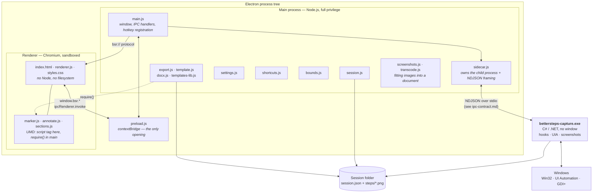

# Engineering Record

The master technical document for Steps Recorder. It sits above the detailed
specifications and links to them rather than repeating them.

- [ipc-contract.md](ipc-contract.md) — the exact message protocol between the
  Electron app and the C# capture engine. Normative.
- [FIELD-GUIDE.md](FIELD-GUIDE.md) — the same system explained for a
  non-programmer. Keep both true.

**Maintenance rule.** Any meaningful change — a design decision, a new module or
dependency, a swap, a rationale that would otherwise survive only in a commit
message — updates this document and the field guide as part of the same work,
before the change is considered done.

---

## 1. What this is

A Windows screen-capture tool that turns a task performed on screen into a
document somebody else can follow. A replacement for the deprecated
`PSR.exe`.

Current state: **v0.1.0**, packaged as an unsigned per-user NSIS installer,
private repository, being handed to a second user for the first time.

---

## 2. System

### Process boundaries and why they are where they are

| Boundary | Reason |
|---|---|
| Electron ↔ C# engine | Chromium cannot install global input hooks, call UI Automation, or capture other applications' windows. The engine exists solely to do what a browser is designed to prevent. |
| Main ↔ renderer | `contextIsolation: true`, `nodeIntegration: false`. The renderer gets a fixed, enumerated API surface via `contextBridge` and nothing else. |
| `bsr://` custom protocol | Screenshots are served to the renderer through a scheme that refuses any path outside the open session directory, rather than exposing `file://`. |

Renderer CSP: `default-src 'none'; img-src bsr: data:; style-src 'self'; script-src 'self'`.

### Transport

One JSON object per line (NDJSON), UTF-8, over the child process's stdio.
`stdout` is protocol; `stderr` is logs and is never parsed. Every message
carries `v`, `type` and `id`; `id` echoes on the response so requests correlate.

Chosen over shared memory or a socket because it is trivially loggable, survives
being read by a human during a failure, and has no partial-state failure mode.

---

## 3. Invariants

These are load-bearing. Breaking one is a defect even if tests pass.

1. **Exclusion beats inclusion.** `ignorePids` is evaluated before `allowPids`,
   so no scope choice can drag the recorder's own windows into a recording.
   Implemented as a pure function (`Scope.cs`) with its own tests rather than a
   condition inside the worker.
2. **Out-of-scope events are discarded before capture**, not captured and
   filtered. A screenshot that we delete afterwards still existed, and so did a
   password held in a buffer until the next flush. Scope is decided when focus
   moves, on the field, before a character is kept or a UIA call is made.
3. **A template is read, never written.** Unrecognised markers are left exactly
   as found and reported.
4. **Naming never blocks capture.** UIA runs off-thread behind a 400 ms
   deadline; a lookup that fails yields an unnamed step, never a lost one.
5. **Password secrecy is a property of the field, not of the buffer**, and
   survives a flush.
6. **Claimed hotkeys are suppressed in the engine**, or the last step of every
   recording is the user pressing stop.
7. **Blur is destructive**, and pre-blur originals are purged when the session
   closes or the undo entry expires.
8. **Excluded steps' screenshots are never copied alongside an export.**
9. **Step metadata is flushed on every mutation.** PSR serialised only at export
   and lost everything on a crash.
10. **The engine's hooks are installed on the thread that pumps messages.** See
    D-9; this is not optional, it is how Windows dispatches hook callbacks.
11. **A capture never fails.** If a window cannot draw itself, the screen is
    copied instead; a step is never lost for want of a screenshot.
12. **Nothing in a `session.json` may name a file outside its own folder.** A
    recording is something people send each other, so its paths are claims.
    Rejected at load and re-checked at every read, write and delete.
13. **A screenshot is exactly the size of the `frame` recorded with its step.**
    The click marker is a percentage of that rectangle, so any mismatch
    misplaces the marker on every step of the guide.
14. **Step numbers run through the whole guide, never restarting at a heading.**
    A reader who says "step 9" must mean the ninth step of the procedure. Every
    format counts rows that are neither notes nor headings, via
    `sections.countSteps`.
15. **A heading that has no name, or nothing under it, never reaches the
    reader.** Applied after exclusion, so holding back a phase's last step
    takes the phase too.
16. **Every edit that can touch more than one step is one undo entry.** Bulk
    delete and replace-all both; twenty presses of Ctrl+Z is not undo.
17. **`textEdited` means a person wrote those words.** Only an explicit claim
    sets it. Inferring it from a mechanical substitution freezes that step's
    tense at export.

---

## 4. Decision changelog

Newest first. Each entry records what was decided, why, and what it replaced.

### D-37 · Autosaving and disk use are shown, not merely true
`(this change)` · [ui/src/renderer/bytes.js](../ui/src/renderer/bytes.js)

Two properties of this application were true and invisible, and a true thing
nobody can see is not a promise - it is a thing they find out later.

**There is no Save button.** Every mutation flushes to disk (invariant 9), and
a `✓ Saved` tick said so - but only while recording. Open an existing
recording and edit it and the bar read "12 steps · C:\...", which is the
moment somebody is most likely to go looking for a Save button and worry when
there isn't one. It now says the same thing in both places, and the screen the
application opens on says it outright.

**Screenshots stack up faster than anybody expects.** Nine real recordings came
to 479 MB, and one of them - a game - was 403 MB of that: 84% of the archive in
a single entry, findable only through Explorer. The landing screen now carries
the folder, the count and the total; every card and every search result carries
its own size. That is what makes the 403 MB one findable.

**Measured, not remembered.** The screenshots are written by the capture engine,
so a stored total would be wrong the moment anything touched them. Walking every
folder took 12ms for nine recordings and 289 files, which is a price worth
paying to never be wrong.

Amber past a gigabyte. Not a warning - the application has no business telling
somebody their own disk is too full - just the point at which they would want
to know without having gone looking.

Two things found while building it:

- `folderBytes` built a path *before* its guard, so a directory entry it could
  not make sense of threw past the caller and dropped that recording from the
  listing entirely. The same class of fault as the folder-name bug in D-24: a
  measurement problem costing somebody a recording.
- And the reason it took two attempts to see any of it on screen: a patch
  script threw on its last edit and, because it writes the file at the end,
  silently discarded the four edits before it. Everything reported as applied
  had been applied to a string that was never saved.

### D-36 · An application is called what Windows calls it
`e15ff4d` · [ui/src/renderer/appname.js](../ui/src/renderer/appname.js)

A recording of Gemini in Chrome listed as **explorer.exe**. Two faults at once.

**It was the first step's application, not the recording's.** A recording almost
always begins by clicking something on the taskbar, so "the first step that
names a process" named the way IN rather than the thing being documented. It is
a tally now, which is what `template.js` had been doing all along - the listing
was simply the one place that never got it.

**And it was a filename.** Windows already knows the good name: every executable
carries a FileDescription, which is where "Google Chrome" and "Windows Explorer"
come from. The engine now reads it per window - cached by process id, because
this runs once per captured step and reading version information means opening
the file on disk - and records it as `window.product`.

Recordings made before that only have the filename, so there is a fallback: a
short list of Windows' own executables whose names are genuinely opaque
(`explorer.exe`, `taskmgr.exe`, `rundll32.exe`), and otherwise the filename
tidied - `chrome.exe` becomes `Chrome`. Deliberately short: a list of every
application anybody might record is a thing to maintain forever and would still
be missing whatever the next person uses. The FileDescription is the general
answer; the list only covers the past.

Applied everywhere a person reads it - the library, search results, the step
list, the per-step line in HTML and Markdown, and `INJECT_TARGET_APP`. Templates
keep `{{process}}` as the filename for anyone who wants it, and gain
`{{application}}` for the readable one.

Found by writing the test for it: `ProductNameOf` read `p.Id` for its cache key
*outside* its own guard, and a `Process` object with nothing behind it throws on
that. It would have been caught by `Describe`'s own catch and cost the process
name as well as the product name.

### D-35 · The archive is searched, not just the open recording
`a2463b9` · [ui/src/main/archive.js](../ui/src/main/archive.js)

A recording is written once and read months later. After forty of them the
question stops being "what does this guide say" and becomes "which of these is
the one where I set up the VPN" - and without an answer to that, an archive is
a pile rather than a record. This is the feature that decides which of the two
the application is.

**The same matcher as the find bar**, unchanged. A search across the archive and
a search inside one recording must never disagree about what matches, so the
literal-not-a-pattern rule and the whole-word behaviour come from `find.js`
rather than being written twice.

**Read on every search rather than indexed.** An index would be faster and would
be wrong the moment a recording is edited outside the application; a few hundred
small JSON files is milliseconds, and being right without having to be
invalidated is worth more than being fast. Revisit only when somebody has enough
recordings for it to be slow.

**A result opens the recording at the matched step.** That is what separates a
search from a filter: finding the recording is half the job, and the other half
is not then scrolling forty steps looking for the line you searched for.

**Ranked by how much a recording matches, then by recency.** Someone searching
an archive wants the recording that is most *about* the thing, and falls back to
the most recent when several are equally about it. Only a few lines come back
per recording, with a true total, because a result is a way in and the recording
itself is one click away.

Two things found by looking at it rather than asserting: a match in a
recording's *name* fell through to the browser's own `<mark>` - a solid yellow
block with black text in the middle of a dark interface, because the highlight
rule was scoped to the snippets. And the heading still read "Recent recordings"
over a list of search results, which is a small lie the eye catches before the
mind does.

Found while building it: `library.js` counted a card's steps with
`action !== 'note'`, so every heading counted as a step and a card promised more
work than the recording held. The invariants suite was supposed to catch exactly
that and named three files by hand, missing this one - it now finds every module
in `ui/src` rather than being told where to look. A check that has to be
remembered is a check that will be forgotten.

Also here: `window_test.js` wrote its preload straight into the system temp
folder. Node resolves a module by walking UP looking for a `package.json`, so an
unrelated program that had dropped a malformed one in there made Electron refuse
to load the preload at all and the page came up with no bridge. The test now
writes into its own directory with its own `package.json` beside it, which stops
the walk at the first step.

### D-34 · Scope is a property of the focused field, decided before anything is kept
`a1f249b` · [capture/TypingState.cs](../capture/TypingState.cs)

Invariant 2 says out-of-scope events are discarded *before* capture, not
captured and filtered. That held for the mouse - `InScope` is checked before any
screenshot or UIA work. It did not hold for the keyboard.

Scope was applied in `EmitKeyStep`, at flush time. Every character typed into
every other application on the desktop was accumulated in `TypingState._buffer`
first and thrown away afterwards. Nothing reached disk, and no step was ever
emitted - but "documenting one system does not capture your mail and chat" is
the promise this feature exists to keep, and holding somebody's password in a
buffer for the length of a flush is not keeping it.

Worse in its own way: `IsPasswordField` and `FocusAcceptsText` were called on
every focus change *anywhere*, so the recorder reached across into applications
the user had explicitly scoped out to ask what kind of field they had focused.

Scope is now decided once when focus moves, alongside secrecy and for the same
reason, and stored on the field. Out of scope: no UIA call, no characters, no
key counts, nothing pending, and not even the fact that a password field was
typed into. `ProcessKey` returns before the switch, so a named key or a chord is
never taken either - the difference between discarding an event and never
taking it.

Proved against the old behaviour: with the guard removed, four of the new
checks in `LogicTests` go red.

Also here, while reading the engine: `ReadCommands` caught only `JsonException`,
so a command that failed for any other reason - a session directory that could
not be created, a disk that filled - killed the process mid-recording, taking
the hooks and any unflushed typing with it. Any failure is now reported as
`COMMAND_FAILED` and the loop keeps listening.

Read and found sound, for the record: the dead-key handling (`ToUnicodeEx` with
the do-not-disturb flag, which is what stops a recording corrupting accented
input in the app being documented), GDI handle discipline in `ScreenCapture`,
double-click folding (three rapid clicks correctly become a pair and a single,
not one endlessly-superseding double), hook callbacks that only enqueue, and the
command parser's per-field `TryGet` discipline.

### D-33 · A recording's own paths are treated as claims, not facts
`bb6dfb4` · [ui/src/main/paths.js](../ui/src/main/paths.js)

A recording is a folder, and the entire point of it is that it can be handed to
somebody else - the README says so. Which means `session.json` is not this
application's data. It is a file that arrived from outside, and every path in
it is an assertion by whoever wrote it.

`Session.load` took `data.steps` verbatim, and `step.screenshot` was joined to
the session directory in seven places. `path.join` resolves `..` cheerfully, so
a recording containing `"screenshot": "../../../secrets.txt"` would have the
application:

- read that file and hand its bytes to the window (`shot:data`),
- serve it over the `bsr:` protocol,
- **replace it** with a blurred or cropped screenshot (`rewriteScreenshot`),
- **copy it** into the recording's trash on the way (`stash`),
- and **delete it** when the step was removed or re-recorded.

Opening a recording somebody sent you and blurring one step is an ordinary
thing to do. Demonstrated rather than argued: with the check reverted, the
hostile-recording test in `session_test.js` deletes the file it planted outside
the recording, and fails by not being able to read it back.

**Rejected at load, and guarded at every file operation.** The reference is
dropped and the step kept - losing a picture is better than refusing to open
the recording, and the step's wording is still worth reading. `screenshotRejected`
marks it rather than blanking it silently.

**`startsWith` is not the check.** The `bsr:` handler already tried to confine
itself and got this wrong: `C:\Recordings\session-10` starts with
`C:\Recordings\session-1`, so every sibling recording passed. `path.relative`
is the check - it answers "how would I get from here to there", and any answer
that begins by climbing is outside.

This is defence in depth for the renderer, which runs only our code under
`script-src 'self'`. It is not defence in depth for a shared recording, which
is a real input from a real stranger.

### D-32 · A crop cuts the frame as well as the picture
`aa181e2` · [ui/src/renderer/crop.js](../ui/src/renderer/crop.js)

A screenshot framed by the monitor, or of a maximised window, is mostly not the
thing being pointed at. Cropping is the difference between a guide whose
pictures a reader can follow and one where every step is a full desktop with a
small ring somewhere in it.

The pixels were never the hard part. **The click marker is stored as a
percentage of the step's `frame`** (invariant 12), so cutting the image without
cutting the frame by the same proportion moves the marker off what it points
at - on every export, silently, with nothing on screen to show it happened.
`frameAfter()` scales the frame by the crop, in the frame's own coordinates
rather than the image's, so a 4K capture of a window measured in logical pixels
scales instead of shifting. The percentage then resolves to the same place in
the world, and the screenshot is still exactly the size of its frame.

**A crop that cuts the click out is legitimate** - trimming to a panel the
click was not in - but it must never be a surprise, so it is asked about before
it happens rather than discovered in a finished document. `markerPosition`
already returns null for a click outside the frame, so nothing further is
needed to make the marker disappear correctly.

**Undo restores both.** A `crop` entry carries the stashed image and the
previous frame; putting one back without the other is the one thing this must
never leave behind. Writing the pixels is now `rewriteScreenshot()`, shared
with redaction, which had the only copy of the write-beside-and-rename dance.

**The compliance summary says so.** A cropped picture is not the frame that was
captured, and a reader comparing the document to the live system should be told.
That is the same honesty as not overclaiming a redaction (`79f85b5`), pointing
the other way.

Verified by cropping a real screenshot and marking it: 27.4%, 60.2% became
17.8%, 64.6% after trimming 15% off each edge, which is what the arithmetic
predicts - and the ring landed on the same element in both pictures.

### D-31 · Word gets the marker drawn into the pixels
`88c5f6e` · [ui/src/main/composite.js](../ui/src/main/composite.js)

HTML and PDF lay the click marker over the picture in CSS, which is why it is
free and restyleable. Word cannot: it embeds a picture and has no way to put
anything on top of it. So in the format most likely to reach a company, the
single most important thing on a screenshot - where to click - was absent.

The only way in is to burn it into the pixels, which needs something that can
draw. There is no image library here and a native one would cost the "no build
tools, one file" install, so the drawing is done by the renderer already
present: a hidden window with a canvas.

**The geometry is the same geometry.** `marker.svg()` is derived from the same
`plan()` the window and the HTML export use, scaled against the image's own
width. A second implementation of "a 34px ring" is precisely how the Word export
would start quietly disagreeing with the guide beside it - which is the reason
[marker.js](../ui/src/renderer/marker.js) exists at all (D-21).

**It arrives by the route the re-encoder already uses.** The composited buffers
go into the same `images` map `screenshots.prepare` fills, so from `docx.js`'s
side a marked screenshot and a shrunk one are indistinguishable. Marking happens
*after* shrinking, so the marker is drawn at the size the reader will see rather
than being resampled away.

**It can never cost somebody their export.** A screenshot that cannot be drawn
keeps whatever it had; if the window itself cannot be opened, every screenshot
goes in unmarked and the document is still produced. A missing marker is a worse
document. A thrown error is no document.

Two things found by running it rather than reasoning about it:

- **The second export failed.** Creating a window, destroying it and creating
  another leaves the second `loadURL` returning ERR_FAILED forever, so a person
  who exported to Word twice in one sitting got a marked document and then a
  failure. One window is now kept for the life of the application.
- **Which then would have stopped the application quitting.** Electron counts
  that hidden window, so `window-all-closed` would never fire and closing the
  app would leave an invisible process running. It is disposed with the main
  window.

Verified at the pixel: the ring is the marker's red where the ring belongs, the
middle of it is still the screenshot, and both hold after the bytes have been
through `docx.render` into `word/media/`. Then looked at, on two real
screenshots, because a ring in the wrong place passes every colour test.

### D-30 · A replacement is not authorship, and it is one undo
`69fb39c` · [ui/src/renderer/find.js](../ui/src/renderer/find.js)

A guide is written once and read for years. The system it documents gets
renamed, a team changes, a button's label changes - and without find-and-replace
the choice is retyping forty steps or letting the guide go stale, which in
practice means stale.

Two things had to be true before it was safe to add, and neither was.

**Nothing in the undo history covered text.** The stack held `delete`,
`deleteMany` and `redact` only, so every text edit in the application was
already irreversible - unnoticed while edits were one step at a time, fatal the
moment one action could rewrite forty. There is now a `retext` entry holding
the previous wording of every row it touched, pushed as **one** entry: replacing
a term across forty steps and pressing Ctrl+Z forty times is not undo, the same
bargain `deleteMany` makes.

**`updateStep` claimed authorship of any text it was given.** Setting
`textEdited` is right when a person rewrites a step - export must then leave
their words alone. It is wrong for a mechanical substitution inside a sentence
the engine wrote: it would stop the export rewriting "Clicked" into "Click", so
renaming a button would silently put those steps, and only those steps, into
the past tense. The flag is now only inferred when the caller does not say, and
replace passes the row's existing value through.

**The query is a literal string, not a pattern.** Everything a person searches
for in a procedure - `(draft)`, `step 1.`, `C:\Users`, `a+b` - is made of regex
syntax. Unescaped, `(` throws and `.` matches every character in the recording.
Whole-word uses lookarounds rather than `\b`, which anchors to a word character
and so matches nothing at all for a query starting with punctuation.

**Notes and headings are searched too.** A reader sees them; a rename that
skipped them would leave the guide contradicting itself.

The count shown is occurrences *and* rows, because "Replace all" against a
number that only counts rows is a guess. A replacement that changes nothing is
refused rather than filling the undo history with a no-op - though a case-only
change does count as a change.

Three things the window test caught that no unit test could:

- The stub returned `null` for `shotData`, so every completed drag hit
  `alert('Could not read the screenshot.')` - a modal that never resolves in a
  hidden window. The test had never reached the marking path at all, and now
  serves a real PNG at a real size ([tests/png-fixture.js](../tests/png-fixture.js)),
  because every ratio in that code is degenerate against a 1x1 placeholder.
  `window.alert` is now recorded rather than raised, and "nothing gave up and
  raised a dialog" is an assertion.
- The test window was sandboxed where the application's is not, so its preload
  could not `require` anything. Matching the app made it more faithful, not
  less.
- In a sidebar this narrow the find bar's two text fields came out about two
  characters wide. It is two rows now. Only the screenshot showed it.

### D-29 · The window is driven in a test, not only reasoned about
`ca9e946` · [tests/window_test.js](../tests/window_test.js)

The drag preview shipped broken twice and nothing caught it. `previewDrag` was
called as `previewDrag(dragStart, { x, y })` from a scope where `x` and `y` do
not exist - a ReferenceError on every mousedown, which killed the rest of the
handler, so **no tool previewed anything**: not the circle the user reported,
not the arrow, not even the rubber band a box and a blur have always had. Every
unit test passed, because none of them runs a handler. `renderer_wiring_test`
passed, because every element and channel it checks does exist.

Under it sat a second one that only a rendered page could show. The overlay is
an `<svg>`, and `.hidden` belongs to `HTMLElement` - so
`el.dragPreview.hidden = false` defined a plain JavaScript property, left the
`hidden` attribute the stylesheet matches on exactly where it was, and read
back as `false` as though it had worked. A DOM assertion written against
`.hidden` was fooled the same way the code was; only the screenshot showed it.
Visibility is now toggled with `toggleAttribute`, and the overlay carries an
explicit size, because an `<svg>` with `width: auto` takes its intrinsic size
rather than filling its box.

So there is now a tier between the pure units and the hand check: the real
`index.html`, `renderer.js` and stylesheet in a real Electron window, with the
bridge stubbed by a preload built from the **real preload's own method names**,
so the stub cannot drift from the surface the page has. Mouse events are
dispatched into the page; nothing is synthesized at the operating system, which
is what made the retired `ui_drive.py` tier unrunnable on a machine in use.

The test was checked against the broken code before being kept: 13 of its 19
checks fail there, and it names the ReferenceError. A test that cannot fail is
not evidence.

Two smaller things it forced, both worth keeping:

- **It must not be able to hang.** Electron shows a modal dialog for an
  uncaught main-process error, and on a hidden window that dialog is invisible
  and waits forever - which it did, four times, until the processes were killed
  by hand. There is a watchdog.
- **The page's own CSP applies.** Sizing the placeholder screenshot with an
  injected `<style>` is refused by `style-src 'self'`; it goes through the
  CSSOM instead. A test that worked around the policy would not be testing this
  page.

### D-28 · A heading is a row, not a property of the step below it
`b720b0d` · [ui/src/renderer/sections.js](../ui/src/renderer/sections.js)

Every SOP format we support has section headings, and nothing in a recording
could produce one. The ISO template ships with "5.1 Phase One" in it and the
engine had no way to fill that shape: a forty-click procedure came out as forty
flat steps, and the reader had to infer where one phase of work ended.

**A heading is a note with a rank.** `action: 'section'`, authored text, no
screenshot, no number - the same shape `addNote` already produced. As a row it
inherits insert-after-selection, drag to reorder, delete, exclude, rename and
"authored text is never rewritten by export" from machinery that already
existed and is already tested.

The alternative was `step.heading = 'Preparation'` on the first step of a
phase. Rejected: the heading would die with the step that carried it, and a
step is deleted or re-recorded precisely when its screenshot was wrong - which
is not a reason to lose the phase it began. It would also need new controls on
every step row instead of one new kind of row.

**Numbering runs through the phases, not restarting in each.** A guide with
four sections numbered 1-3 apiece has four step 3s, and "I am stuck on step 3"
stops meaning anything. `countSteps` counts rows that are neither notes nor
headings, in every format.

**One level.** The number of sections is whatever a procedure needs, but they
do not nest: an ISO template gets its 5.1/5.2 hierarchy from its own structure,
and a second hierarchy from us would fight it. `level: 1` is written to disk so
nesting can arrive later without a migration, and is not surfaced.

**A heading that would say nothing is dropped at export.** `withoutEmpty()`
runs after the exclusion filter, so a phase whose every step was held back goes
with them - a heading over nothing is a promise the document does not keep, and
the reader hunts for the part that was cut. An unnamed one goes the same way: a
heading *is* its text, and one with none renders as a rule with a gap, which
reads as a defect rather than a section. It stays in the step list saying it
will not appear, because that is an unfinished edit and not ours to tidy away.

**Boundaries are suggested, never applied.** `suggestions()` marks the points
where the recording changed application - usually, not always, where the work
changed phase - and offers a heading there. Accepting or dismissing one
silences it; a dismissal is `noSection` on the step, so it survives a reload.
Sectioning is an authoring judgement and the tool only knows which program
changed.

Accepting inserts an **unnamed** heading. The first cut named it after the
application and selected the text for overtyping; that is a name for a program,
not for a piece of work, and offering it as a default invites it to survive
into a guide. The empty row asks the question instead of answering it wrongly.

**Markdown demotes its steps when a guide has headings**, so a wiki's contents
list shows phases with steps beneath rather than forty flat entries. A guide
with no headings is byte-identical to before.

**`{{text_block}}` for the template engine**, in the same spirit as
`image_block` (D-7): a loop body is one string for every row and the engine has
no conditionals, so without it a heading rendered as another bold line of body
text - the one thing a heading must not be. `{{checkbox}}` is the same idea for
checklist templates, empty on a written row so nobody is asked to tick off a
phase name. The Word template branches on `isSection` with `{{IF}}`, which
docx-templates does support, and takes a Heading3 style added for it.

Two things worth recording about the work rather than the design:

- The step description is now computed once per row. `describe` is a window
  tracker that advances on every call, so `text_block` asking it a second time
  would have given two different strings for one step - D-26's condensation
  silently applied twice.
- Notes deliberately keep the emphasis they have always had in templates. The
  first cut of `text_block` restyled them in passing; a test asserting the old
  output caught it. Changing how notes look was not what anybody asked for.

### D-27 · Marks are burned into the image, and are not redactions
`f02cba4` · [ui/src/renderer/annotate.js](../ui/src/renderer/annotate.js)

A recorder can say where the click landed. It cannot say "this is the field
that matters" - that is the author's knowledge, and without a way to add it
every screenshot is a flat picture of a screen. Box, arrow and highlight now
share the machinery blur already had: arming, drag selection, the mapping from
displayed pixels to image pixels, the write-back, and the undo stash.

**Burned in, not stored beside.** Annotations held as data would stay editable,
but Word embeds the picture and cannot layer anything over it - the click marker
is already missing there for exactly this reason (D-23's debt). A mark held as
data would be absent from the format most likely to reach a company. Burning it
in costs the ability to restyle, which is why the original is stashed for undo.

**An annotation is not a redaction.** `redacted` feeds the compliance summary -
"N screenshot(s) had regions blurred by the author" - so an arrow filed as one
would claim a privacy act that never happened, the overclaiming `79f85b5`
exists to prevent. Annotations set `annotated` instead, and undo restores both.

Two things the geometry tests could not have caught, both found by looking at
the rendered picture:

- **The highlight was invisible.** `multiply` is how a highlighter behaves on
  paper - it darkens - so yellow over a dark interface came out as nothing at
  all, on exactly the screenshots this tool is most often pointed at. It is now
  a translucent wash with an outline, which reads on either ground.
- Stroke width scales with the image diagonal. A fixed width vanishes on a 4K
  screenshot and swamps a small dialog.

### D-26 · The window is named once, at render time
`(this change)` · `windowTracker()` in [ui/src/main/export.js](../ui/src/main/export.js)

92% of steps ended `in "<window title>"`, and in one recording that clause was
**69% of all the description text** - the same 60 characters, 103 times.

**Not fixed in the engine.** Every recorded step has to be true on its own:
steps can be reordered, excluded and re-recorded individually, so a step meaning
"the window mentioned two steps ago" would break silently the moment anything
moved. The record keeps the full title; the *document* drops it.

So the condensing happens at render, where the final order and the final set of
included steps are both known. The title is written when it changes and omitted
when it has not. A note carries no window and neither states nor clears one, so
it does not make the following step repeat itself; a title quoted mid-sentence
is part of what was clicked and is left alone.

Found while measuring it: HTML and Markdown also printed the window title as a
caption under **every** step, so condensing the description alone took one
recording from 104 mentions to 2, not to 1. The caption now carries the process
name only - the description names the window at exactly the points the caption
appears, so the two had been saying the same thing on the same line.

Measured on real recordings: description text down 79% and 45%.

### D-25 · Keys are transcribed only where text is entered
`(this change)` · [capture/UiaResolver.cs](../capture/UiaResolver.cs),
[capture/TypingState.cs](../capture/TypingState.cs)

In a 106 step recording of Rocket League, **42 steps read `Typed "wddad"`**. The
only characters across all of them were `a d e q s w` - W A S D driving a car,
transcribed as prose. Two fifths of the document was noise.

The discriminator is **where the keys are going**, not which application is
running. A game is a legitimate thing to document, and a CAD tool's navigation
keys are indistinguishable from a game's; filtering by process would break the
Minecraft-tutorial and point-cloud cases while fixing nothing in principle.

So the focused control is asked whether it accepts text - `ControlType.Edit`,
`Document`, `ComboBox`, `Spinner`, or a writable `ValuePattern`/`TextPattern`.
Where it does, typing is transcribed as before. Where it does not, the keys are
counted and named instead: `Pressed A, D, W (6 times)`. Which keys and how many
is the useful part; the order is not.

**Fails open**, like the password check and for the same reason: when UI
Automation cannot answer, transcribing is the existing behaviour, whereas
summarising would silently discard someone's typing. It costs one extra UIA
call, made at the moment focus changes, where the password check already runs.

Merging consecutive key steps was considered and rejected on the evidence: in
that recording the pattern is `CKCKCKCK` with a longest run of one. Every burst
sits between two clicks, so there is nothing to merge.

### D-24 · A folder is a recording because of what is in it
`(this change)` · [ui/src/main/library.js](../ui/src/main/library.js)

Recordings are created in folders named `session-<timestamp>`, so that two can
never collide and renaming one inside the app never moves files underneath an
open session (`9a0120d`). The library listing then also *required* that prefix.

So renaming a folder - the obvious thing to do with a folder called
`session-2026-09-05T20-19-13-795Z` - removed the recording from the application
entirely, while 404MB of it sat untouched on disk. It was reported as "the
Rocket League demo was renamed RL", and the folder was found only by listing the
directory without the prefix filter.

The prefix was never the test. A readable `session.json` is what makes a folder
a recording; the folder's own name belongs to the person whose disk it is. The
listing now says so, and falls back to the folder name when a recording has no
label of its own, so nothing ever lists as blank.

### D-23 · The stock Word template declares the namespaces a picture needs
`(this change)` · [scripts/make-docx-template.js](../scripts/make-docx-template.js)

Every Word export containing a screenshot was invalid and could not be opened.
Word reported only "Word experienced an error trying to open the file", naming
nothing.

A `.docx` is XML. The stock template declared `w:` and `r:` and no more, which
is correct for what the template contains - paragraphs. But an inserted picture
arrives as drawing XML using `a:`, `pic:`, `wp:` and `a14:`, and a prefix that
is used without being declared makes the whole document malformed. The template
was valid; every export made from it was not.

Only our own generated template was affected. A `.docx` authored in Word
declares the full set already, so a user's own template never hit this.

**The verification was the real failure.** Two separate checks had passed this
file: one confirmed a valid zip containing 104 images, the other that the
document contained no leftover placeholders. A broken export satisfies both. The
suite now parses the document and asserts that every prefix used is declared -
and it was confirmed to fail against the previous template, naming all four
missing prefixes, rather than merely passing against the new one.

### D-22 · Every export honours what the recording was for
`(this change)`

`62cd413` decided that a procedure is written as instructions and an evidence
record stays in the past tense, and made the app ask before recording starts.
Three export formats honoured that. The fourth - templates, including Word -
did not, so the format most likely to reach a company read as a report of what
one person once did.

`template.js` accepted a `voice`, threaded it down to the function building each
step, and that function never read it. `main.js` passed none anyway, and
`docx.js` had no notion of voice at all.

The reason it survived is worth more than the fix: **the test fixtures were
worded imperatively already** - "Click the New User button" - while the engine
records "Clicked the New User button". The transform was a no-op on the test
data in either direction, so the suites watched a template export ignore the
voice entirely and reported nothing wrong. Fixtures now use the engine's own
wording, and the evidence-record direction is asserted as well as the procedure
one, since only checking the default would have passed throughout.

### D-21 · The click indicator is configurable, and defined in one place
`(this change)` · [ui/src/renderer/marker.js](../ui/src/renderer/marker.js)

Feedback was that the red ring confuses readers. It reads either as an error, or
as part of the application being documented rather than an annotation on it. An
arrow does not: it comes from outside the interface and points inward, which is
unambiguously a note about the picture.

Settings now offers **circle or arrow**, each optionally **bolder**. Circle stays
the default; nothing changes for existing guides unless it is asked for.

**One definition, used by both.** The preview in the window and the exported
document had separate copies of the same 34px circle, in `styles.css` and in the
exporter's inline CSS. That is how a preview starts quietly disagreeing with
what it is previewing. The shape, its geometry and its stylesheet now live in one
module, loaded as a plain script by the renderer and required by the exporter.

**The arrow flips to stay inside the picture.** Its tip is the click point and
its tail runs up-left by default, which is the natural reading direction; within
28% of the top or left edge there is no room for the tail, so that axis flips.
Markers are also clipped to the image, because a small screenshot is shorter
than an arrow is long and a marker hanging outside the picture reads as a fault.

Two defects found while building it, both invisible to the tests that existed:

- **The arrowhead was a straight line.** Both barbs were offset along the
  shaft's own diagonal rather than perpendicular to it, so all three points were
  collinear and the head enclosed no area. Every string-matching assertion
  passed. There is now a test that computes the triangle's area.
- Markers escaped the image on short screenshots, which is what prompted the
  clipping above.

### D-20 · A build is identified by version, commit and build time
`(this change)` · [ui/src/main/build-info.js](../ui/src/main/build-info.js),
[scripts/stamp-build.js](../scripts/stamp-build.js)

The application could not say which build it was. Two installers that behaved
quite differently - one of which put the recording strip into every screenshot -
were distinguishable only by comparing file timestamps on disk by hand.

**The version number does not answer it.** It sat at `0.1.0` across every commit
in a day, so an About box reading "0.1.0" would have been no help at all. The
identity is the three together, and the commit carries a trailing `+` when the
tree was dirty, because the commit alone does not then describe what was built.

**The engine is reported separately** because the two halves compile
independently and drift. A rebuilt interface talking to a stale engine looks
exactly like a fix that did not work.

Staleness compares the engine to **its own source**, not to the app. The obvious
check - is the engine older than the app? - is wrong twice over: in a package
the two ship together inside one installer, and `dotnet publish` rightly skips a
rebuild when nothing changed, so a perfectly current engine keeps an older
timestamp than the packaging run around it. Written the obvious way, the freshly
built installer accused itself of shipping a stale engine, in red, on first
open. The case actually worth catching only exists in a source tree: the C# was
edited and not rebuilt.

Settings shows the label, the version and the commit, and nothing else. The
build time and the engine's were shown at first and were noise beside a hash
that already identifies the build uniquely; the engine is now mentioned only
when it has something wrong to report, so silence there means agreement. The
full line including timestamps goes to the log at startup - in plain ASCII,
since a log is opened with whatever tool is to hand and a middot written as
UTF-8 returns as mojibake in anything assuming the system codepage.

The red warning says "capture engine needs rebuilding" rather than naming what
was compared: since the check became the engine against its own source, the app
being newer is no longer the point.

The stamp is generated at build time and gitignored: it describes a build, not a
source tree. Without one the app asks git directly and reports `development`
rather than claiming to be a release.

### D-19 · A framed window is asked to draw itself, not copied off the screen
`(this change)` · [capture/ScreenCapture.cs](../capture/ScreenCapture.cs)

The recording strip was appearing inside the screenshots. `CopyFromScreen` takes
whatever is physically in the rectangle, and the strip is always-on-top, so it
sat in the corner of the screenshots of the very procedure being documented — a
reader sees Pause and Stop buttons that are not part of the software the guide
is about. `ignorePids` does not help: it filters *events*, so a click on the
recorder is not recorded as a step, but it has nothing to say about pixels.

`PrintWindow` with **`PW_RENDERFULLCONTENT`** renders only that window's own
content, so everything overlapping it is excluded by construction — our strip,
notification toasts, another application's tooltips alike. The flag matters: the
previous comment in this file recorded that PrintWindow returns black for
GPU-composited applications, and it does, *without* it. Measured on Chrome:
flag 0 gives 0% non-black, flag 2 gives a complete render.

Two alternatives were measured and rejected:

- **`setContentProtection(true)`** — Windows applies `WDA_MONITOR`, which draws
  the window as a **solid black rectangle** in captures rather than omitting it.
  A black box over the documented application is barely an improvement.
- **`SetWindowDisplayAffinity(WDA_EXCLUDEFROMCAPTURE)` from the engine** — fails
  with `ERROR_ACCESS_DENIED` (5). The call must come from the process owning the
  window, and Electron does not expose that flag.

**Best-effort, with the screen copy as the floor.** Some windows report success
and draw nothing, so the result is sampled and the screen copy used when it
comes back blank. A read-only sweep of every visible window on the development
machine: Settings/UWP 92%, Explorer 100%, Notepad 100%, Chrome, Electron and
Spotify all rendering; NVIDIA's overlay and the Windows Input Experience blank
and falling back. Those two are overlays nobody documents a procedure against,
and they degrade rather than producing a black screenshot.

**Monitor and full-screen framing are unchanged and still show the strip**,
because there is no single window to ask. Documented under debt below.

Image dimensions are unchanged: `PrintWindow` draws the whole window rect,
including the invisible resize border, and the result is cropped back to the DWM
frame so it matches what copying the screen produced. Verified — the click
marker is positioned as a percentage of the recorded frame, so a size mismatch
would silently misplace it on every step.

### D-18 · The capture format is advised on, never changed automatically
`(this change)` · `advise()` in [ui/src/main/screenshots.js](../ui/src/main/screenshots.js)

D-17 copes with an oversized recording at export time. This is the same problem
addressed one step earlier: a recording of photographic content pays about 85MB
per minute for PNG, and the Settings toggle that would fix it is one nobody
would think to look for.

**The format is not switched automatically.** Changing it part way through
alters the record without asking, which for an evidence recording is exactly
the wrong thing to do; and the moment it would have to happen — mid-recording —
is the moment the user is inside the application they are documenting, with this
window shrunk to a strip. So the app says something once, after the recording
has stopped, in a dismissible strip rather than a dialog. Consistent with
`20fe21c`, which removed a modal for the same reason: a routine outcome must not
freeze the window.

**Judged on the average, not the total.** A long recording of ordinary windows
is large without anything being wrong; a short recording of video is small and
still badly served by PNG. Above about 2MB per screenshot the subject is
photographic or 3D — a text-heavy window does not reach that even at 4K.
Verified against both real recordings on this machine: the game recording
(3.89MB average) is flagged, an Explorer recording (0.49MB average, 14MB total)
is not.

Silent when the format is already JPEG, when there are fewer than five
screenshots to judge from, or when the whole recording is under 100MB.

### D-17 · Screenshots are re-encoded when a document cannot hold them
`(this change)` · [ui/src/main/screenshots.js](../ui/src/main/screenshots.js),
[ui/src/main/transcode.js](../ui/src/main/transcode.js)

A 106 step recording of Rocket League is **412MB of PNG**. Base64 inflates that
to 550MB, V8's maximum string length is 536,870,888 characters (512MB), and
`buildHtml` builds one string — so the HTML export threw `RangeError: Invalid
string length` and wrote nothing at all. The Word exporter would have put the
same bytes into a zip.

PNG is the right default and stays the default: the usual subject is an
application window full of text, where PNG is crisp *and* small. It is exactly
wrong for photographic or 3D content, where it faithfully stores every pixel of
noise — 4.5MB for a single game frame that is 214KB as a JPEG nobody can
distinguish.

So the rule is **embed the originals while they fit, re-encode when they do
not**, and never touch the files on disk: the recording is the record, the
re-encode is only the copy going into the document. Measured on the recording
that failed: 408MB → 22MB, a 29MB HTML with all 105 images embedded, 4 seconds.

Three states rather than two, because re-encoding is not always enough — a
recording of several thousand frames still cannot be one string. Then the images
are written beside the document and referenced relatively, and the user is told
the file is no longer self-contained. **The export never simply fails.**

The decision (`screenshots.js`) is kept apart from the encoder
(`transcode.js`) so the policy is testable with plain node, while the half that
genuinely needs Electron's image decoder stays behind an injected function.

### D-16 · Window geometry is fitted to the display the window is on
`a31207f` · [ui/src/main/bounds.js](../ui/src/main/bounds.js)

`defaultBounds()` sizes from the *primary* display. A window that opens or is
moved elsewhere can exceed that display's work area, and the edge that leaves
the screen is the bottom one — which is the status bar.

The genuine failure this guards is the minimum size: `MIN_SIZE` is 940×600
points, but a 1366×768 laptop at 125% scaling has roughly 1092×566 points of
work area. Windows honours a minimum size, so the window would be held taller
than the screen and the status bar pushed behind the taskbar. **On a display
that small the minimum is relaxed rather than the status bar sacrificed.**

Extracted as pure arithmetic on plain objects so the awkward cases — second
monitor, monitor unplugged mid-session, display smaller than the minimum — are
testable without a screen. 19 tests.

> Not the cause of a reported missing status bar: that window was on a second
> monitor and the screenshot was misleading. Measured in the DOM, the status bar
> was fully visible throughout. Kept because the small-display case is real.

### D-15 · Global shortcuts are rebindable, and conversion lives in one module
`a31207f` · [ui/src/main/shortcuts.js](../ui/src/main/shortcuts.js)

A chord that is free on one machine is taken on another, and a collision
previously left a shortcut that silently did nothing.

A hotkey must exist in three forms simultaneously — the Electron accelerator
(`Control+Shift+F9`), the engine's chord label (`Ctrl+Shift+F9`), and the
keycaps the user reads. A rebind that reaches registration but not the engine
produces a recording whose final step is the user pressing stop, so the
conversions are owned by one module and cannot drift.

Bindings that would swallow ordinary typing machine-wide are rejected: a bare
letter is refused, a function key alone is allowed. Duplicate pause/stop is
refused. A chord that fails to register is reported in the dialog as *in use
elsewhere* rather than left looking bound.

### D-14 · Visual hierarchy over uniform chrome
`a31207f`

Feedback was that the app was not ready to hand to somebody else, and the
substance was hierarchy: every toolbar control carried equal weight. Toolbar
split into two groups with a divider (what a recording does / what you do with
one afterwards); four surface tokens replace two so panels are distinguishable
without borders doing the work; disabled buttons drop background and border
rather than dimming text, so *unavailable* reads as a state rather than as low
contrast.

> **Rejected from the same feedback:** a claim that body text failed WCAG AA.
> Measured, the muted text is 6.3:1 against its background — AA requires 4.5:1 —
> and disabled controls are exempt from contrast minimums. Changing it would
> have been change without improvement. Measure the claim before acting on it.

### D-13 · Documents resolved through the Known Folder API
`b515e01` · [ui/src/main/settings.js](../ui/src/main/settings.js)

The default save root was `os.homedir() + "Documents"`. Windows redirects
Documents when OneDrive's Known Folder Move is enabled — very common on personal
machines — and `%USERPROFILE%\Documents` may then not exist at all. First
recordings would land somewhere the user never looks, or fail the writability
check. Now `app.getPath('documents')`, injected into `Settings` so it stays
testable.

### D-12 · Product identity is the author's own
`eb33468`

`author` and `build.appId` carried a third party's name, taken off a URL as
placeholder branding and never corrected. `appId` ships inside the installer as
the application's identity on the machine. Corrected before any install existed;
afterwards it would have stranded upgrades.

### D-11 · Purpose is chosen before recording, not at export
`62cd413`

Pressing record asks what is being made, and the answer changes the work rather
than labelling it:

| Purpose | Voice | Template |
|---|---|---|
| Procedure | imperative | SOP template |
| Training guide | imperative | none |
| Evidence record | **past tense** | none |

An evidence record states what was done; rewriting *Clicked the Save button*
into *Click Save* would misrepresent the document. Deciding this at export would
mean the decision is made by whoever exports, not by whoever recorded.

Templates are chosen here too. A template picked for a recording beats the one
in Settings, because it was picked for *that* recording.

### D-10 · Rot detection by indexed tree walk
`20fe21c` · [capture/Verifier.cs](../capture/Verifier.cs)

Steps already carry automation id, control type and name, which is enough to ask
a running application whether those controls still exist.

The tree is walked **once per window and indexed**, not searched per step: a
descendant search across a large application takes seconds, so a forty-step
guide would take minutes and look like a hang. Capped at 6000 elements and 20
seconds, on its own thread so it cannot stall stop or pause.

Statuses are kept honest and distinct — *not running* is not *fine*, and a walk
that hit its cap reports **inconclusive**, because failing to find something is
not proof it is gone. Results are timestamped: "missing when checked" is a
different claim from "wrong".

Proven against a real version change: the test application takes `--v2` to
rename one control, and a guide recorded against v1 flags exactly that step.

### D-9 · Hooks are installed on the message-pumping thread
`90402cc` · [capture/Program.cs](../capture/Program.cs)

**The most instructive bug in the project.** A low-level hook's callbacks are
dispatched to the message queue of the thread that *installed* it, and that
thread must pump messages. The keyboard hook was installed on demand from the
stdin reader, which never pumps — so it reported success, logged "keyboard
capture on", and never fired once. The mouse hook worked only by accident of
living on the main thread.

Installation is now posted to the pumping thread via `WM_APP+1` / `WM_APP+2`.

> This could not have been found from logs — every line said the feature was on.
> It is the origin of the project's rule that features are verified by running
> them, not by reading their output.

### D-8 · Word templates via `docx-templates`, not string surgery
`3810d4f` · [ui/src/main/docx.js](../ui/src/main/docx.js)

Regulated industries do not run on Markdown; their SOPs are `.docx` with a
controlled letterhead, revision table and signature block.

Word cannot hold an HTML comment, so `.docx` templates use typed placeholders
(`{{title}}`, `{{FOR s IN steps}}`, `{{IMAGE shot($s)}}`). Word habitually
splits typed text across runs — a spell-check mark is enough — so the
placeholder may not exist as contiguous text. **Naive `.docx` filling works on a
file generated by a script and fails on the real template somebody has edited,
which is the only kind that matters here.** Hence a library (MIT licensed) that
normalises runs.

Screenshots are embedded sized from intrinsic dimensions so they are not
stretched; a missing screenshot is reported and omitted rather than aborting the
export.

### D-7 · Template loop bodies are the row template
`79f85b5` · [ui/src/main/template.js](../ui/src/main/template.js)

Two corrections to the format as originally proposed, both material:

- The proposal had only prose between `START_STEPS` and `END_STEPS`, which means
  the engine invents step formatting — and step formatting is precisely what a
  corporate template exists to control. The block between markers **is** the row
  template. A block with no placeholders falls back to a built-in row, and the
  report says so, because that is a warning sign rather than a success.
- The proposed compliance section asserted that PII "has been stripped or hashed
  by the ingestion agent". This tool suppresses password fields and masks card
  and SSN shapes; blur is the author's own doing. **Emitting a blanket assurance
  the tool cannot back is worse than emitting nothing**, so
  `INJECT_REDACTION_SUMMARY` states what actually happened to that recording,
  including how many steps were withheld.

HTML comments retained for top-level hooks: the template stays a valid, readable
document in Word or a wiki before injection.

### D-6 · Static wiring test for the renderer
`4599036` · [tests/renderer_wiring_test.js](../tests/renderer_wiring_test.js)

Checks that every element the renderer resolves exists in the markup, every
`el.*` reference was captured, every bridge call is exposed by preload, and
every `invoke` channel has a handler in main.

A typo in any of those blanks the window at load — a failure mode no logic test
reaches and, without driving the UI, one that surfaces in front of a user. It
found a shadowed `el` on its first run.

### D-5 · Capture frame is configurable; steps record what was framed
`4599036`

Framing the clicked window is the right default — it crops noise and keeps files
small — but it is wrong for clicks with no window (desktop, taskbar, tray, where
the old code fell back to a blind 800×600 box), for actions spanning two
windows, and whenever surrounding context is the point. Settings offers window,
monitor or all displays.

Steps carry the region actually captured as `frame`, and both the detail view
and the exporter position the click marker against that. Without it, a
monitor-framed screenshot puts the marker in entirely the wrong place.

### D-4 · Scope by process, and the engine enumerates windows
`88ea168` · [capture/Scope.cs](../capture/Scope.cs)

Scope is by **process**, not window: dialogs and child windows of the same
application must stay in scope or half a recording silently vanishes.

The engine answers `listWindows` because Electron cannot see other
applications' windows. Cloaked windows are filtered — every UWP app keeps
invisible ghosts and without that the picker is mostly junk.

### D-3 · Export embeds images; PDF reuses the HTML layout
`11d9171` · [ui/src/main/export.js](../ui/src/main/export.js)

HTML embeds images so an export is a single portable file rather than a document
that breaks the moment it is emailed alone. PDF renders the same HTML offscreen
and prints it, so there is one layout to maintain. Markdown writes relative
paths into a sibling folder, for a wiki or docs directory.

The click marker is positioned as a percentage of the screenshot so it holds at
any width, and omitted when the point falls outside the captured frame.

### D-2 · Blur is destructive, pixelate-then-blur
`11d9171`

An overlay that merely covers pixels leaves the data in the session folder, and
a "redacted" guide whose sources still contain the data is worse than none.
Pixelate **then** blur, because blur alone can leave enough structure to read
short text back; downsampling actually discards it.

Editing loads the screenshot as a data URL, since a canvas painted from the
`bsr://` scheme is tainted and cannot be read back.

### D-1 · Two processes, NDJSON over stdio
`5b9116e`, `8bbb5ca` · [ipc-contract.md](ipc-contract.md)

The founding decision. See §2.

---

## 5. Notable defects, and what they taught

Kept because each changed how the project is built, not merely what it contains.

| Defect | Root cause | Rule it produced |
|---|---|---|
| Keyboard capture never fired (`90402cc`) | Hook installed on a non-pumping thread | Verify features by running them; logs lied |
| Passwords leaked after a typing flush (`f01bd63`) | Secrecy stored with the buffer, cleared on flush | Secrecy belongs to the field and survives flushes |
| Field contents leaked via UIA `Name` (`0f1da69`) | Some controls report contents as their name | Compare name against value; drop when they track |
| App froze after any blur (`0d42f74`) | `.arming { position: fixed; inset: 0 }` collided with a class the blur tool set on the screenshot wrapper — a full-screen overlay over the toolbar | Proven with `elementFromPoint`; scope overlay rules to an id |
| Blur looked broken (`f01bd63`) | Redaction rewrites in place; only the `#` fragment changed, and fragments are not part of the cache key | Cache-bust with a query parameter |
| Stranded in the floating strip (`0d42f74`) | `leaveCompact` ran only from Stop; the strip's Stop delegated to a disabled button | Idle-while-compact always restores |
| Unredacted originals kept forever (`0d42f74`) | Undo stashed pre-blur images; a comment claimed cleanup that did not exist | Comments are not evidence |
| Export vanished silently (`62cd413`) | A `ReferenceError` rejected into an unawaited click handler | Report export failure; never close the dialog on error |
| The recorder appeared in its own screenshots (D-19) | `CopyFromScreen` composites everything on screen; `ignorePids` filters events, not pixels | Ask the window to draw; keep the screen copy as the floor |
| Renaming a recording's folder hid it from the app (D-24) | The listing required a `session-` prefix as well as a readable `session.json` | Identify things by what they contain, not what they are called |
| Every Word export with a screenshot was unopenable (D-23) | The stock template declared `w:` and `r:` only; inserted pictures use `a: pic: wp: a14:` | Assert the artefact opens, not that it exists |
| Word and template exports were in the wrong tense (D-22) | `voice` was accepted, threaded down, and never read; the template paths never passed one | Test fixtures must be worded the way the engine words them |
| HTML export died with "Invalid string length" (D-17) | 412MB of PNG base64'd to 550MB, past V8's 512MB string ceiling | Size the output before building it; degrade, never fail |
| App appeared to start maximised (`9a0120d`) | 1280×860 requested in logical px = 1600×1075 physical at 125% | Size from the work area |
| Compact strip jumped to the primary monitor (`0d42f74`) | Positioned from `getPrimaryDisplay()` | Use the display the window is on — see D-16 |

---

## 6. Testing

Everything below runs without touching the mouse or keyboard, in seconds, on a
machine in use.

| Suite | Runs | Covers |
|---|---|---|
| `tests/composite_test.js` | `npm run test:composite` (from `ui/`) | the click marker drawn into real pixels, and into a real .docx |
| `tests/window_test.js` | `npm run test:window` (from `ui/`) | the real page in a real window: the drag preview, and that the console stays clean |
| `tests/*_test.js` (21) | `npm test` (from `ui/`), or `node tests/<file>` | export rendering, templates, .docx, sessions, section headings, annotations, shortcut conversion, window fitting, screenshot sizing, library listing, build identity, click markers, renderer wiring |
| `tests/scope_test.py` | `python tests/<file>` | window enumeration, scope precedence |
| `tests/verify_test.py` | `python tests/<file>` | rot detection against a real target app |
| `tests/smoke.py` | `python tests/<file>` | engine protocol |
| `tests/LogicTests` (C#) | `dotnet run` | redaction, typing secrecy, naming, scope rules, capture framing |

`invariants_test.js` checks the properties in §3 that hold ACROSS files, where
no unit test is positioned to notice them breaking: an undo entry pushed with a
type nothing handles, a screenshot written without being stashed first, a
handler nothing can reach, a new place that counts steps by "not a note" and so
counts headings. It checks shape, not behaviour - a pass means nothing has
drifted, not that the behaviour is right.

`renderer_wiring_test.js` earns its place cheaply: it checks statically that
every element the renderer resolves exists in the markup, every bridge call is
exposed by preload, and every invoke channel has a handler. A typo in any of
those blanks the window at load — a failure no logic test reaches.

### The interface is checked by hand, on purpose

There was a second tier that drove the real interface by synthesizing clicks at
fixed pixel coordinates (`ui_drive.py` and eleven suites). It was retired.

The reasons, in order of weight:

- **It reported success while failing.** The suites never exited non-zero, so a
  return-code check called a run green while eight assertions inside it failed.
  Any past claim that these passed was unfounded.
- **It rotted silently.** The setup dialog (D-11) landed and every suite that
  pressed Record kept waiting for a session that would never appear. That went
  unnoticed for a day, because taking over the machine means they are only ever
  run deliberately, and a test only run deliberately is one that is not run.
- **Fixed coordinates cannot survive layout work.** Grouping the toolbar moved
  three buttons; the export dialog's confirm button had drifted 169px from the
  coordinate the suite still used.

**Where automation is genuinely wanted, drive the DOM instead.** Launching with
`--remote-debugging-port` and exercising the page through the DevTools protocol
runs the real handlers and real IPC, is immune to layout drift, and does not
take over the machine. It is how the shortcuts dialog, rebinding and both
rejection paths were verified in `a31207f`.

What was given up: end-to-end proof of the keyboard hook path, of scoped capture
recording an in-scope click, and of the capture-option matrix. The logic beneath
each is covered by `LogicTests` — typing secrecy alone has 14 checks — but the
hook-to-screenshot path is now only ever exercised by a person using the tool.

## 7. Dependencies

| Dependency | Why | Licence |
|---|---|---|
| Electron 34 | The window; Chromium + Node in one runtime | MIT |
| electron-builder | NSIS per-user installer | MIT |
| docx-templates | Word placeholders split across runs — see D-8 | MIT |
| .NET 10 (win-x64) | The capture engine | MIT |
| UI Automation | Naming controls | Windows |
| GDI+ / `System.Drawing` | Screenshots | Windows |

The engine publishes self-contained and single-file with compression: 166 MB →
72 MB, at the cost of a one-off extraction on first launch, which the UI already
waits out because it waits for the engine's `ready`.

---

## 8. Open questions and debt

### Known gaps

- **Not code-signed.** SmartScreen warns on first run and endpoint protection
  may object to a binary that hooks input and screenshots. Requires purchasing a
  certificate. The README states this plainly rather than letting a user
  discover it.
- **Window bounds are not persisted.** Every launch centres on the primary
  display. Deliberate for now (it makes D-16's failure mode rare), but a user
  who works on a second monitor re-moves the window every session.
- **The compact strip's elapsed timer is visually unverified.** Its logic is
  wired and the element renders, but seeing it requires an actual recording,
  which captures the screen.
- **A screenshot shared by two steps carries only the first one's marker in
  Word.** Two steps can reference one file; HTML and PDF overlay per step and
  are unaffected, but Word's marker is in the pixels, so the file can only hold
  one. The second is skipped and logged rather than drawn on top of the first,
  which would put both markers on both steps. Rare, and the fix is per-step
  image parts in the .docx rather than per-file.
- **A wide, short screenshot gets an oversized marker.** The marker scales with
  the image's width, matching what the HTML guide does, so a 1920x60 taskbar
  strip gets a marker sized for a 1920-wide picture. Consistent between the two
  formats, which is the property that matters, but larger than ideal on both.
- **Interface coverage is partial, not absent.** `window_test.js` drives the
  real page in a real window (the drag preview, find and replace, cropping) and
  `composite_test.js` checks the Word marker at the pixel, but between them they
  touch one screen. Recording, the compact strip, Settings, the export dialog
  and the library are checked by a person following the manual checklist. What
  is covered is covered honestly; most of the interface is not covered.
- **No automated coverage of the installed artefact.** The installer is verified
  by hand.
- **Monitor and full-screen framing still capture the recording strip.** They
  read the desktop, so there is no window to ask. The options are to hide the
  strip for the duration of each capture, which costs a round trip and a visible
  flicker per step, or to accept `setContentProtection`'s black rectangle.
  Neither is obviously right, and window framing — the default — is now clean.
- **The size notice is advisory only.** It cannot offer to re-encode the
  recording it is describing, because that would rewrite screenshots on disk —
  and those are the record. A user who takes the advice gets the benefit on
  their *next* recording, not this one.
- **Export has no progress reporting.** Re-encoding 105 screenshots takes about
  four seconds, and a recording of several thousand would take minutes. The
  status line says "Exporting…" and nothing more; there is no percentage and no
  way to cancel.
- **The Markdown export does not re-encode.** It copies the originals beside the
  document, so a 412MB recording produces a 412MB folder. Correct, but not
  small; it has no string limit to force the issue.

### Deferred by decision

- **Capture watermarking / hosted branding.** Considered and declined: it would
  put a company's mark on every screenshot, which is the wrong place for it —
  branding belongs in the document, where it already is. Revisit only with a
  concrete request from a real organisation.

### Open questions

- Does the imperative rewrite need to handle verbs beyond the current eight? It
  is a fixed list, and an unmatched verb passes through in the past tense.
- Rot detection identifies *that* a control is gone, not *what replaced it*.
  Suggesting the likely replacement is the obvious next step and is not started.
- No migration story for `session.json` if its shape changes. Fine while the
  only recordings are the author's; not fine after distribution.

---

## 9. Repository

`https://github.com/Bunbob41/BetterStepsRecorder` — **private**. Single branch,
`master`, linear history.

Build: `npm run dist` from `ui/` → `dist/StepsRecorder-Setup-<version>.exe`.
