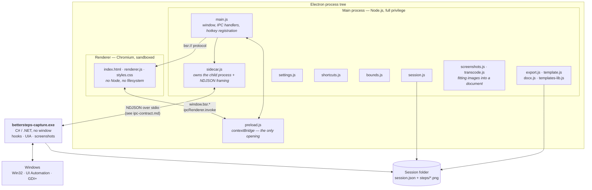

# Engineering Record

The master technical document for Steps Recorder. It sits above the detailed
specifications and links to them rather than repeating them.

- [ipc-contract.md](ipc-contract.md) — the exact message protocol between the
  Electron app and the C# capture engine. Normative.
- [FIELD-GUIDE.md](FIELD-GUIDE.md) — the same system explained for a
  non-programmer. Keep both true.

**Maintenance rule.** Any meaningful change — a design decision, a new module or
dependency, a swap, a rationale that would otherwise survive only in a commit
message — updates this document and the field guide as part of the same work,
before the change is considered done.

---

## 1. What this is

A Windows screen-capture tool that turns a task performed on screen into a
document somebody else can follow. A replacement for the deprecated
`PSR.exe`.

Current state: **v0.1.0**, packaged as an unsigned per-user NSIS installer,
private repository, being handed to a second user for the first time.

---

## 2. System

### Process boundaries and why they are where they are

| Boundary | Reason |
|---|---|
| Electron ↔ C# engine | Chromium cannot install global input hooks, call UI Automation, or capture other applications' windows. The engine exists solely to do what a browser is designed to prevent. |
| Main ↔ renderer | `contextIsolation: true`, `nodeIntegration: false`. The renderer gets a fixed, enumerated API surface via `contextBridge` and nothing else. |
| `bsr://` custom protocol | Screenshots are served to the renderer through a scheme that refuses any path outside the open session directory, rather than exposing `file://`. |

Renderer CSP: `default-src 'none'; img-src bsr: data:; style-src 'self'; script-src 'self'`.

### Transport

One JSON object per line (NDJSON), UTF-8, over the child process's stdio.
`stdout` is protocol; `stderr` is logs and is never parsed. Every message
carries `v`, `type` and `id`; `id` echoes on the response so requests correlate.

Chosen over shared memory or a socket because it is trivially loggable, survives
being read by a human during a failure, and has no partial-state failure mode.

---

## 3. Invariants

These are load-bearing. Breaking one is a defect even if tests pass.

1. **Exclusion beats inclusion.** `ignorePids` is evaluated before `allowPids`,
   so no scope choice can drag the recorder's own windows into a recording.
   Implemented as a pure function (`Scope.cs`) with its own tests rather than a
   condition inside the worker.
2. **Out-of-scope events are discarded before capture**, not captured and
   filtered. A screenshot that we delete afterwards still existed.
3. **A template is read, never written.** Unrecognised markers are left exactly
   as found and reported.
4. **Naming never blocks capture.** UIA runs off-thread behind a 400 ms
   deadline; a lookup that fails yields an unnamed step, never a lost one.
5. **Password secrecy is a property of the field, not of the buffer**, and
   survives a flush.
6. **Claimed hotkeys are suppressed in the engine**, or the last step of every
   recording is the user pressing stop.
7. **Blur is destructive**, and pre-blur originals are purged when the session
   closes or the undo entry expires.
8. **Excluded steps' screenshots are never copied alongside an export.**
9. **Step metadata is flushed on every mutation.** PSR serialised only at export
   and lost everything on a crash.
10. **The engine's hooks are installed on the thread that pumps messages.** See
    D-9; this is not optional, it is how Windows dispatches hook callbacks.

---

## 4. Decision changelog

Newest first. Each entry records what was decided, why, and what it replaced.

### D-17 · Screenshots are re-encoded when a document cannot hold them
`(this change)` · [ui/src/main/screenshots.js](../ui/src/main/screenshots.js),
[ui/src/main/transcode.js](../ui/src/main/transcode.js)

A 106 step recording of Rocket League is **412MB of PNG**. Base64 inflates that
to 550MB, V8's maximum string length is 536,870,888 characters (512MB), and
`buildHtml` builds one string — so the HTML export threw `RangeError: Invalid
string length` and wrote nothing at all. The Word exporter would have put the
same bytes into a zip.

PNG is the right default and stays the default: the usual subject is an
application window full of text, where PNG is crisp *and* small. It is exactly
wrong for photographic or 3D content, where it faithfully stores every pixel of
noise — 4.5MB for a single game frame that is 214KB as a JPEG nobody can
distinguish.

So the rule is **embed the originals while they fit, re-encode when they do
not**, and never touch the files on disk: the recording is the record, the
re-encode is only the copy going into the document. Measured on the recording
that failed: 408MB → 22MB, a 29MB HTML with all 105 images embedded, 4 seconds.

Three states rather than two, because re-encoding is not always enough — a
recording of several thousand frames still cannot be one string. Then the images
are written beside the document and referenced relatively, and the user is told
the file is no longer self-contained. **The export never simply fails.**

The decision (`screenshots.js`) is kept apart from the encoder
(`transcode.js`) so the policy is testable with plain node, while the half that
genuinely needs Electron's image decoder stays behind an injected function.

### D-16 · Window geometry is fitted to the display the window is on
`a31207f` · [ui/src/main/bounds.js](../ui/src/main/bounds.js)

`defaultBounds()` sizes from the *primary* display. A window that opens or is
moved elsewhere can exceed that display's work area, and the edge that leaves
the screen is the bottom one — which is the status bar.

The genuine failure this guards is the minimum size: `MIN_SIZE` is 940×600
points, but a 1366×768 laptop at 125% scaling has roughly 1092×566 points of
work area. Windows honours a minimum size, so the window would be held taller
than the screen and the status bar pushed behind the taskbar. **On a display
that small the minimum is relaxed rather than the status bar sacrificed.**

Extracted as pure arithmetic on plain objects so the awkward cases — second
monitor, monitor unplugged mid-session, display smaller than the minimum — are
testable without a screen. 19 tests.

> Not the cause of a reported missing status bar: that window was on a second
> monitor and the screenshot was misleading. Measured in the DOM, the status bar
> was fully visible throughout. Kept because the small-display case is real.

### D-15 · Global shortcuts are rebindable, and conversion lives in one module
`a31207f` · [ui/src/main/shortcuts.js](../ui/src/main/shortcuts.js)

A chord that is free on one machine is taken on another, and a collision
previously left a shortcut that silently did nothing.

A hotkey must exist in three forms simultaneously — the Electron accelerator
(`Control+Shift+F9`), the engine's chord label (`Ctrl+Shift+F9`), and the
keycaps the user reads. A rebind that reaches registration but not the engine
produces a recording whose final step is the user pressing stop, so the
conversions are owned by one module and cannot drift.

Bindings that would swallow ordinary typing machine-wide are rejected: a bare
letter is refused, a function key alone is allowed. Duplicate pause/stop is
refused. A chord that fails to register is reported in the dialog as *in use
elsewhere* rather than left looking bound.

### D-14 · Visual hierarchy over uniform chrome
`a31207f`

Feedback was that the app was not ready to hand to somebody else, and the
substance was hierarchy: every toolbar control carried equal weight. Toolbar
split into two groups with a divider (what a recording does / what you do with
one afterwards); four surface tokens replace two so panels are distinguishable
without borders doing the work; disabled buttons drop background and border
rather than dimming text, so *unavailable* reads as a state rather than as low
contrast.

> **Rejected from the same feedback:** a claim that body text failed WCAG AA.
> Measured, the muted text is 6.3:1 against its background — AA requires 4.5:1 —
> and disabled controls are exempt from contrast minimums. Changing it would
> have been change without improvement. Measure the claim before acting on it.

### D-13 · Documents resolved through the Known Folder API
`b515e01` · [ui/src/main/settings.js](../ui/src/main/settings.js)

The default save root was `os.homedir() + "Documents"`. Windows redirects
Documents when OneDrive's Known Folder Move is enabled — very common on personal
machines — and `%USERPROFILE%\Documents` may then not exist at all. First
recordings would land somewhere the user never looks, or fail the writability
check. Now `app.getPath('documents')`, injected into `Settings` so it stays
testable.

### D-12 · Product identity is the author's own
`eb33468`

`author` and `build.appId` carried a third party's name, taken off a URL as
placeholder branding and never corrected. `appId` ships inside the installer as
the application's identity on the machine. Corrected before any install existed;
afterwards it would have stranded upgrades.

### D-11 · Purpose is chosen before recording, not at export
`62cd413`

Pressing record asks what is being made, and the answer changes the work rather
than labelling it:

| Purpose | Voice | Template |
|---|---|---|
| Procedure | imperative | SOP template |
| Training guide | imperative | none |
| Evidence record | **past tense** | none |

An evidence record states what was done; rewriting *Clicked the Save button*
into *Click Save* would misrepresent the document. Deciding this at export would
mean the decision is made by whoever exports, not by whoever recorded.

Templates are chosen here too. A template picked for a recording beats the one
in Settings, because it was picked for *that* recording.

### D-10 · Rot detection by indexed tree walk
`20fe21c` · [capture/Verifier.cs](../capture/Verifier.cs)

Steps already carry automation id, control type and name, which is enough to ask
a running application whether those controls still exist.

The tree is walked **once per window and indexed**, not searched per step: a
descendant search across a large application takes seconds, so a forty-step
guide would take minutes and look like a hang. Capped at 6000 elements and 20
seconds, on its own thread so it cannot stall stop or pause.

Statuses are kept honest and distinct — *not running* is not *fine*, and a walk
that hit its cap reports **inconclusive**, because failing to find something is
not proof it is gone. Results are timestamped: "missing when checked" is a
different claim from "wrong".

Proven against a real version change: the test application takes `--v2` to
rename one control, and a guide recorded against v1 flags exactly that step.

### D-9 · Hooks are installed on the message-pumping thread
`90402cc` · [capture/Program.cs](../capture/Program.cs)

**The most instructive bug in the project.** A low-level hook's callbacks are
dispatched to the message queue of the thread that *installed* it, and that
thread must pump messages. The keyboard hook was installed on demand from the
stdin reader, which never pumps — so it reported success, logged "keyboard
capture on", and never fired once. The mouse hook worked only by accident of
living on the main thread.

Installation is now posted to the pumping thread via `WM_APP+1` / `WM_APP+2`.

> This could not have been found from logs — every line said the feature was on.
> It is the origin of the project's rule that features are verified by running
> them, not by reading their output.

### D-8 · Word templates via `docx-templates`, not string surgery
`3810d4f` · [ui/src/main/docx.js](../ui/src/main/docx.js)

Regulated industries do not run on Markdown; their SOPs are `.docx` with a
controlled letterhead, revision table and signature block.

Word cannot hold an HTML comment, so `.docx` templates use typed placeholders
(`{{title}}`, `{{FOR s IN steps}}`, `{{IMAGE shot($s)}}`). Word habitually
splits typed text across runs — a spell-check mark is enough — so the
placeholder may not exist as contiguous text. **Naive `.docx` filling works on a
file generated by a script and fails on the real template somebody has edited,
which is the only kind that matters here.** Hence a library (MIT licensed) that
normalises runs.

Screenshots are embedded sized from intrinsic dimensions so they are not
stretched; a missing screenshot is reported and omitted rather than aborting the
export.

### D-7 · Template loop bodies are the row template
`79f85b5` · [ui/src/main/template.js](../ui/src/main/template.js)

Two corrections to the format as originally proposed, both material:

- The proposal had only prose between `START_STEPS` and `END_STEPS`, which means
  the engine invents step formatting — and step formatting is precisely what a
  corporate template exists to control. The block between markers **is** the row
  template. A block with no placeholders falls back to a built-in row, and the
  report says so, because that is a warning sign rather than a success.
- The proposed compliance section asserted that PII "has been stripped or hashed
  by the ingestion agent". This tool suppresses password fields and masks card
  and SSN shapes; blur is the author's own doing. **Emitting a blanket assurance
  the tool cannot back is worse than emitting nothing**, so
  `INJECT_REDACTION_SUMMARY` states what actually happened to that recording,
  including how many steps were withheld.

HTML comments retained for top-level hooks: the template stays a valid, readable
document in Word or a wiki before injection.

### D-6 · Static wiring test for the renderer
`4599036` · [tests/renderer_wiring_test.js](../tests/renderer_wiring_test.js)

Checks that every element the renderer resolves exists in the markup, every
`el.*` reference was captured, every bridge call is exposed by preload, and
every `invoke` channel has a handler in main.

A typo in any of those blanks the window at load — a failure mode no logic test
reaches and, without driving the UI, one that surfaces in front of a user. It
found a shadowed `el` on its first run.

### D-5 · Capture frame is configurable; steps record what was framed
`4599036`

Framing the clicked window is the right default — it crops noise and keeps files
small — but it is wrong for clicks with no window (desktop, taskbar, tray, where
the old code fell back to a blind 800×600 box), for actions spanning two
windows, and whenever surrounding context is the point. Settings offers window,
monitor or all displays.

Steps carry the region actually captured as `frame`, and both the detail view
and the exporter position the click marker against that. Without it, a
monitor-framed screenshot puts the marker in entirely the wrong place.

### D-4 · Scope by process, and the engine enumerates windows
`88ea168` · [capture/Scope.cs](../capture/Scope.cs)

Scope is by **process**, not window: dialogs and child windows of the same
application must stay in scope or half a recording silently vanishes.

The engine answers `listWindows` because Electron cannot see other
applications' windows. Cloaked windows are filtered — every UWP app keeps
invisible ghosts and without that the picker is mostly junk.

### D-3 · Export embeds images; PDF reuses the HTML layout
`11d9171` · [ui/src/main/export.js](../ui/src/main/export.js)

HTML embeds images so an export is a single portable file rather than a document
that breaks the moment it is emailed alone. PDF renders the same HTML offscreen
and prints it, so there is one layout to maintain. Markdown writes relative
paths into a sibling folder, for a wiki or docs directory.

The click marker is positioned as a percentage of the screenshot so it holds at
any width, and omitted when the point falls outside the captured frame.

### D-2 · Blur is destructive, pixelate-then-blur
`11d9171`

An overlay that merely covers pixels leaves the data in the session folder, and
a "redacted" guide whose sources still contain the data is worse than none.
Pixelate **then** blur, because blur alone can leave enough structure to read
short text back; downsampling actually discards it.

Editing loads the screenshot as a data URL, since a canvas painted from the
`bsr://` scheme is tainted and cannot be read back.

### D-1 · Two processes, NDJSON over stdio
`5b9116e`, `8bbb5ca` · [ipc-contract.md](ipc-contract.md)

The founding decision. See §2.

---

## 5. Notable defects, and what they taught

Kept because each changed how the project is built, not merely what it contains.

| Defect | Root cause | Rule it produced |
|---|---|---|
| Keyboard capture never fired (`90402cc`) | Hook installed on a non-pumping thread | Verify features by running them; logs lied |
| Passwords leaked after a typing flush (`f01bd63`) | Secrecy stored with the buffer, cleared on flush | Secrecy belongs to the field and survives flushes |
| Field contents leaked via UIA `Name` (`0f1da69`) | Some controls report contents as their name | Compare name against value; drop when they track |
| App froze after any blur (`0d42f74`) | `.arming { position: fixed; inset: 0 }` collided with a class the blur tool set on the screenshot wrapper — a full-screen overlay over the toolbar | Proven with `elementFromPoint`; scope overlay rules to an id |
| Blur looked broken (`f01bd63`) | Redaction rewrites in place; only the `#` fragment changed, and fragments are not part of the cache key | Cache-bust with a query parameter |
| Stranded in the floating strip (`0d42f74`) | `leaveCompact` ran only from Stop; the strip's Stop delegated to a disabled button | Idle-while-compact always restores |
| Unredacted originals kept forever (`0d42f74`) | Undo stashed pre-blur images; a comment claimed cleanup that did not exist | Comments are not evidence |
| Export vanished silently (`62cd413`) | A `ReferenceError` rejected into an unawaited click handler | Report export failure; never close the dialog on error |
| HTML export died with "Invalid string length" (D-17) | 412MB of PNG base64'd to 550MB, past V8's 512MB string ceiling | Size the output before building it; degrade, never fail |
| App appeared to start maximised (`9a0120d`) | 1280×860 requested in logical px = 1600×1075 physical at 125% | Size from the work area |
| Compact strip jumped to the primary monitor (`0d42f74`) | Positioned from `getPrimaryDisplay()` | Use the display the window is on — see D-16 |

---

## 6. Testing

Roughly 280 checks across three harnesses. **The split matters operationally.**

| Suite | Runs | Safe on a machine in use? |
|---|---|---|
| `tests/*_test.js` (8 files) | `node tests/<file>` | **Yes** — pure logic |
| `tests/scope_test.py`, `verify_test.py` | `python tests/<file>` | **Yes** — pure logic |
| `tests/LogicTests` (C#) | `dotnet run` | **Yes** |
| `tests/ui_*.py`, `capture_test.py`, `keyboard_test.py`, `e2e.py`, others | via `tests/ui_drive.py` | **NO** |

The last group **synthesizes mouse and keyboard input and takes over the
machine.** Do not run them while the machine is in use. `ui_drive.py` reads
coordinates from the DWM frame so they match a screenshot pixel for pixel, and
asserts the window size before clicking — coordinates were once read at the
default size and a toolbar change made a working feature look broken.

`close_window()` posts `WM_CLOSE` rather than terminating: killing a GUI process
can leave its pixels composited on screen, and those stale pixels swallow clicks
aimed at what is behind them.

### Driving the UI without synthesizing input

For verification while the user is at the machine, launch with
`--remote-debugging-port=9222` and drive the renderer's DOM over the DevTools
protocol. This exercises real handlers and real IPC without touching the user's
input devices. Used to verify the shortcuts dialog, rebinding, and both
rejection paths in `a31207f`.

---

## 7. Dependencies

| Dependency | Why | Licence |
|---|---|---|
| Electron 34 | The window; Chromium + Node in one runtime | MIT |
| electron-builder | NSIS per-user installer | MIT |
| docx-templates | Word placeholders split across runs — see D-8 | MIT |
| .NET 10 (win-x64) | The capture engine | MIT |
| UI Automation | Naming controls | Windows |
| GDI+ / `System.Drawing` | Screenshots | Windows |

The engine publishes self-contained and single-file with compression: 166 MB →
72 MB, at the cost of a one-off extraction on first launch, which the UI already
waits out because it waits for the engine's `ready`.

---

## 8. Open questions and debt

### Known gaps

- **Not code-signed.** SmartScreen warns on first run and endpoint protection
  may object to a binary that hooks input and screenshots. Requires purchasing a
  certificate. The README states this plainly rather than letting a user
  discover it.
- **Window bounds are not persisted.** Every launch centres on the primary
  display. Deliberate for now (it makes D-16's failure mode rare), but a user
  who works on a second monitor re-moves the window every session.
- **The compact strip's elapsed timer is visually unverified.** Its logic is
  wired and the element renders, but seeing it requires an actual recording,
  which captures the screen.
- **`tests/ui_*.py` were not run against `a31207f`.** They synthesize input and
  the machine was in use. The JS and pure-Python suites all pass.
- **No automated coverage of the installed artefact.** The installer is verified
  by hand.
- **Export has no progress reporting.** Re-encoding 105 screenshots takes about
  four seconds, and a recording of several thousand would take minutes. The
  status line says "Exporting…" and nothing more; there is no percentage and no
  way to cancel.
- **The Markdown export does not re-encode.** It copies the originals beside the
  document, so a 412MB recording produces a 412MB folder. Correct, but not
  small; it has no string limit to force the issue.

### Deferred by decision

- **Capture watermarking / hosted branding.** Considered and declined: it would
  put a company's mark on every screenshot, which is the wrong place for it —
  branding belongs in the document, where it already is. Revisit only with a
  concrete request from a real organisation.

### Open questions

- Does the imperative rewrite need to handle verbs beyond the current eight? It
  is a fixed list, and an unmatched verb passes through in the past tense.
- Rot detection identifies *that* a control is gone, not *what replaced it*.
  Suggesting the likely replacement is the obvious next step and is not started.
- No migration story for `session.json` if its shape changes. Fine while the
  only recordings are the author's; not fine after distribution.

---

## 9. Repository

`https://github.com/Bunbob41/BetterStepsRecorder` — **private**. Single branch,
`master`, linear history.

Build: `cd ui && npm run dist` → `dist/StepsRecorder-Setup-<version>.exe`.
