# Field Guide

This explains what Steps Recorder is, what every piece of it does and why it
exists, without assuming you write code. If you read only this document you
should still be able to hold a sensible conversation about how the whole thing
works.

The companion document, [ENGINEERING.md](ENGINEERING.md), is the technical
master record. This one is the map.

---

## 1. What the product is

You press record. You do a task on your computer — clicking, typing, dragging.
Every action is captured with a screenshot, and named in words: *Clicked the
"Save" button in "Billing"*. You press stop, tidy the result, and export it as a
document somebody else can follow.

It replaces `PSR.exe`, the Problem Steps Recorder that shipped with Windows for
years and was removed. PSR was crude but genuinely useful, and nothing replaced
it.

---

## 2. The one structural idea: it is two programs, not one

This is the single most important thing to understand, because almost every
other design decision follows from it.

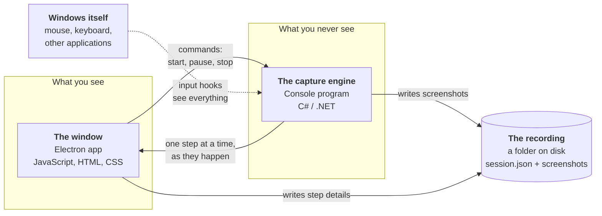

**Why two programs?** Because neither one could do the whole job.

The window is built with **Electron**, which is essentially the Google Chrome
browser wrapped up so it can be shipped as a desktop application. That gives us
a fast, modern interface for free. But a browser is deliberately sealed off from
the rest of the computer — that is the entire point of a browser. It cannot
watch your mouse when you are in another application, cannot read the name of a
button inside Microsoft Word, and cannot take a screenshot of Excel.

The capture engine is a small **C#** program with no window at all. C# can reach
directly into Windows itself, which is exactly what capturing requires.

So the window is the part you talk to, and the engine is the part that watches.
They are separate processes: the engine is launched by the window when the app
starts, and shut down when it closes.

### How the two halves talk

They exchange **one line of text at a time**, in a format called JSON — the same
sort of structured text a website uses to send data. The window writes a line
saying "start recording"; the engine writes back a line for every step it
captures.

It is deliberately dull. Text lines over a pipe are easy to log, easy to read
when something goes wrong, and impossible to get subtly wrong in the way a
shared block of memory can be. The exact list of messages is written down in
[ipc-contract.md](ipc-contract.md).

---

## 3. The jargon, defined once

You will meet these terms repeatedly. None of them are complicated.

| Term | What it actually means |
|---|---|
| **Electron** | Chrome, packaged as a desktop app. Our window is a web page. |
| **Chromium** | The open-source browser engine inside Chrome and Electron. |
| **Node.js** | JavaScript running outside a browser, with access to files and processes. Electron contains both. |
| **.NET / C#** | Microsoft's programming platform and language. The capture engine's world. |
| **Win32** | The decades-old core interface to Windows. Low-level, unglamorous, and the only way to do several things we need. |
| **UI Automation (UIA)** | A Windows service that lets one program ask another *what is this button called?* Built for screen readers. It is how we name what you clicked. |
| **Hook** | A standing request to Windows: *tell me about every mouse click / key press on this machine*. |
| **DPI scaling** | Windows enlarging everything on a high-resolution screen, typically to 125% or 150%. A constant source of "the screenshot is the wrong size" bugs. |
| **IPC** | Inter-Process Communication. Two programs talking. Ours is JSON over a pipe. |
| **NSIS** | The system that builds the `Setup.exe` installer. |
| **Sidecar** | Our nickname for the capture engine — a helper process running alongside the main one. |

---

## 4. What happens when you record

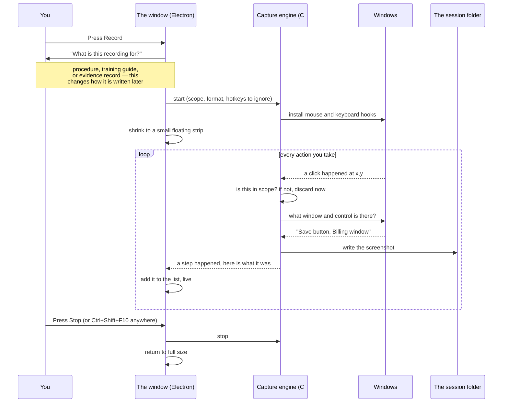

Four details in that diagram are worth pulling out, because each solves a real
problem.

**The window shrinks while recording.** While you record, you are working inside
the application you are documenting. A large editor window is the last thing
that should be on screen. It becomes a small strip showing the state, the step
count, an elapsed timer, and pause/stop. PSR did this, and it is the reason PSR
felt usable despite everything else about it.

**Out-of-scope actions are discarded before a screenshot is taken.** If you
scope a recording to one application, clicks elsewhere are dropped by the engine
immediately — they are never captured, rather than captured and then filtered
out. That distinction is the whole value: a screenshot of your email that we
delete afterwards still existed.

**The stop shortcut is hidden from the recording.** The window tells the engine
which key combinations it has claimed, and the engine ignores them. Otherwise
the final step of every recording you ever make is *"Pressed Ctrl+Shift+F10"*.

> The two halves have to spell the key the same way, which is less obvious than
> it sounds: the engine names keys for someone *reading* a step ("Page Up"),
> and a shortcut names them for Windows ("PageUp"). Where those disagreed, the
> engine was told to ignore a chord it never produced, and the suppression
> quietly did nothing.

**Steps are written to disk as they happen.** PSR saved everything only at the
end, so a crash lost the lot. Here the folder is always current.

### Why the recorder is not in its own screenshots

There are two ways to take a screenshot of a window, and the difference decides
whether the recording strip ends up in your guide.

**Copying the screen** takes whatever is physically in that rectangle — which
includes anything sitting on top of the window. The strip is always on top, so
it landed in the corner of the screenshots, and a reader would see Pause and
Stop buttons that are not part of the software being documented at all.

**Asking the window to draw itself** returns only that window's own content.
Anything overlapping it is excluded automatically: the strip, notification
pop-ups, another application's tooltips. That is what the app now does.

The catch, and the reason it was not done this way originally, is that asking
politely used to return a black rectangle for anything drawing with the graphics
card — Chrome, and most modern applications. Windows later added a flag for
exactly that case, and with it they render properly.

It is still best-effort. A few windows — screen overlays, mostly — draw nothing
when asked, so the app checks the result and falls back to copying the screen. A
screenshot is never lost.

> One exception: if you set the capture frame to **monitor** or **every
> display** rather than **window**, there is no single window to ask, so the
> strip can still appear. The default is window.

---

## 5. How it knows what you clicked

This is the feature that makes the output readable, so it is worth understanding.

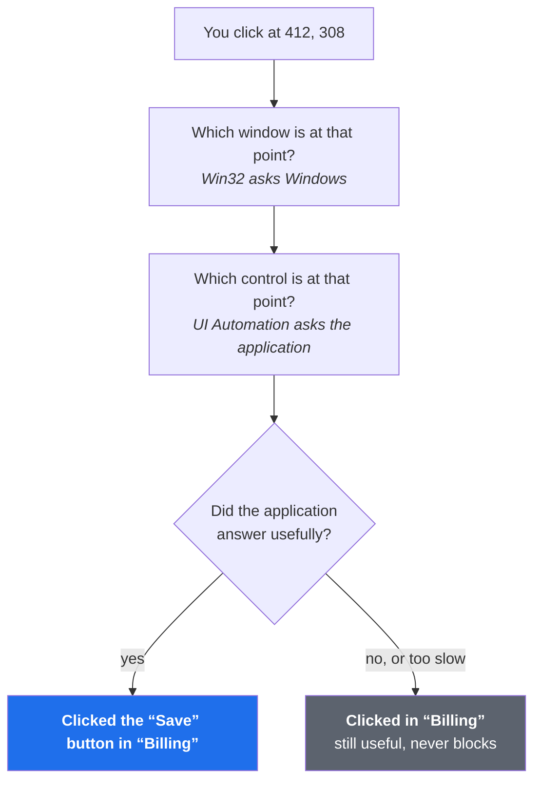

UI Automation is asking *another running program* a question, and that program
might be busy or hung. So every lookup runs on a separate thread with a hard
400-millisecond deadline. If the answer does not arrive, the step is recorded
without the name. **Naming is a bonus, never a dependency** — a recording must
never be lost because Word was thinking.

### Where naming does not work

Some applications will not tell anyone what their controls are called, and you
will see it immediately: the step says *"Clicked in 'Untitled - Paint'"* instead
of naming a button.

The dividing line is how the application is built. Ordinary Windows programs and
classic dialogs — the Control Panel, Region settings, most desktop software —
answer the question fully, and you get *"Clicked the 'Apply' button"*. Some newer
Windows apps built on WinUI put their whole interface behind what Microsoft calls
a *content island*, and asking what is at a point stops at the island's edge
rather than reaching the button inside it. Windows 11's Paint is one: every
point in it, from the ribbon to the canvas, comes back nameless.

The step, the screenshot and the click marker are all still correct — only the
wording is poorer. You can type over it, and a description you write is kept
even if you later re-record that step.

### The trap that had to be fixed

Some applications, when asked "what is this text box called?", answer with *what
is typed in it*. A text box containing a password could therefore report its own
contents as its name — and that would print the password into the step
description, right after we had carefully suppressed it from the typing.

The fix is not to ignore names for text boxes, because well-behaved applications
give genuinely useful ones. Instead the name is compared against the field's
current value. A real label and the text somebody typed do not coincide by
accident, so when the name tracks the value it is treated as content and dropped.

---

## 6. What is recorded when you type

Recording every keystroke individually would produce a useless document. Typing
is therefore **gathered per field** and emitted as one step: *Typed "ACME Corp"
into the Customer Name field*. After 1.5 seconds of quiet, or when you move to a
different field, that step is written.

Three protections apply:

- **Password fields record nothing but the fact.** You get *Entered password*.
  The characters never enter the recording at any point.
- **Keys are only written out as text when they go into a text box.** Pressing
  W, A, S and D to drive a car, pan a 3D view or trigger an editor's shortcuts
  is not typing, and writing it down as *Typed "wddad"* helps nobody. Those are
  counted and named instead: *Pressed A, D, W (6 times)*. The app decides this
  by asking what is focused, not by guessing which program you are in - a game
  is a perfectly good thing to document.
- **Card numbers and national insurance / social security shapes are masked**
  even in ordinary fields, because people paste them into the wrong boxes.
- **Keyboard capture can be turned off entirely** in Settings, in which case the
  hook is never installed at all rather than installed and ignored.

> A bug worth knowing about, because it shaped the design: whether a field is a
> password field was originally remembered alongside the typed text. Flushing
> the text after a pause also cleared that flag — so typing a password, pausing,
> and continuing in the same box leaked the rest of it. Secrecy is now a
> property of the field that survives a flush, and is re-decided only when focus
> moves.

---

## 7. What a recording is, on disk

A recording is just a folder. Nothing is hidden in a database, and nothing
leaves your machine.

```
StepRecordings/
└── 2026-09-05 13-19-13/
    ├── session.json      every step: what, where, when, the words
    └── steps/
        ├── 0001.png
        ├── 0002.png
        └── ...
```

Folders are named by timestamp and never renamed. The recording's *name* is a
label stored inside `session.json`. This is deliberate: renaming a recording
must not move files around underneath a session you have open.

---

## 8. Turning a recording into a document

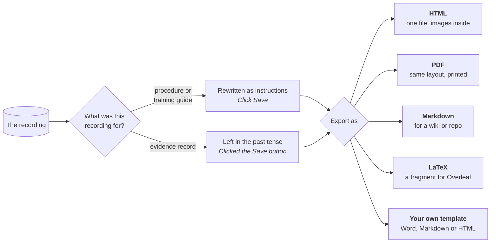

**The tense change is the interesting part.** The engine records what happened,
in the past tense, because that is the truth of it. A procedure is written in
the imperative, because the reader has not done it yet. So *Clicked the Save
button* becomes *Click Save* on the way out.

But not always — and this is why the app asks what a recording is *for* before
it starts rather than at export time. An **evidence record** stays in the past
tense, because it states what was done. Rewriting it into instructions would
misrepresent what the document is. And if you rewrote a step's wording yourself,
your words are emitted exactly as you wrote them. Your prose is not ours to
correct.

### A recording that will not open

Very occasionally a recording's details file gets damaged — a crash part-way
through a save, or something else editing the folder. When that happens the
recording is **listed, dimmed, and left completely alone**, with an explanation
rather than a shrug.

It is deliberately not opened as an empty recording, which is what it used to
do. That was the dangerous behaviour: the app would show you a recording with
nothing in it, and because there is no Save button, your next click would write
that emptiness over the real file. The screenshots would still be on disk, with
nothing left pointing at them.

If you see one, the folder is intact — the screenshots are all still there.

### Recordings made by a different version

Every recording records which version of the app made it. An older one opens
normally — nothing has ever been taken away from a recording, only added.

A recording made by a **newer** version is deliberately not opened. It appears
in your list, dimmed, saying so. The reason is not that its steps cannot be
shown; it is that opening it and changing one thing would rewrite the whole
file in this version's shape and quietly throw away whatever this version has
never heard of. Updating the app is the fix, and the message says so.

### There is no Save button

Because there is nothing to save. Every step is written to disk as it is
captured, and every edit you make afterwards — rewording, reordering, a
heading, a crop, a blur — is written the moment you make it.

You will see **✓ Saved** in the bar at the bottom, both while recording and
while editing, along with the folder it went to. The screen the app opens on
says the same thing above your recordings.

It is written carefully, too: each save goes to a temporary file and is then
renamed over the real one, so a crash halfway through leaves the previous good
version rather than a half-written one.

The one thing that is *not* kept is the undo history. **Ctrl+Z** covers a slip
while you are working, and **Ctrl+Y** (or Ctrl+Shift+Z) puts it back if you
went one too far. Close the app and that history goes, along with the copies of
pre-blur screenshots it was holding — deliberately, so redacted pixels do not
linger.

Both are also on the right-click menu, on a step and on the screenshot, so you
do not have to know the keystroke to find them.

### What recordings cost you

Screenshots add up much faster than people expect. The landing screen tells you
where recordings are kept, how many there are and how much room they take, and
every recording shows its own size.

That last part matters more than it sounds. In one real archive of nine
recordings totalling 479 MB, a single recording of a game was 403 MB of it —
84% of everything, in one entry. Sizes on each recording are how you find that
one and decide what to do about it.

If you record anything animated — a game, a video, a 3D view — expect
roughly **85 MB a minute**. Ordinary application windows are a tiny fraction of
that. Settings has a capture format option if you want to trade some quality
for a lot of room.

### Finding things in Settings

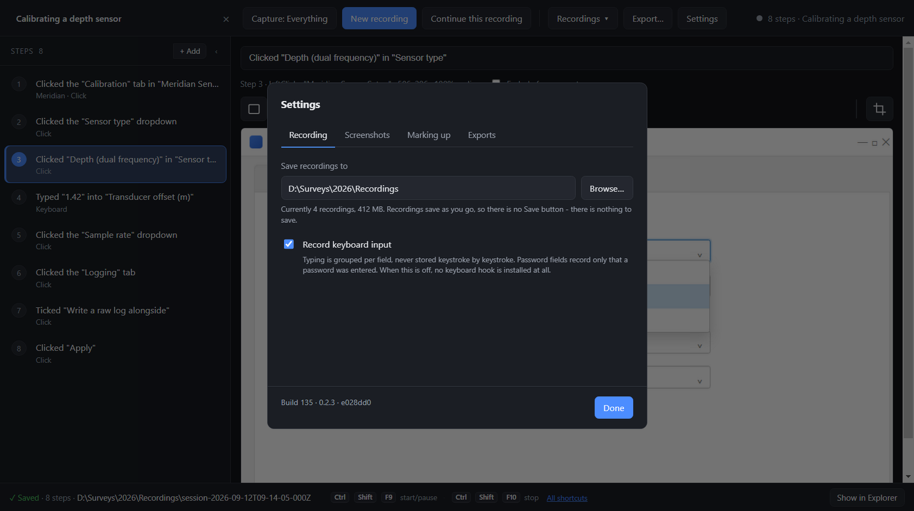

Settings holds four unrelated kinds of thing, so it is four tabs rather than one
long page:

- **Recording** — where recordings are saved, and whether typing is captured.
- **Screenshots** — what each shot shows, its format, and how big it is.
- **Marking up** — the click indicator, and the highlighter key.
- **Exports** — your organisation's name, logo, footer and SOP template.

It opens on whichever tab you used last, so if you only ever touch Exports you
are not scrolling past everything else each time. The one exception is the
*Open Settings* link on the notice about screenshot size — that opens on
**Screenshots**, which is the tab that can do something about it.

### What a recording is called after

Each recording is labelled with the application it is about — **Google Chrome**,
not `chrome.exe`, and not `explorer.exe` just because you started by clicking
the taskbar.

Two small things make that work. The application is the one the recording spent
its time in, counted across every step rather than taken from the first one. And
the name is the one Windows itself uses: every program on your machine carries a
description, and that is what you see. Recordings made before this arrived fall
back to a tidied-up filename, so they read reasonably too.

### Finding the recording you mean

The screen the app opens on has a search box above your recent recordings. Type
into it and it looks through **every recording you have** — the step text, your
written notes, your section headings, and the recording's own name.

Each result shows the recording and the lines that matched, with the words
picked out. **Click a line and it opens that recording on that step**, which is
the point: finding the guide is half the job, and not then scrolling forty steps
looking for the line is the other half.

Results are ordered by how much a recording is about what you searched for, and
recent ones win ties. Only the first few matching lines are shown per recording,
with a note saying how many more there are.

**Escape** clears the box and your recent recordings come back.

### The screen it opens on

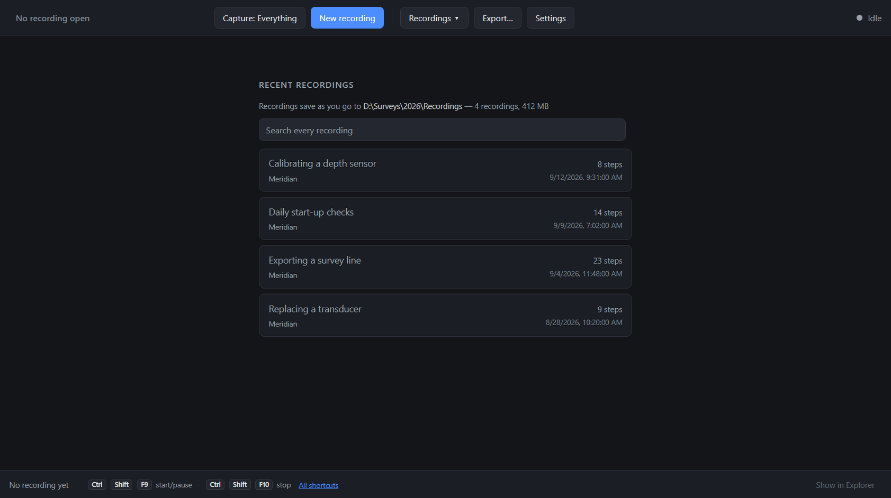

Your recordings, newest first, with what each one costs you in disk. The box
searches every recording you have, not just the open one.

### Getting back to your recordings

The right-hand side of the window shows one of two things: **your recordings**,
or **the step you have selected**. Opening a recording replaces the first with
the second.

**Recordings**, in the top toolbar next to Open…, brings the first one back. It
greys out when you are already there, so you can always tell which of the two
you are looking at.

It does not close anything. The recording stays open, and the step you were on
stays highlighted in the list on the left — so clicking that step takes you
straight back to it. One button, both directions.

Whatever you searched for stays in the search box and is run again, so you come
back to your results rather than to the recent list. The recording you were just
in is marked **open now**, so you can see where you were.

### Starting without going back to the window

The point of a shortcut that works everywhere is that you are already in the
application you want to document. So the **pause** shortcut starts a recording
when none is running — it is one key for all three states:

| When | What it does |
| --- | --- |
| Nothing is recording | Starts one |
| Recording | Pauses |
| Paused | Resumes |

A recording started this way asks you nothing, so it makes one decision for
you: **it records only the application that was in front when you pressed the
key.** That is almost certainly the one you meant, and it is narrower than what
the Start button defaults to — press the key by accident and it cannot quietly
begin recording your mail. The app says which application it picked, and the
Capture button shows it, so you can widen it if you want something else.

The name is filled in with the date; rename it whenever you like, during or
after.

Pressing **stop** when nothing is recording now says so. It used to do nothing
at all, which looks exactly like a shortcut that is broken.

### Changing the pause and stop shortcuts

**All shortcuts**, at the bottom of the window, lists them and lets you change
the two global ones. Click **Change**, then press the combination you want.

While it is waiting, the application lets go of its own hotkeys — otherwise the
combination you are trying to replace would be swallowed by the very shortcut
you are replacing, and nothing would happen. They come back the moment you
choose one, cancel with Escape, or close the dialog.

It needs a modifier (Ctrl, Alt or Shift), or a function key on its own — a bare
letter would swallow that key everywhere on your machine, which is not a
shortcut, it is a fault. If you press something that cannot be used, it says so
and keeps waiting.

Two things it will refuse: a combination the other action already has, and one
another application has already claimed system-wide. In the second case it
keeps the previous shortcut rather than leaving you with one that silently does
nothing, and any shortcut that fails to register is marked **in use elsewhere**
in the list.

### Changing a word everywhere

**Ctrl+F** opens a find bar above the step list. Type what you are looking for
and the steps containing it are marked in amber, with a count: *3 in 2 steps* —
occurrences first, then how many steps they are spread across.

Fill in the second field and press **Replace all**. **Aa** makes it match case;
**Word** stops *Save* matching *Saved*. **Escape** closes it.

It searches your written notes and your section headings as well as the
recorded steps, because a reader sees all three — a rename that skipped them
would leave the guide contradicting itself.

Two things it deliberately does *not* do:

- **It does not treat what you type as a pattern.** Searching for `(draft)` or
  `C:\Users` finds exactly that, not a wildcard.
- **It does not claim you wrote the step.** Swapping one word inside a sentence
  the recorder wrote is not the same as rewriting the step yourself, so those
  steps still get turned into instructions on the way out — *Click Save* rather
  than *Clicked the Save button*. If it counted as your wording, renaming a
  button would quietly put those steps, and only those, into the past tense.

The whole replacement is **one** undo. Ctrl+Z puts every step back at once.

### Grouping the steps into phases

A procedure of forty clicks is really three or four pieces of work — get the
file ready, put it through the system, file the paperwork — and a reader who
cannot see where one ends has to work it out for themselves.

**+ Section** in the step list adds a heading. It sits beside **+ Note**
because it is the same act: inserting a row you wrote, rather than one that was
recorded. A heading behaves like every other row — drag it to move it, delete
it, rename it, exclude it — and carries no step number of its own.

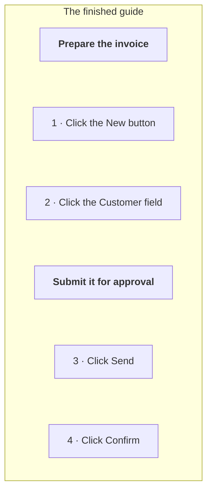

**The numbering keeps going across the headings** — 1, 2, 3, 4, not 1, 2 then
1, 2 again. If it restarted, a guide with four phases would have four step 3s,
and "I'm stuck on step 3" would stop meaning anything.

**The app offers headings where it thinks they belong.** Wherever the recording
moved to a different program, a dashed row appears in the list — *Moves to
Excel here* — with a **+ Section** button. That is a guess, and only a guess:
work can change phase without changing program, and change program in the
middle of a phase. Accept it and you get an empty heading with the cursor in
it, waiting for a name — the app knows where a phase probably starts, not what
it is called, and "Excel" is the name of a program rather than of a piece of
work. Dismiss it with the **×** and it stays dismissed.

**An unnamed heading does not appear in the export.** It stays in the step
list, saying so, because it is an unfinished edit rather than a mistake — but
a heading *is* its text, and one with none renders as a rule with a gap where
the name should be.

**A heading with nothing left under it is dropped too.** If you exclude every
step of a phase, the heading goes with them, rather than promising the reader
a section that is not there.

Headings do not nest. One level, as many as the procedure needs.

### Marking where you clicked

Every screenshot carries an indicator showing where the click landed. Settings
offers two shapes, either of which can be made bolder:

- **A circle** around the click. The original, and still the default.
- **An arrow** pointing at it. Some readers take a red ring to mean an error, or
  mistake it for part of the software being documented. An arrow comes from
  outside the picture and points inward, so it reads as a note *about* the
  screenshot rather than something *in* it.

The arrow's point always lands exactly on the click. Its tail normally runs up
and to the left, but near the top or left edge of a screenshot there is no room
for it, so it swings round to come from the other side instead — the point stays
where it belongs either way.

Whatever you choose shows both in the preview inside the app and in what you
export, because both are drawn by the same piece of code.

> One gap worth knowing: **Word exports have no indicator**. A .docx embeds the
> picture itself rather than layering anything on top of it, so the marker
> cannot simply be drawn over it the way it is in a web page or PDF.

#### Turning the arrow

If the marker is an arrow, it comes with a small round handle at its tail.
**Drag the handle** and the arrow swings around the spot it points at — the tip
stays put, because that is the thing you are pointing at, and the tail is what
moves.

Left alone it chooses for itself: it comes from the upper left, and for a click
near the top or left edge of a picture it swings round so its tail has room.

That choosing stops the moment you touch the arrow. Turning it by the handle
fixes its direction, and so does **moving it** — whichever way it happened to
be pointing when you picked it up is the way it still points when you put it
down. Otherwise an arrow would re-aim itself partway across a picture as you
dragged it, which is startling and never what was wanted. Right-click the
screenshot and choose **Point the arrow the way it chooses** to hand the
decision back.

#### Turning it off

Sometimes an arrow you draw yourself says it better than a ring around a click.
Right-click a screenshot and choose **Hide the marker on this step**, and that
step carries none — on screen and in everything you export. The same item shows
it again.

If that is how you always work, Settings → **Marking up** has *Mark where the
click was*: turn it off and no screenshot carries a marker at all.

The click is still recorded either way. Hiding the marker only stops it being
drawn, so you can show it again later without losing where you clicked.

#### Moving it

Sometimes the marker is not quite in the right place, and there is a reason for
it that is worth understanding rather than working around.

For a click, the recorder knows the exact pixel. For a **typed** step it does
not: it knows which box you typed into, so it marks the middle of that box. On
a small field that is fine. On a wide search box, or a text area half a page
tall, the middle of the box is not where the words went.

So: **drag the marker**. Pick it up on the screenshot and put it where it should
have been. It glows faintly once you have moved it, so you can tell at a glance
which steps you have adjusted. An arrow keeps the direction it was pointing —
moving a marker is not asking for it to be re-aimed.

Right-click the screenshot and choose **Put the marker back where it was
recorded** to undo that for good; Ctrl+Z works too.

The position is remembered as a *proportion* of the picture rather than as
pixels — a quarter across, a third down — which is the same way the recorded
position is stored. That is what lets you crop the step afterwards and find the
marker still pointing at the same thing.

A drawing tool takes priority: while Box, Circle, Arrow, Highlight, Blur or Crop
is armed, dragging on the screenshot draws, and the marker stays put. Disarm the
tool and you can pick the marker up again.

### Right-clicking

Two menus, both of which start with **Undo** and **Redo** so those are never
more than a click away.

**On a step** in the list: add a note or a section heading below it, leave the
step out of the guide, or delete it. Right-clicking a step selects it first —
unless it is already part of a multiple selection, in which case the menu acts
on all of them, and says so ("Delete 3 steps").

**On a screenshot**: undo, redo, and putting a dragged marker back where the
recording put it.

### Trimming a screenshot

**Crop** trims a screenshot to the part that matters. Arm it, drag a rectangle,
and everything outside it goes. The selection is drawn the opposite way round
to the others — what is *inside* it is what you keep — and everything being cut
away is dimmed.

The interesting part is what happens to the marker. Every step remembers the
region of the screen it was captured from, and the click is stored as a
position *within that region*. So when the picture is cut, that region is cut
by the same proportion — and the marker goes on pointing at the same thing. Get
this wrong and every cropped step would have its marker quietly in the wrong
place, in every export, with nothing on screen to show it.

If you crop the click itself out of the picture — trimming to a panel the click
was not in — you are asked first. That step then has no marker, which is
correct, but it should never be a surprise.

**Ctrl+Z** puts the screenshot and its region back together.

Cropped steps are counted in the compliance section of a template export, so a
reader knows the pictures are not the full frames that were captured.

### The marker in a Word document

Word works differently from the other formats, and it is worth knowing why.

HTML and PDF put the marker *on top of* the screenshot — it is a separate thing
laid over the picture, which is why changing its style in Settings costs
nothing. Word has no way to do that: it embeds a picture and cannot layer
anything above it.

So for Word the marker is **drawn into the picture itself**, at export time, on
a copy. Your recording is not touched — the screenshots in the session folder
stay exactly as they were captured.

It is the same circle or arrow you chose in Settings, in the same place, scaled
to the screenshot so it looks the same size on the page. If a screenshot cannot
be drawn on for any reason, it goes into the document as it is rather than
costing you the export.

### Why screenshots are sometimes re-encoded

Screenshots are saved as PNG, which is the right choice for the usual subject: a
window full of text, where PNG is both sharp and small. It is the wrong choice
for a photograph or a 3D game, where PNG dutifully stores every pixel of noise —
one frame of a game is around 4.5MB as a PNG and around 214KB as a JPEG you
could not tell apart.

That matters at export time, because an HTML or Word file carries its images
*inside* it. A 106-step recording of a game is 412MB of screenshots, and there
is a hard limit in JavaScript on how much text one document can be built from —
about 512MB. Encoding 412MB of images for embedding needs 550MB. It does not
fit, and the export used to fail outright with *Invalid string length*.

So the app now measures first:

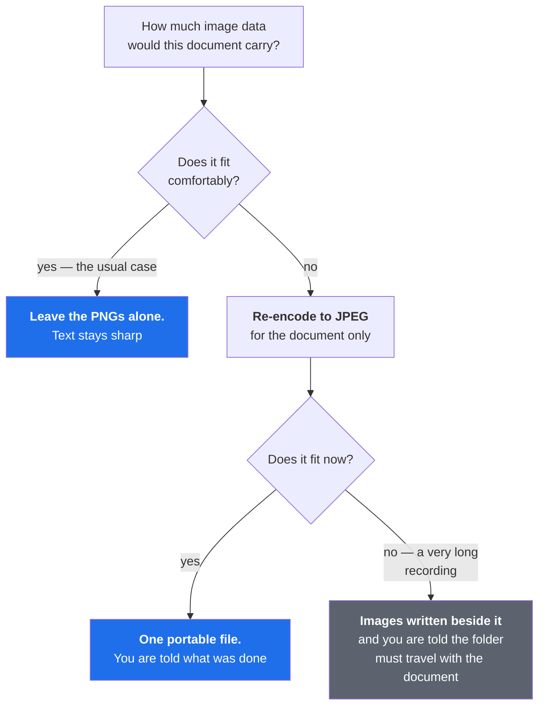

**Your recording is never altered.** Re-encoding applies only to the copy going
into the document. The screenshots in the session folder stay exactly as they
were captured, because that is the record.

There is a second, quieter part to this. Recording a game costs roughly **85MB a
minute** in PNG, and you would have no way of knowing. So when a recording ends,
if its screenshots are unusually large — above about 2MB each, which reliably
means video or 3D rather than an application window — a strip appears under the
toolbar saying so, with a link to the setting that would fix it.

It is only ever a suggestion. The app does not change the format on your behalf:
doing that part way through a recording would quietly alter the record, and if
what you are making is an evidence record, that is the last thing it should do.
Dismiss it and it goes away.

### Photographs from a camera

Not everything in a procedure happens on a screen. A cable in the right socket,
a switch in the right position, a serial number on the underside of a unit —
these are photographs, and they can be steps like any other.

**Three ways to add them**, and they all end up in the same place:

- **The + Photo button**, above the step list. The photos land after whichever
  step is selected, so you can put them exactly where they belong.
- **Drag them onto the window.** Anywhere on it — the whole window is the
  target, so you do not have to aim.
- **Drop them in the recording's own folder**, and they are added the next time
  you open that recording. This is the one to use after a job: the pictures come
  off a camera or a phone in a lump, and adding thirty of them one at a time
  through a dialog is nobody's idea of an afternoon.

A photo step has no click, because nothing was clicked. It has a picture and
whatever you write under it, and it is numbered like every other step. If you
want to point at something in it, right-click the picture and choose **Put a
marker here** — then drag it, or turn it, exactly as you would on a screenshot.

**What happens to your photos.** Each one is copied into the recording at 2000
pixels on its long edge, saved as JPEG. That is a sensible size for a page and
small enough that a recording with forty photos in it can still be emailed. The
file you dropped in is **moved into an `originals` folder inside the recording**
— not deleted. What the recording keeps is a smaller copy, and this tool is not
going to be the reason your full-sized photograph no longer exists. Photos you
add with the button or by dragging are copied, and left where they were.

Moving the original is also what stops the same picture being added again every
time you open the recording.

**iPhone photos (HEIC) cannot be read** — Windows itself cannot open them
without an extra codec, and neither can this. You will be told which file, by
name, rather than finding one missing later. Set the phone to save as JPEG, or
convert them first.

### LaTeX, for a manual in Overleaf

If your team writes its manuals in LaTeX, this exports the procedure as a
**fragment**: a `\subsection`, a numbered list, and the screenshots in between.
Not a whole document, and that is deliberate — your manual already has a
preamble, a class and a house style, and a complete document would have to be
taken apart before any of it could be used.

So you paste it in. Two things travel with it:

- **The screenshots**, in a folder written beside the `.tex` file. LaTeX has no
  such thing as an embedded picture, so that folder has to be uploaded too.
- **`\usepackage{graphicx}`**, which the fragment assumes your preamble already
  loads. It cannot add packages itself: by the time a fragment is read, the
  preamble is long past. Any manual with figures in it will already have this.

The top of the exported file says both of those in comments, so they travel with
it even if this page does not.

**Numbering.** Each recording becomes one `\subsection`; section headings inside
it become `\subsubsection`. A note or a heading between two steps breaks the
numbered list in LaTeX, so the list is closed and reopened with the count
carried over — the steps stay numbered the way the app shows them rather than
restarting at 1 partway down. Figures are captioned *procedure name, step N*, so
a List of Figures and a cross-reference are both worth something.

**The click marker is drawn into the screenshots**, exactly as it is for Word
and for the same reason: `\includegraphics` embeds a picture and LaTeX has no
way to lay anything over it.

**Figures float** (`[htbp]`), which is LaTeX's default behaviour. If you want
each one pinned exactly where it appears, the file's header tells you how: add
`\usepackage{float}` to your preamble and change `[htbp]` to `[H]`.

**Everything that came off your screen is escaped** — window titles, what you
typed, file paths. A backslash in a file path is a command to LaTeX, and left
alone it would either break the build or quietly do something nobody asked for.
Straight quotes are turned into proper opening and closing pairs, because TeX
prints `"` as a closing quote wherever it finds one and most steps quote the
name of a button.

### Exporting to Word

Word is the fourth entry in the Export dropdown. **It works straight away** —
an SOP template ships with the app and is used when you have not chosen one of
your own, so there is nothing to set up first. The dropdown names whichever one
it will use.

Settings lists the templates available to you: the ones that ship with the app,
anything in your own templates folder, and any file you point it at.

To make one your own, press **Make a copy I can edit**. That copies the selected
template somewhere you own, starts using it for exports, and opens it so you can
change the wording, the letterhead, the sections - whatever your organisation
needs. The ones that ship with the app are inside the installation and are
replaced whenever it updates, so editing a copy rather than the original is the
difference between keeping your work and losing it.

The only rule when editing: **leave the `{{…}}` markers alone**. They are where
the recording is poured in. Everything around them is yours.

### Your own template

This is the feature that decides whether an organisation can actually adopt the
tool. A company's SOPs are usually a Word file with a controlled letterhead, a
revision table and a signature block, from a template nobody is allowed to
recreate — only fill in.

So: you point the app at that file, and the output *is* their document, with the
recording injected into marked slots.

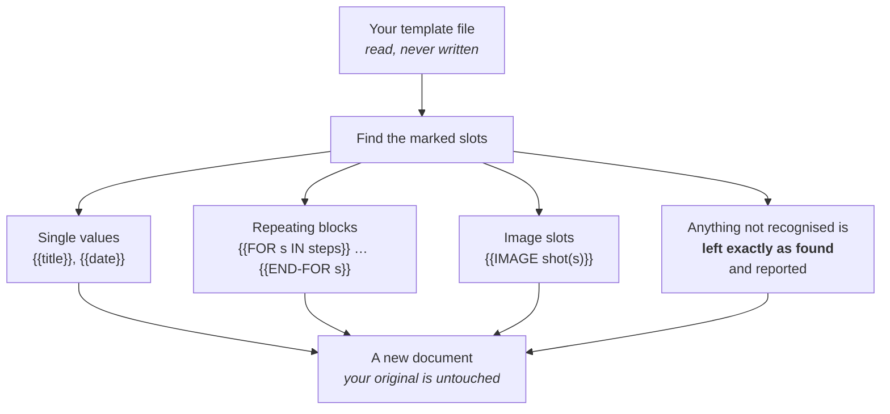

Two rules matter here:

- **The template is only ever read.** Your master file is never modified.
- **A slot we do not recognise is left alone and reported**, rather than quietly
  removed. A typo in a placeholder shows up as an untouched marker you can see —
  not as a silent gap somebody discovers during an audit.

**Section headings in a template.** A repeating block is one piece of markup
used for every row, and a heading is not a step - so if the block says
"put this in bold", a heading comes out as another bold line rather than a
heading. Two ready-made placeholders exist for this:

| Placeholder | What it gives you |
|---|---|
| `{{text_block}}` | The row already marked up for what it is: a heading as a heading, a step as a numbered line |
| `{{checkbox}}` | A tick box for a step, and nothing for a heading or a note — so a checklist never asks anyone to tick off a phase name |
| `{{section}}` | The name of the phase a step falls under, if you would rather print it beside each step than as a row of its own |

The templates that ship with the app use these, so copying one gives you
working headings without having to know any of this. In a Word template the
`{{IF $s.isSection}}` form is available too, which is how the stock Word
template gives a heading the document's own heading style.

There is one subtlety with Word. Word habitually splits typed text across
several internal fragments — a spell-check mark is enough to do it — so
`{{title}}` may not exist as a single piece of text inside the file. Handling
that properly is why the app uses an established library (`docx-templates`)
rather than simple find-and-replace. Naive replacement works on a file generated
by a script and fails on the real template somebody has actually edited, which
is the only kind that matters.

---

## 9. Keeping a guide true: the Check button

Writing a guide is a one-off. Keeping it true is the work. A vendor moves one
dialog and a forty-step procedure is quietly wrong — and nobody finds out until
somebody follows it. That is why guides decay until people stop trusting them.

Every step already records the identity of the control that was clicked. So the
app can open the application again and ask: *are these controls still here?*

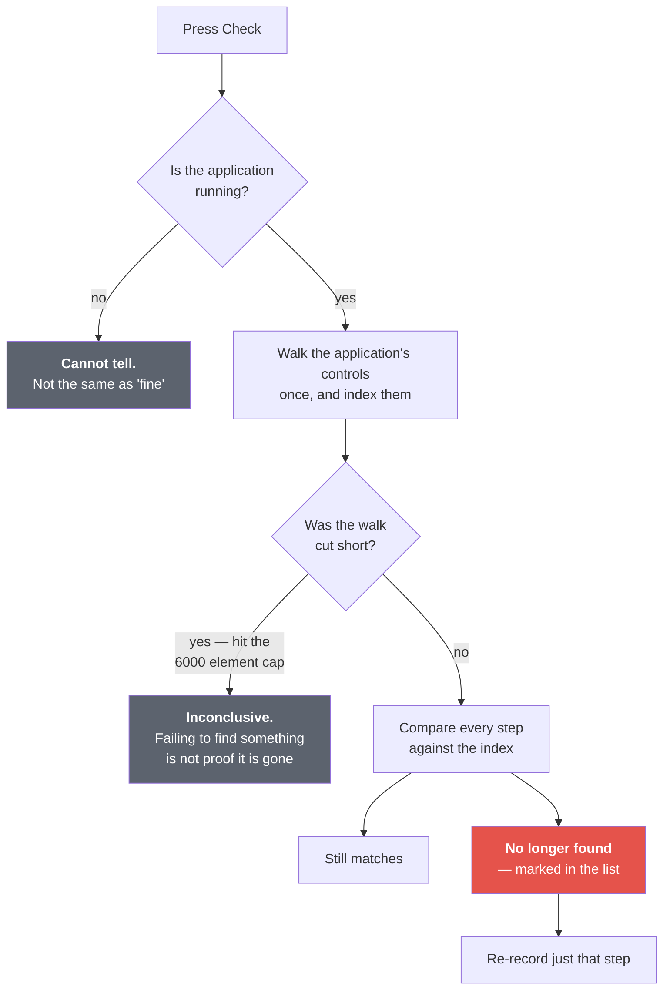

Two design points, both about honesty:

- **The tree is walked once and indexed**, rather than searched once per step.
  Searching a large application takes seconds; forty of those would take minutes
  and look like the app had hung. Indexed, the whole guide is answered in well
  under a second.
- **The three "don't know" answers are kept distinct from "fine".** *Not
  running*, *inconclusive* and *still matches* mean different things, and
  results are stamped with when they were taken — because "this control was
  missing when checked" is a different claim from "this step is wrong".

---

## 10. Privacy, concretely

Nothing leaves the machine. There is no account, no server, no telemetry. Beyond
that:

| Risk | What the app does |
|---|---|
| Recording your mail or chat by accident | Scope to one application; out-of-scope events are dropped before capture |
| Passwords in the recording | Password fields yield only *Entered password* |
| Card / SSN numbers in ordinary fields | Masked by shape |
| A field's contents leaking via its name | Name is dropped when it tracks the value |
| Sensitive things visible in a screenshot | Blur — and it **overwrites the pixels in the file** |
| Blurred originals lingering | Undo copies are purged when the session closes |
| Excluded steps leaking | Their screenshots are not copied alongside an export either |

### Marking up a screenshot

Select a step and you get six tools above the picture:

- **Box** — a rectangle around the thing that matters
- **Circle** — an oval inscribed in what you drag, so a square drag gives a
  circle and a wider one an oval
- **Arrow** — drag *from* where the arrow should start *to* what it points at.
  The preview shows the arrow itself, not the region dragged
- **Highlight** — a translucent wash. **Right-click the button** to choose the
  colour: yellow, green, blue, pink or orange
- **Label** — click where the words should start, type them, press Enter. The
  box appears on the picture, at the spot it is about, in roughly the size and
  colour the finished label will be
- **Blur** — the privacy one, described below

The first five say *look here*, which the recorder cannot know. They are held as
**data on the step**, not painted into the screenshot, and that is what lets you
change your mind:

**Click a mark to take hold of it.** A strip appears above the picture with
just that mark's controls — its colour, its size if it is a label, and Delete
— and **you can drag it wherever it should have gone**. Press Escape, or click
somewhere empty, to let it go. Double-click a label to retype it.

Everything is also on the right-click menu if you prefer it:

- **Delete it** — that one, whichever order you drew them in. Not undo, and not
  the four marks you drew after it.
- **Change its colour** — red, blue, green, amber or black.
- **Retype a label.** Clearing the words removes it.

To set the colour of the *next* mark, right-click the Box, Circle, Arrow or
Label tool and choose. That choice is remembered.

You still see the same picture everywhere: the marks are laid over the
screenshot in the app, in HTML and in PDF, and drawn *into* it for Word and
LaTeX, because those embed an image and cannot lay anything on top of it. Crop a
marked screenshot and the marks move with it; anything cropped out of the
picture entirely is dropped.

Only blur counts as redaction. An arrow you drew is never reported as though you
had hidden something — and unlike the others, blur cannot be right-clicked away
afterwards, because there is nothing left to remove. See below.

**If you use more than one highlighter colour**, turn on *Explain the
highlighting in exports* in Settings and say what each colour means - "green:
safe to change", "orange: check with your supervisor". The guide then carries a
key at the top. Only the colours you actually used are listed, so a reader is
never sent hunting for an orange mark that was never made; a colour you used but
never explained is listed too, saying so, because a mark the key does not cover
is exactly what a key is for.

**Scoping to one application really does mean one application.** When you scope
a recording, keystrokes in every other program are not merely left out of the
guide — they are never taken. Nothing is buffered, nothing is counted, and the
recorder does not even ask those programs what kind of field you are typing in.
Previously the text was collected and then discarded at the last moment, which
came to the same document but is not the same promise.

**A recording you were sent is treated as a stranger's file.** A recording is a
folder, and the point of it is that people pass them around — so the little
`session.json` inside one did not necessarily come from your copy of this app.
It could name a file somewhere else on your machine and, unchecked, blurring
one step would overwrite that file. Every path inside a recording is now
checked to be inside that recording, when it is opened and again every time
anything is read, written or deleted. A step naming somewhere else loses its
picture and keeps its words.

**Blur is destructive on purpose.** An overlay that merely covers pixels leaves
the customer's name sitting in the folder, and a "redacted" guide whose source
images still contain the data is worse than none. It pixelates first and then
blurs, because blur alone can leave enough structure to read short text back —
downsampling actually discards it.

---

## 11. How it is packaged and installed

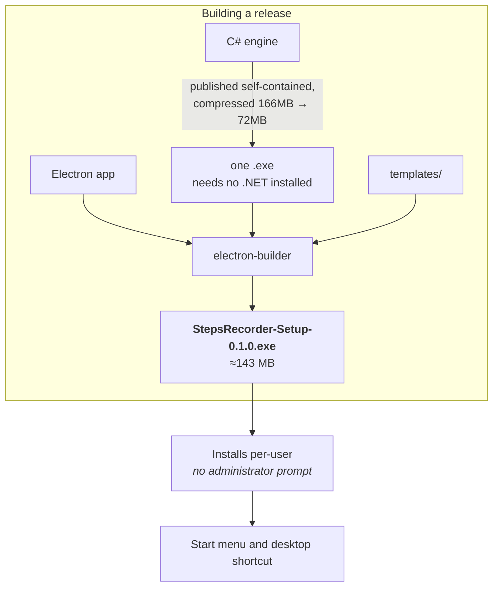

Three deliberate choices:

- **Self-contained.** The engine carries the whole .NET runtime, so the machine
  you send it to needs nothing installed. The cost is size, and a one-off
  extraction on first launch — which the app already waits out, because it waits
  for the engine to report ready.
- **Per-user install, no administrator prompt.** The people who write SOPs work
  in managed environments where needing admin rights ends the conversation.
- **The engine ships beside the app, not inside it.** Electron packs its own
  files into a bundle that programs cannot be run from directly, so the engine
  sits alongside as an extra resource.

### Knowing which build you have

Open **Settings** and look at the bottom left:

```
Build 36 · 0.1.0 · 4c78965
```

**The build number is the one to read.** It goes up by one with every change, so
a bigger number is a newer app - that is the whole question you usually have.

The version number beside it stays at `0.1.0` for a long time; it did not move
once across a day of fixes, so on its own it cannot tell you anything. The last
part is the exact code the build came from, which is worth quoting in a bug
report and otherwise ignoring. A `+` after it means there were uncommitted edits
when it was built, so it does not fully describe what is inside.

You will not normally see anything about the capture engine, because in an
installed copy it ships inside the same installer and cannot be out of step. It
is only mentioned when something is wrong - if it needs rebuilding, the line
says so in red - so no news is good news.

The build time is written to the log each time the app starts rather than shown
here, since it is one more thing to read and the commit already answers the
question.

**It is not code-signed.** Windows SmartScreen will show a warning on first run,
and endpoint protection may object to a program that hooks input and takes
screenshots. That is stated plainly in the README rather than left for a new
user to discover. Signing requires buying a certificate.

---

## 12. Where everything lives

```
stepsrecorderproject/
├── capture/            The C# engine — the part that watches
│   ├── Program.cs          reads commands, owns the message loop
│   ├── Recorder.cs         turns raw events into steps
│   ├── MouseHook.cs        }  standing requests to Windows
│   ├── KeyboardHook.cs     }
│   ├── TypingState.cs      gathers typing per field; owns password secrecy
│   ├── UiaResolver.cs      asks applications what you clicked
│   ├── ScreenCapture.cs    takes the screenshot, DPI-correct
│   ├── Scope.cs            in or out of scope — a pure decision, tested alone
│   └── Verifier.cs         the Check feature
│
├── ui/src/main/        Electron's privileged half (Node.js)
│   ├── main.js             windows, menus, all the wiring
│   ├── sidecar.js          owns the engine process and the JSON framing
│   ├── session.js          a recording on disk
│   ├── settings.js         preferences
│   ├── shortcuts.js        the three forms a hotkey must exist in
│   ├── bounds.js           fitting the window to the screen it is on
│   ├── screenshots.js      deciding whether images must be re-encoded
│   ├── transcode.js        doing the re-encoding
│   ├── export.js           HTML, PDF, Markdown
│   ├── template.js         Markdown/HTML templates
│   ├── docx.js             Word templates
│   └── templates-lib.js    which templates are available
│
├── ui/src/renderer/    The page you actually see
│   ├── index.html
│   ├── renderer.js
│   ├── styles.css
│   ├── marker.js           where the click landed  }  shared: the page loads
│   ├── annotate.js         box, circle, arrow, highlight  }  these as scripts,
│   └── sections.js         headings, and where to suggest them  }  and the
│                           exporters require() the same files
│
├── templates/          The SOP templates that ship with the app
├── tests/              See ENGINEERING.md — some of these take over the machine
└── docs/               This guide, the engineering record, the IPC contract
```

---

## 13. If you want to run it from source

You need [Node 20 or newer](https://nodejs.org) and the
[.NET 10 SDK](https://dotnet.microsoft.com/download). Everything below is run
from the `ui` folder.

```
cd ui
npm install
npm start
```

To build the installer:

```
npm run dist
```

The result appears in `dist/`, one file, ready to hand to somebody.

To check nothing is broken first:

```
npm test
npm run test:window
```

The first is a few seconds and touches nothing. The second opens a window for a
moment, because some things can only be checked by running the real page.

> One thing that catches people out: these are **not** `&&` chains. Windows
> PowerShell — the blue terminal — does not accept `&&` as a separator and will
> say *"The token '&&' is not a valid statement separator in this version."*
> Run the lines one at a time, or join them with `;` instead.
